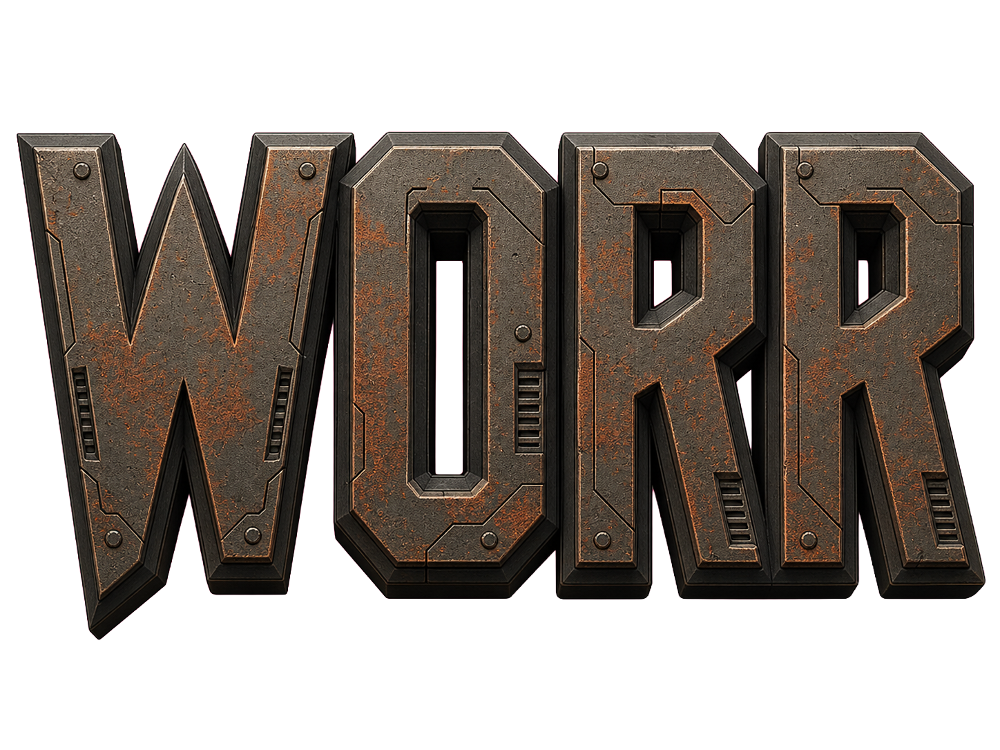

<div align="center">
  
  <h2>WORR – The new way to experience <b>QUAKE II Rerelease</b></h2>

  [](https://github.com/DarkMatter-Productions/WORR/releases/latest)
  [](LICENSE)
  [](https://github.com/DarkMatter-Productions/WORR/actions/workflows/nightly.yml)
  [](https://github.com/DarkMatter-Productions/WORR/actions/workflows/release.yml)
  [](https://github.com/DarkMatter-Productions/WORR/issues)
  [](https://github.com/DarkMatter-Productions/WORR/stargazers)
</div>

<p align="center">
  <b>WORR</b> is an advanced gameplay expansion and standalone engine fork for <b>QUAKE II Rerelease</b>,
  designed as a drop-in replacement offering a richer, more dynamic and refined single-player and multiplayer experience.
</p>

<p align="center">
  The KEX-dependent server mod variant can be found here:
  <a href="https://github.com/themuffinator/worr-kex">themuffinator/worr-kex</a>
</p>

<p align="center">
  WORR is the spiritual successor to
  <a href="https://github.com/themuffinator/muffmode">Muff Mode</a>.
</p>

<p align="center">
  <a href="#quick-start">Quick Start</a> •
  <a href="#install-staging-install">Install Staging</a> •
  <a href="#nightly-builds">Nightly Builds</a> •
  <a href="#project-backbone">Project Backbone</a> •
  <a href="#building">Building</a> •
  <a href="#usage--documentation">Documentation</a>
</p>

---

## About

**WORR** is a fork of [Q2REPRO](https://github.com/Paril/q2repro), which in turn is a fork of [Q2PRO](https://code.nephatrine.net/QuakeArchive/q2pro.git), which itself is a fork of the original [Quake II](https://github.com/id-Software/Quake-2).

The goals of WORR are:

- To act as a **drop-in engine replacement** for the official Quake II Rerelease assets.
- To provide a **modern C++ codebase** suitable for long-term development and experimentation.
- To power the extensive **WORR gameplay module** (and future projects) with:
  - Expanded entity and monster support (across Quake titles and mods),
  - Competitive and casual multiplayer improvements,
  - Modern rendering and UI systems.

> ⚠️ **Compatibility note:**
> Future engine updates may break compatibility with non-**WORR** game modules.

---

## Quick Start

1. Configure a build directory.

   ```bash
   meson setup builddir --wrap-mode=forcefallback --buildtype=release -Dbase-game=basew -Ddefault-game=basew -Dtests=false
   ```

2. Compile.

   ```bash
   meson compile -C builddir
   ```

3. Refresh `.install/` with current binaries and packaged assets.

   ```bash
   python3 tools/refresh_install.py --build-dir builddir --install-dir .install --base-game basew
   ```

   On Windows, use `python` and optionally validate the staged payload:

   ```powershell
   python tools/refresh_install.py --build-dir builddir --install-dir .install --base-game basew --platform-id windows-x86_64
   ```

4. Launch from `.install/` for local runtime testing.

---

## Install Staging (`.install/`)

WORR treats `.install/` as the local distributable staging root.

- Every `tools/refresh_install.py` run deletes and rebuilds `.install/` from the current build output.
- Runtime binaries are copied to `.install/` root and gameplay/runtime payload goes under `.install/basew/`.
- `tools/package_assets.py` is run as part of refresh to emit `.install/basew/pak0.pkz` from the canonical repo `assets/` tree; loose staged asset duplication is no longer kept under `.install/`.
- Published release archives and the Windows MSI keep the same single `basew/` gamedir layout used by local staging.
- CI release/nightly workflows use the same refresh flow before packaging artifacts.

---

## Nightly Builds

Nightly automation is defined in [`.github/workflows/nightly.yml`](.github/workflows/nightly.yml).

- Scheduled daily at `23:50 UTC`, with manual `workflow_dispatch` support.
- Builds Windows, Linux, and macOS targets, then refreshes and validates `.install/` per platform.
- Packages role-specific client/server artifacts plus metadata, verifies expected release payloads and manifest contents, and publishes/updates the nightly release tag without marking it as a GitHub prerelease.
- Generates release notes with compare links and workflow traceability metadata.

Stable releases are published by [`.github/workflows/release.yml`](.github/workflows/release.yml).
That workflow now uses the same cross-platform packaging path and publishes versioned GitHub releases from `WORR_VERSION` (currently `0.1.0`).

---

## Project Backbone

WORR uses task-based projects as the primary planning and execution model.

- Canonical strategic project doc: [`docs-dev/proposals/swot-feature-development-roadmap-2026-02-27.md`](docs-dev/proposals/swot-feature-development-roadmap-2026-02-27.md)
- Significant development work should be tracked against roadmap task IDs (`FR-*` feature tasks, `DV-*` development tasks).
- Engineering change docs under `docs-dev/` should reference the corresponding task IDs so implementation, planning, and release outcomes stay aligned.

### Current Priority Tracks

- Native Vulkan parity closures for gameplay-visible gaps.
- JSON UI/menu completion and widget backlog execution.
- Bot system implementation from structural scaffolding to gameplay-ready behavior.
- CI/test expansion beyond release packaging to day-to-day merge confidence.
- Dependency/version hygiene and documentation freshness.

---

## Building

For build instructions, see **[`BUILDING`](BUILDING.md)**.

This covers:

- Required toolchain and dependencies,
- macOS SDL3/MoltenVK Vulkan setup notes,
- Configuration options,
- Build targets for the engine and game module.

---

## Usage & Documentation

WORR documentation is split by audience:

- `docs-user/`: player/server-admin docs with practical setup guidance.
- `docs-dev/`: engine, renderer, migration, and release automation internals.

Start with:

- [`docs-user/README.md`](docs-user/README.md)
- [`docs-user/getting-started.md`](docs-user/getting-started.md)
- [`docs-user/server-quickstart.md`](docs-user/server-quickstart.md)
- [`docs-dev/README.md`](docs-dev/README.md)

### Font system quick reference

- `scr_font` / `scr_font_size` / `scr_fontpath`: select TTF/OTF or legacy fonts and pixel height for HUD text.
- `scr_text_backend`: choose `ttf`, `kfont`, or `legacy` (bitmap) rendering.
- `scr_text_dpi_scale`: override automatic DPI scaling (0 = auto).
- `scr_text_outline`: default outline thickness (0 = disabled).
- `scr_text_bg` / `scr_text_bg_alpha`: enable an optional black text background and set its opacity.
- `ui_font` / `ui_font_size`: menu/UI font selection and scale.
- `ui_text_bg` / `ui_text_bg_alpha`: UI-only background fill and opacity.
- `con_font` / `con_scale`: console font selection and scale. See the
  [in-game console guide](docs-user/console.md) for live completion, smooth
  scrolling, mouse selection, and appearance controls.
- `scr_text_debug`: draw debug outlines around text bounds for troubleshooting.
- Style flags available to UI code: `UI_BOLD`, `UI_ITALIC`, `UI_UNDERLINE`, `UI_OUTLINE`, plus shadow/color flags.

---

## Related Repositories

- **WORR (KEX server mod):**
  <https://github.com/themuffinator/worr-kex>

- **Muff Mode (legacy project):**
  <https://github.com/themuffinator/muffmode>

- **Q2REPRO:**
  <https://github.com/Paril/q2repro>

- **Q2PRO:**
  <https://code.nephatrine.net/QuakeArchive/q2pro.git>

---

## License

See the [`LICENSE`](LICENSE) file in this repository for licensing details.
