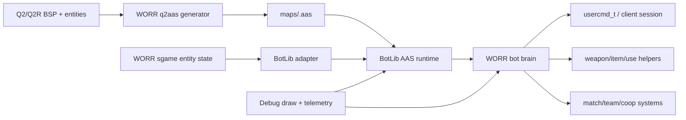

# Quake III Arena BotLib and Q2 AAS Port Plan

Date: 2026-06-16

Status: Implementation In Progress

Roadmap tasks: `FR-04-T01` through `FR-04-T07`, `FR-04-T10` through `FR-04-T16`, and `DV-07-T06`.

## Purpose

Elegantly port the Quake III Arena bot system into WORR by bringing across the useful architecture, data formats, tooling, and behavior patterns while respecting WORR's Quake II Rerelease gameplay, server-game ownership, build layout, and documentation rules.

The port is not a blind file drop. The target is a maintained WORR bot stack with:

- A Quake II map aware AAS generator based on `TTimo/bspc`.
- A rehosted Q3A BotLib/AAS runtime behind a narrow WORR adapter.
- WORR-native fake-client, command, cvar, match, and debug integration.
- Q2/Q2R weapon, item, movement, team, and coop behavior layered above the imported navigation primitives.
- Full source credit, license, and provenance tracking for every upstream-derived file and concept.

## Completion Snapshot

Last refreshed: 2026-06-21 coop target-sharing round.

- Total checklist completion: 648 of 763 items complete, or 84.9%.
- Phase checklist completion: 648 of 751 phase items complete, or 86.3%.
- Completed in the latest worker lanes: live combat aim-profile policy and brain-owned live-aim/projectile-lead consumption, live pickup/observed-respawn item timing consumers with status-friendly counters, coop and resource policy helper metadata, stricter scenario marker gates for live aim and match-policy evidence, reference-map required-feature diagnostics, long-soak source-counter completeness diagnostics, and richer first-party botfile behavior metadata. These land on top of the earlier same-day promotion, packaging, source-counter, scenario, botfile, and documentation lanes.
- Latest implementation round: coop monster target sharing now has a default-off blackboard adoption bridge behind `sg_bot_coop_target_share`. Server smoke mode `30` runs a two-bot coop proof with a lightweight hostile `SVF_MONSTER` target, support-policy bots can adopt a teammate's current target, compact status exposes `coop_target_share_*` evidence, and the promoted `coop_target_share` scenario hard-gates source-candidate, adoption, target-entity, and support-combat intent evidence.
- Still pending: durable autonomous role consumption in live FFA/TDM/CTF flows, deeper coop behavior beyond leader-route/readiness/progress-wait/lead-advance/interaction-retry/resource-share/anti-blocking/target-share proofs, campaign-specific door/elevator/trigger coordination, staging additional reference maps beyond the current available `mm-rage` set, CI/platform breadth, fresh long-soak CPU baselines with current source-counter fields, and the final imported BotLib runtime/adapter catch-all log.

## Source Baseline

Primary local source:

- Quake III Arena source tree: `E:\_SOURCE\_CODE\Quake-III-Arena-master`
- Q3A BotLib runtime: `E:\_SOURCE\_CODE\Quake-III-Arena-master\code\botlib`
- Q3A game bot behavior: `E:\_SOURCE\_CODE\Quake-III-Arena-master\code\game\g_bot.c`, `ai_main.c`, `ai_dmq3.c`, `ai_dmnet.c`, `ai_team.c`, `ai_chat.c`, `ai_cmd.c`, and related `be_ai_*.h` APIs.
- Q3A fake-client and BotLib import glue: `E:\_SOURCE\_CODE\Quake-III-Arena-master\code\server\sv_bot.c`
- Q3A BSPC/AAS generator lineage: `E:\_SOURCE\_CODE\Quake-III-Arena-master\code\bspc`

Required external tool baseline:

- `TTimo/bspc`: `https://github.com/TTimo/bspc`
- The repository describes itself as the Quake III Arena BSP-to-AAS compiler, is forked from `bnoordhuis/bspc`, includes Quake II BSP/map support files such as `l_bsp_q2.c`, `map_q2.c`, and `q2files.h`, and is licensed as GPL-2.0-or-later per its README/license.

Current WORR bot surface:

- The inherited Quake II Rerelease `bot_debug.*`, `bot_exports.*`, and `bot_utils.*` surface has been removed from `src/game/sgame/bots/` because it targets a different engine-side bot system.
- `src/game/sgame/bots/bot_runtime.*` owns the WORR BotLib/AAS lifecycle, public `sg_bot_*` cvars, active-map AAS setup, and frame-level entity sync.
- `src/game/sgame/bots/botlib_adapter.*` owns the narrow bridge to imported Q3A BotLib/AAS code.
- `src/game/sgame/bots/bot_nav.*` owns AAS route lookup, cached route state, persistent route goals, command steering data, and native route/goal debug overlays.
- `src/game/sgame/bots/bot_think.*` keeps `Bot_BeginFrame` and `Bot_EndFrame` as AAS-gated lifecycle hooks and exposes the AAS route-steered `Bot_BuildFrameCommand()` path for server-owned bot `usercmd_t` dispatch.
- The old Q2R game-export bot callbacks are explicitly unavailable from `sgame`; future weapon, item, trigger, and use behavior must land in a new WORR bot action layer above the BotLib/AAS path. `Entity_ForceLookAtPoint` remains as a standalone helper exported outside the removed bot surface.
- `src/game/sgame/client/client_session_service_impl.cpp` already marks bot clients with `SVF_BOT` and calls `Bot_BeginFrame`.
- `src/game/sgame/player/p_view.cpp` already calls `Bot_EndFrame`.

## Guiding Decisions

1. Port the architecture before the behavior. First make AAS generation, BotLib loading, entity updates, and bot input plumbing reliable; only then expand combat/team intelligence.

2. Keep Q3A code in a quarantine boundary. Upstream-derived C code should live in clearly named BotLib/tooling directories with minimal local edits, explicit wrappers, and retained license headers. WORR behavior should call into it through adapter APIs instead of spreading Q3 globals through `sgame`.

3. Build Q2-native behavior above Q3 primitives. Q3A's Area Awareness System, goal weights, movement results, character files, and team AI are valuable. Q3A's item IDs, weapons, powerups, game modes, VM trap model, and player movement assumptions need translation.

4. Make AAS a first-class build artifact. Bots must not depend on hand-authored waypoints. AAS generation should be reproducible, validated, and staged with `.install/basew` whenever maps/assets are packaged.

5. Use `sg_` for new server-game cvars. Existing imported `bot_*` debug names may be retained inside quarantined upstream compatibility layers, but new public WORR controls should use `sg_bot_*`.

6. Preserve credits continuously. Every phase has an explicit credit/provenance checklist. A task is not done until source attribution is updated.

## Q3A to WORR Difference Matrix

This project must treat game and architecture differences as first-order design input, not cleanup after the port.

| Area | Quake III Arena Assumption | WORR / Quake II Rerelease Reality | Porting Response |
|---|---|---|---|
| Game module architecture | Q3 game code calls engine traps from a VM-style boundary. | WORR `sgame` is native C++ and already has KEX/Q2R-style game imports. | Replace trap calls with a narrow BotLib adapter and keep imported globals quarantined. |
| Fake clients | Q3 server owns `SV_BotAllocateClient`, `NA_BOT`, and BotLib import setup. | WORR already has client session services, `SVF_BOT`, and match logic that distinguishes bots from humans. | Integrate through WORR session services, not by copying Q3 server slot code directly. |
| Movement physics | Q3 pmove, acceleration, jump, crouch, and weapon movement expectations. | Q2 movement, step heights, water movement, crouch behavior, ladders where supported, knockback, and Q2 weapon timing. | Translate route results into Q2 `usercmd_t` steering and tune AAS reachability to Q2 movement constants. |
| Map format | Q3 BSP plus Q3-oriented AAS generation. | Q2 IBSP38 maps, Q2R-era extensions/tolerance needs, `.pak`/`.pkz` staging under `basew`. | Tailor `TTimo/bspc` Q2 loaders and configs; validate BSPX/extra lump tolerance before runtime reliance. |
| Navigation data | Q3 maps generally expect prebuilt `.aas` for BotLib. | WORR must support Q2 maps without manual waypoint files. | Make `worr_q2aas` reproducible and package/generate AAS as part of the build/release workflow. |
| Entity model | Q3 `gentity_t`, `entityState_t`, item/powerup IDs, and event model. | WORR has Q2/KEX `gentity_t`, `gclient_t`, `sv` bot-facing state, monsters, traps, movers, and Q2 item IDs. | Build explicit entity-state translation and avoid direct struct reuse. |
| Weapons | Q3 weapons and ammo economy. | Q2 weapons, ammo, inventory items, expansion weapons, splash rules, BFG behavior, weapon switching helpers. | Create WORR weapon metadata and use existing bot export helpers instead of Q3 weapon IDs. |
| Items and goals | Q3 item config, weights, and arena item distribution. | Q2 pickups, armor tiers, powerups, keys/objectives in coop, flags/techs in team modes. | Keep the goal/weight concept but author Q2-specific item configs and filters. |
| Match modes | Q3 FFA, tournament, team, CTF assumptions. | WORR includes Q2/Q2R match states, map voting, mymap queue, warmup/intermission logic, and possible coop scope. | Integrate with existing match services and make bots opt into each mode deliberately. |
| Coop/NPC context | Q3 bot AI is multiplayer-arena focused. | WORR also has monsters/NPCs, campaign maps, triggers, doors, and coop progression needs. | Keep coop as a later phase with explicit follow/wait/lead/resource-sharing behavior. |
| Filesystem/assets | Q3 `baseq3`, `pk3`, botfiles, arenas, scripts. | WORR `basew`, `.install`, `pak0.pkz`, current asset packaging rules. | Adapt paths and staging; do not assume Q3 directory names survive publicly. |
| Build system | Q3 make/project files and old C assumptions. | WORR Meson, mixed C/C++20, warning cleanup, local `.install` staging. | Build imported C behind Meson object/static-library boundaries and document warning exceptions. |
| Debug rendering | Q3 debug lines/polygons through server/BotLib hooks. | WORR already has debug draw imports (`Draw_Line`, `Draw_Point`, `Draw_Bounds`, etc.). | Map Q3 debug primitives to WORR draw APIs and preserve developer cvar gates. |
| Protocol/networking | Q3 bot commands and client state are Q3-specific. | WORR must preserve legacy Q2 server/demo compatibility and avoid q2proto churn. | Keep bot control server-side; do not change protocol unless a separate task explicitly proves the need. |
| Licensing/provenance | Q3A and BSPC are GPL-family upstreams with historical file headers. | WORR also carries GPL-compatible lineage and local ZeniMax/WORR headers. | Maintain file-level source ledger, retain headers, and credit direct imports separately from inspirations. |

## Target Architecture

Target source layout, subject to adjustment during implementation:

- `tools/q2aas/`: WORR-tailored BSP-to-AAS generator derived from `TTimo/bspc`.
- `src/game/sgame/bots/q3a/`: imported or lightly wrapped Q3A BotLib runtime code, kept behind C-compatible adapter boundaries.
- `src/game/sgame/bots/bot_runtime.*`: WORR-native BotLib/AAS runtime shell, cvar registration, active-map AAS load probe, and lifecycle/status surface.
- `src/game/sgame/bots/botlib_adapter.*`: WORR import table, map load/unload, entity sync, trace/PVS/FS/memory/debug bridging.
- `src/game/sgame/bots/bot_brain.*`: WORR-native high-level frame command/status ownership, future per-frame scheduling, goal selection, and usercmd generation.
- `src/game/sgame/bots/bot_nav.*`: AAS area lookup, route requests, movement steering, stuck recovery, and debug overlays.
- `src/game/sgame/bots/bot_combat.*`: weapon selection, aim, reaction, projectile prediction, ammo/resource use.
- `src/game/sgame/bots/bot_team.*`: TDM/CTF/duel/match role logic.
- `src/game/sgame/bots/bot_profiles.*`: character/profile loading and skill knobs.
- `docs-dev/plans/q3a-botlib-aas-port.md`: this project plan.
- `docs-dev/q3a-botlib-aas-credits.md`: source ledger and credit tracker, created in Phase 0 and updated with each import/adaptation.
- `docs-dev/q3a-botlib-aas-source-audit-2026-06-16.md`: first-round source audit, baseline pins, license review, and import gate.
- `docs-dev/q2aas-generator-q2-preset-validation-2026-06-16.md`: Q2 movement preset, validation harness, and first staged map smoke log.
- `docs-dev/q2aas-generator-q2-reachability-bridge-2026-06-16.md`: Q2 trace bridge, reachability, clustering, and strict staged-map validation log.
- `docs-dev/q2aas-generator-validation-matrix-2026-06-16.md`: manifest-driven staged-map validation, JSON report, and invalid-input smoke log.
- `docs-dev/q2aas-generator-deterministic-metadata-2026-06-16.md`: AAS sidecar metadata, hash/report schema, Q2 BSP header preflight, and BSPX marker detection log.
- `docs-dev/q2aas-generator-entity-diagnostics-2026-06-16.md`: entity lump parsing, brush-content diagnostics, spawn/item AAS coverage, high-value pickup reachability, and mover inventory log.
- `docs-dev/q2aas-generator-diagnostic-gates-2026-06-16.md`: staged smoke diagnostic gates for clean BSP lumps, spawn/item AAS coverage, and high-value pickup reachability.
- `docs-dev/q2aas-generator-baseline-regression-gates-2026-06-17.md`: manifest-driven structural metric and travel-count regression gates for staged AAS output.
- `docs-dev/q2aas-generator-manifest-schema-validation-2026-06-17.md`: manifest schema validation, task provenance, and validation-report manifest metadata.
- `docs-dev/q2aas-generator-manifest-schema-smoke-2026-06-17.md`: automated malformed-manifest expected-failure smoke in the staged q2aas validation target.
- `docs-dev/q2aas-generator-aas-staging-2026-06-17.md`: validated `.aas` staging into `.install/basew/maps/` and staged-output report metadata.
- `docs-dev/q2aas-generator-stage-audit-2026-06-17.md`: staged `.aas` artifact audit against the validation stage report.
- `docs-dev/q2aas-generator-packaged-map-smoke-2026-06-17.md`: archive-backed map extraction and scratch pkz conversion smoke.
- `docs-dev/q2aas-generator-archive-manifest-guardrails-2026-06-17.md`: archive-backed manifest member validation and expected-failure smoke coverage.
- `docs-dev/q2aas-generator-package-audit-2026-06-17.md`: staged AAS package-readiness audit for loose-or-archive release payload representation.
- `docs-dev/q2aas-generator-archive-packaging-2026-06-17.md`: validated staged AAS injection into `.install/basew/pak0.pkz` and archive-required package audit.
- `docs-dev/q2aas-generator-refresh-install-integration-2026-06-17.md`: `refresh_install.py --package-q2aas-aas` integration for preserving generated AAS through `.install` refreshes.
- `docs-dev/q2aas-generator-stage-archive-member-validation-2026-06-17.md`: generic staged-release archive member validation and q2aas refresh wiring for required packaged AAS hashes.
- `docs-dev/q3a-botlib-runtime-aas-shell-2026-06-17.md`: WORR-native BotLib/AAS runtime shell, `sg_bot_*` cvars, active-map AAS header probe, and server-game lifecycle hooks.
- `docs-dev/q3a-botlib-import-boundary-2026-06-17.md`: Q3A BotLib import root, adapter shell, planned-file inventory, and build strategy decision.
- `docs-dev/q3a-botlib-utility-import-2026-06-17.md`: first commit-pinned Q3A BotLib utility source/header import, local build wrapper, LibVar smoke bridge, and runtime validation log.
- `docs-dev/q3a-botlib-aas-file-loader-2026-06-17.md`: imported Q3A `be_aas_file.c` AAS loader subset, in-memory WORR-to-Q3A filesystem bridge, and staged map loader smoke.
- `docs-dev/q3a-botlib-aas-sample-query-2026-06-17.md`: imported Q3A `be_aas_sample.c`, temporary bridge shims for later runtime hooks, and first loaded-area query smoke.
- `docs-dev/q3a-botlib-aas-reach-query-2026-06-17.md`: imported Q3A `be_aas_reach.c`, removal of the temporary `AAS_AreaReachability` shim, scoped warning policy, and imported reachability smoke.
- `docs-dev/q3a-botlib-aas-route-query-2026-06-17.md`: imported Q3A `be_aas_route.c`, `l_crc.*`, route-cache initialization/unload handling, and imported travel-time/predict-route smoke.
- `docs-dev/q3a-botlib-aas-start-frame-2026-06-17.md`: imported Q3A `be_aas_main.c`, Q3A setup/shutdown ownership for loaded AAS, and per-frame `AAS_StartFrame` smoke.
- `docs-dev/q3a-botlib-aas-entity-cache-2026-06-17.md`: imported Q3A `be_aas_entity.c`, removal of temporary entity reset/invalidation shims, and entity-cache start-frame smoke.
- `docs-dev/q3a-botlib-aas-entity-sync-2026-06-17.md`: WORR bot-facing entity snapshot translation into imported Q3A `AAS_UpdateEntity` and verbose sync counters.
- `docs-dev/q3a-botlib-aas-entity-trace-2026-06-17.md`: Q3A `AAS_EntityCollision` callback bridge into WORR `gi.clip` entity clipping, plus BSP model-index sync correction.
- `docs-dev/q3a-botlib-aas-bsp-leaf-link-2026-06-17.md`: active-map Q2 BSP leaf-link bridge for imported Q3A dynamic entity links and `AAS_BoxEntities`.
- `docs-dev/q3a-botlib-aas-movement-import-2026-06-17.md`: imported Q3A `be_aas_move.c`, WORR/Q2 movement LibVar seeding, and imported floor-drop/jump/client-movement smoke.
- `docs-dev/q3a-botlib-aas-debug-draw-bridge-2026-06-17.md`: callback-backed Q3A debug line/cross/arrow bridge to WORR `gi.Draw_*` imports, gated by bot debug cvars.
- `docs-dev/q3a-botlib-aas-route-overlay-2026-06-17.md`: route/goal overlay smoke using imported Q3A route prediction and the WORR debug draw bridge under `sg_bot_debug_route` / `sg_bot_debug_goal`.
- `docs-dev/q3a-botlib-aas-debug-polygon-bridge-2026-06-17.md`: callback-backed Q3A debug polygon create/delete bridge to WORR debug-line outline rendering, gated by `sg_bot_debug_aas >= 3`.
- `docs-dev/q3a-botlib-aas-debug-area-helpers-2026-06-17.md`: imported Q3A `be_aas_debug.c` debug-area helper smoke through WORR debug line/polygon callbacks.
- `docs-dev/q3a-botlib-aas-cluster-import-2026-06-17.md`: imported Q3A `be_aas_cluster.c`, removed the temporary `AAS_InitClustering` shim, and added loaded-cluster smoke status.
- `docs-dev/q3a-botlib-aas-alternative-route-import-2026-06-17.md`: imported Q3A `be_aas_routealt.c`, removed the temporary alternative-routing lifecycle shims, and added `AAS_AlternativeRouteGoals` smoke status.
- `docs-dev/q3a-botlib-aas-optimize-import-2026-06-17.md`: imported Q3A `be_aas_optimize.c`, removed the temporary `AAS_Optimize` no-op, and kept optimization opt-in behind Q3A `aasoptimize` behavior.
- `docs-dev/q3a-botlib-print-bridge-2026-06-17.md`: callback-backed Q3A `botimport.Print` bridge to WORR logging with verbose status counters.
- `docs-dev/q3a-botlib-bot-client-command-bridge-2026-06-17.md`: callback-backed Q3A `botimport.BotClientCommand` bridge with safe WORR runtime rejection and smoke counters.
- `docs-dev/q3a-botlib-memory-allocator-bridge-2026-06-17.md`: tracked bot-owned Q3A `GetMemory` / `FreeMemory` / `HunkAlloc` bridge with grouped hunk release and status counters.
- `docs-dev/q3a-botlib-filesystem-bridge-2026-06-17.md`: read-only callback-backed Q3A filesystem bridge through WORR FS with file-handle tracking and fallback memory support.
- `docs-dev/q3a-botlib-route-cache-miss-policy-2026-06-17.md`: explicit optional `.rcd` route-cache miss classification so expected cache probes no longer inflate filesystem failure counters.
- `docs-dev/q3a-botlib-lifecycle-telemetry-2026-06-17.md`: explicit BotLib init/load/unload/shutdown counters and repeated import-harness proof of clean active AAS unloads.
- `docs-dev/q3a-botlib-dedicated-lifecycle-smoke-2026-06-17.md`: dedicated server self-smoke cvar, map-reload lifecycle status command, and shutdown-time clean-unload proof.
- `docs-dev/q3a-botlib-bot-slot-lifecycle-2026-06-17.md`: first engine-owned fake-client lifecycle, operator commands, bot-aware teardown, and one-bot slot smoke.
- `docs-dev/q3a-botlib-multibot-slot-queue-2026-06-17.md`: deferred multi-bot add queue, bot team assignment fix, and two-active-bot dedicated smoke.
- `docs-dev/q3a-botlib-min-players-autofill-2026-06-17.md`: `sg_bot_min_players` auto-fill policy, auto/manual bot separation, generated-name fix, and fill/trim/disable smoke.
- `docs-dev/q3a-botlib-profile-loading-2026-06-17.md`: `sg_bot_reload_profiles`, first Q3A-style profile parser, profile-aware add/autofill, and profile smoke.
- `docs-dev/q3a-botlib-profile-behavior-fields-2026-06-17.md`: richer profile behavior field parsing, bot userinfo mapping, and expanded profile smoke.
- `docs-dev/q3a-botlib-native-botfiles-assets-2026-06-18.md`: first WORR-authored `assets/botfiles/bots` profile pack, including the deterministic `smoke` profile.
- `docs-dev/q3a-botlib-botfiles-validation-tool-2026-06-18.md`: CI-oriented standard-library validator for authored bot profile scripts.
- `docs-dev/q3a-botlib-profile-loader-hardening-2026-06-18.md`: deterministic profile scan markers, parse diagnostics, and configurable profile-smoke target.
- `docs-dev/q3a-botlib-profile-scenario-smoke-2026-06-18.md`: `profile_backed_spawn` scenario harness row and marker checks.
- `docs-dev/q3a-botlib-botfiles-loose-staging-2026-06-18.md`: refreshed installs now mirror `botfiles` loose while preserving `pak0.pkz` packaging for no-zlib dedicated builds.
- `docs-dev/q3a-botlib-botfiles-user-docs-2026-06-18.md`: operator-facing bot profile guide and docs links.
- `docs-dev/q3a-botlib-q3-style-botfiles-2026-06-18.md`: correction from flat placeholder profile files to Q3/Gladiator-style `*_c/_w/_i/_t.c` botfile families.
- `docs-dev/q3a-botlib-botfiles-q3a-style-expansion-2026-06-18.md`: denser Q3-style botfile family expansion with multi-skill characters, shared weight scripts, chat blocks, and validator support.
- `docs-dev/q3a-botlib-botfiles-style-audit-2026-06-18.md`: Q3A/Gladiator style conformance audit for the authored WORR botfile families and shared script shims.
- `docs-dev/q3a-botlib-botfiles-scripts-package-coverage-2026-06-18.md`: package regression coverage for future `botfiles/scripts` payloads in both `pak0.pkz` and loose staging.
- `docs-dev/q3a-botlib-botfiles-scripts-support-2026-06-18.md`: compact WORR-native `botfiles/scripts/*_s.c` companions plus profile-validator script parsing.
- `docs-dev/q3a-botlib-botfile-script-parity-2026-06-18.md`: idTech3-style pass over the original WORR script companions with validator proof.
- `docs-dev/q3a-botlib-botfiles-worker-i-validation-2026-06-18.md`: staged botfile family validation, BFG10K token alignment, and package dry-run audit.
- `docs-dev/q3a-botlib-profile-behavior-depth-round-2026-06-18.md`: validated richer behavior metadata for the first-party botfile families.
- `docs-dev/q3a-botlib-team-policy-cleanup-2026-06-17.md`: bot initial placement and per-frame cleanup respect Duel/`maxplayers` active match limits.
- `docs-dev/q3a-botlib-team-policy-smoke-2026-06-17.md`: direct game-side team-policy smoke status through a lightweight game extension.
- `docs-dev/q3a-botlib-frame-command-dispatch-2026-06-17.md`: first AAS-gated bot `usercmd_t` generation and server fake-client movement dispatch smoke.
- `docs-dev/q3a-botlib-route-steered-frame-commands-2026-06-17.md`: AAS-backed route-step steering for bot frame command angles and route diagnostics in the dedicated smoke.
- `docs-dev/q3a-botlib-nav-route-cache-2026-06-17.md`: WORR-owned per-bot route cache, route-query cadence, and route reuse diagnostics.
- `docs-dev/q3a-botlib-nav-debug-overlay-2026-06-17.md`: live cached `bot_nav` route/goal debug overlay counters and fallback to the imported sample overlay before a bot route is cached.
- `docs-dev/q3a-botlib-nav-reachability-debug-2026-06-17.md`: live current-area and next-reachability travel metadata in cached route overlay labels and dedicated frame-command smoke status.
- `docs-dev/q3a-botlib-nav-polyline-debug-2026-06-17.md`: bounded cached route-point polyline drawing and headless polyline counters for live bot route debug.
- `docs-dev/q3a-botlib-nav-debug-client-filter-2026-06-17.md`: `sg_bot_debug_client` selected-client filtering for cached route/goal debug overlays and headless filter counters.
- `docs-dev/q3a-botlib-nav-persistent-goal-2026-06-18.md`: native persistent route-goal ownership, preferred-goal refresh requests, and headless goal counters.
- `docs-dev/q3a-botlib-legacy-bot-surface-removal-2026-06-18.md`: removal of inherited Q2R `sgame/bots` debug/export/entity-state files and replacement boundary notes for the WORR/Q3A BotLib path.
- `docs-dev/q3a-botlib-nav-item-goal-2026-06-18.md`: first native active-pickup route-goal selection, item-goal persistence metadata, and headless item-goal counters.
- `docs-dev/q3a-botlib-nav-item-reservation-2026-06-18.md`: first native item reservation policy, two-bot frame-command smoke, and reservation counters.
- `docs-dev/q3a-botlib-nav-lookahead-steering-2026-06-18.md`: first route-point look-ahead steering in bot frame commands and headless look-ahead counters.
- `docs-dev/q3a-botlib-nav-velocity-steering-2026-06-18.md`: first velocity-aware command yaw adjustment and headless velocity-lead counters.
- `docs-dev/q3a-botlib-route-target-stabilization-2026-06-18.md`: route-refresh target stabilization for near-origin route steps and adjacent-area jitter mitigation counters.
- `docs-dev/q3a-botlib-nav-stuck-repath-2026-06-18.md`: first stuck-progress watchdog, forced repath refresh reason, and stalled-command smoke.
- `docs-dev/q3a-botlib-nav-stuck-recovery-command-2026-06-18.md`: short back/strafe recovery command window after stuck detections.
- `docs-dev/q3a-botlib-nav-goal-blacklist-cooldown-2026-06-18.md`: per-bot active-pickup goal blacklist cooldown after stuck detections.
- `docs-dev/q3a-botlib-nav-failed-goal-reason-2026-06-18.md`: failed-goal reason diagnostics for abandoned route goals.
- `docs-dev/q3a-botlib-nav-movement-state-commands-2026-06-18.md`: reachability-aware jump, crouch, swim, and ladder command intent.
- `docs-dev/q3a-botlib-bot-brain-command-ownership-2026-06-18.md`: high-level frame command/status ownership moved into `bot_brain.*` while `bot_think.*` stays as the stable wrapper surface.
- `docs-dev/q3a-botlib-nav-natural-travel-goal-2026-06-18.md`: smoke-backed natural `TRAVEL_JUMP`, `TRAVEL_LADDER`, `TRAVEL_WALKOFFLEDGE`, `TRAVEL_ELEVATOR`, and `TRAVEL_BARRIERJUMP` route selection from packaged `mm-rage.aas`.
- `docs-dev/q3a-botlib-nav-natural-ladder-travel-goal-2026-06-18.md`: follow-up natural `TRAVEL_LADDER` route-goal smoke mode and staged validation metrics.
- `docs-dev/q3a-botlib-nav-natural-walkoffledge-travel-goal-2026-06-18.md`: route-only natural `TRAVEL_WALKOFFLEDGE` smoke mode, pass semantics, and staged validation metrics.
- `docs-dev/q3a-botlib-nav-natural-elevator-travel-goal-2026-06-18.md`: route-only natural `TRAVEL_ELEVATOR` smoke mode and staged validation metrics.
- `docs-dev/q3a-botlib-nav-natural-barrierjump-travel-goal-2026-06-18.md`: natural `TRAVEL_BARRIERJUMP` direct-reachability route smoke and staged validation metrics.
- `docs-dev/q3a-botlib-nav-rocketjump-policy-2026-06-18.md`: default-off `TRAVEL_ROCKETJUMP` route policy gate, opt-in and blocked smoke modes, and staged validation metrics.
- `docs-dev/q3a-botlib-nav-four-bot-frame-command-smoke-2026-06-18.md`: four-bot route-command smoke mode, item reservation validation, and staged validation metrics.
- `docs-dev/q3a-botlib-nav-eight-bot-frame-command-smoke-2026-06-18.md`: eight-bot route-command smoke mode, higher-load item reservation validation, and staged validation metrics.
- `docs-dev/q3a-botlib-nav-soak-frame-command-smoke-2026-06-18.md`: ten-minute eight-bot route-command soak mode, long-run route cleanliness validation, and command-budget fix notes.
- `docs-dev/q3a-botlib-nav-map-change-repeat-smoke-2026-06-18.md`: same-map reload repeat smoke mode, reload timeout handling, and cycle marker contract for validation harnesses.
- `docs-dev/q3a-botlib-nav-natural-movement-door-retry-2026-06-18.md`: natural crouch/swim/waterjump support diagnostics plus first interaction wait/use retry telemetry for mover/elevator routes.
- `docs-dev/q3a-botlib-nav-natural-interaction-diagnostics-2026-06-18.md`: interaction context counters by world entity type for future door/platform/button/trigger policy.
- `docs-dev/q3a-botlib-perception-blackboard-2026-06-18.md`: per-bot enemy/last-seen/heard/damaged blackboard, staggered visible-enemy scans, and blackboard status output.
- `docs-dev/q3a-botlib-blackboard-state-enrichment-2026-06-18.md`: per-bot goal, route, stuck, item-reservation, and team-role blackboard facts plus compact status output.
- `docs-dev/q3a-botlib-behavior-action-dispatcher-2026-06-18.md`: first WORR-native behavior/action dispatcher boundary for future item, weapon, combat, inventory, and world-use policy.
- `docs-dev/q3a-botlib-behavior-action-brain-telemetry-2026-06-18.md`: initial action dispatcher sampling/status bridge from `bot_brain.*` before the later application-helper lane.
- `docs-dev/q3a-botlib-action-item-utility-2026-06-18.md`: intent-only item utility scoring and future smoke counters for health/armor pickups and weapon-switch observation.
- `docs-dev/q3a-botlib-combat-weapon-metadata-2026-06-18.md`: Q2/WORR weapon metadata and pure preferred-weapon scoring helper for later combat policy.
- `docs-dev/q3a-botlib-action-application-helpers-2026-06-18.md`: detailed action-application results, command-button mutation for accepted attack/use decisions, and pending weapon/inventory intent telemetry.
- `docs-dev/q3a-botlib-nav-health-armor-focus-2026-06-18.md`: reserved-mode health/armor item-focus routing through `bot_items` utility scoring and pickup observation hooks.
- `docs-dev/q3a-botlib-team-objective-helper-scaffold-2026-06-18.md`: first team-objective helper scaffold plus frame/objective status exposure for future mode `23` promotion.
- `docs-dev/q3a-botlib-smoke-scenario-modes-2026-06-18.md`: server-side reservation of pending scenario smoke modes 20 through 23 without synthetic pass metrics, plus runtime warmup waiting before final status capture.
- `docs-dev/q3a-botlib-scenario-smoke-harness-2026-06-18.md`: local scenario smoke harness, catalog output, Markdown/comparison reports, and offline parser tests.
- `docs-dev/q3a-botlib-pending-scenario-counters-2026-06-18.md`: proposed counter/pass contracts for enemy engagement, weapon switching, health/armor pickup, and team-objective scenarios.
- `docs-dev/q3a-botlib-scenario-promotions-2026-06-18.md`: promotion-check diagnostics for pending scenario rows, including marker-backed checks.
- `docs-dev/q3a-botlib-scenario-raw-reserved-diagnostics-2026-06-18.md`: pre-promotion raw reserved-mode log parsing for modes 20 through 23 in pending gap reports.
- `docs-dev/q3a-botlib-scenario-tooling-source-aware-raw-diagnostics-2026-06-18.md`: source-order-preserving raw marker diagnostics for reserved modes 20 through 23 and missing-metric source hints.
- `docs-dev/q3a-botlib-bot-perf-telemetry-2026-06-18.md`: bot smoke log analyzer, derived performance/budget metrics, scenario baselines, Markdown reports, and regression tests.
- `docs-dev/q3a-botlib-bot-perf-source-counters-2026-06-18.md`: source-counter proposal for true CPU, route, visibility, PVS/PHS, and trace-pressure telemetry.
- `docs-dev/q3a-botlib-source-counter-plumbing-2026-06-18.md`: import/adapter route, PVS/PHS, visibility, entity-trace, and static BSP trace source-counter getters plus split status emission.
- `docs-dev/q3a-botlib-route-cpu-timing-2026-06-18.md`: route query, route reuse, and Q3A route import CPU timing field plumbing.
- `docs-dev/q3a-botlib-scenario-promotion-cpu-status-2026-06-18.md`: modes `20` through `23` promoted to implemented scenarios plus bot-frame/route CPU status validation.
- `docs-dev/q3a-botlib-static-bsp-trace-cpu-2026-06-18.md`: static Q2 BSP trace CPU source counters and perf analyzer validation.
- `docs-dev/q3a-botlib-entity-trace-clip-cpu-2026-06-18.md`: dynamic WORR `gi.clip(...)` bridge CPU source counters and perf analyzer validation.
- `docs-dev/q3a-botlib-aas-memory-source-counters-2026-06-18.md`: Q3A BotLib AAS memory source-counter status and analyzer grouping.
- `docs-dev/q3a-botlib-high-bot-degradation-policy-2026-06-18.md`: explicit high-bot degradation policy in scenario catalog/reporting.
- `docs-dev/q3a-botlib-high-bot-soak-budget-2026-06-18.md`: ten-minute eight-bot soak budget sidecar and documentation.
- `docs-dev/q3a-botlib-release-packaging-hardening-2026-06-18.md`: botfile family/hash validation plus q2aas AAS package hash enforcement.
- `docs-dev/q3a-botlib-release-policy-2026-06-18.md`: q2aas/BSPC tool binary default-exclusion and required license/credit notice bundle policy.
- `docs-dev/q2aas-reference-map-coverage-2026-06-18.md`: reference-map coverage categories, optional missing-map reporting, and strict future gate.
- `docs-dev/q3a-botlib-weapon-inventory-command-api-2026-06-18.md`: validated action-layer command request API for weapon/inventory intents.
- `docs-dev/q3a-botlib-weapon-inventory-dispatch-2026-06-18.md`: brain-owned exact `use_index_only` weapon/inventory command-request dispatch for accepted pending action intents.
- `docs-dev/q3a-botlib-aim-fairness-policy-2026-06-18.md`: opt-in aim/fairness helper policy for reaction, FOV, turn, settle, burst, error, and tracking-noise metadata.
- `docs-dev/q3a-botlib-live-combat-policy-round-2026-06-18.md`: live combat aim profiles, status-rich live-aim results, and projectile-lead scaling for brain-owned aiming.
- `docs-dev/q3a-botlib-enemy-health-armor-estimates-2026-06-20.md`: WORR-owned per-bot enemy health/armor estimates from visible observations and split bot-attributed damage deltas.
- `docs-dev/q3a-botlib-estimate-aware-weapon-selection-2026-06-20.md`: first weapon-selection consumer for enemy estimates, including finisher, armor-pressure, and underpowered-choice scoring adjustments.
- `docs-dev/q3a-botlib-carried-arsenal-selection-2026-06-20.md`: action-layer carried-weapon scan that feeds the best scorer-approved inventory weapon into combat selection.
- `docs-dev/q3a-botlib-nonweapon-inventory-policy-2026-06-20.md`: conservative carried non-weapon inventory/powerup use policy for combat and survival pressure.
- `docs-dev/q3a-botlib-utility-deployable-inventory-policy-2026-06-20.md`: environment utility and sphere deployable use policy with status evidence.
- `docs-dev/q3a-botlib-escape-deployable-inventory-policy-2026-06-20.md`: placement-aware doppelganger and last-resort personal teleporter use policy with status evidence.
- `docs-dev/q3a-botlib-safe-nuke-inventory-policy-2026-06-20.md`: safety-gated nuke inventory policy with friendly-fire, self-pressure, launch, and enemy-value checks.
- `docs-dev/q3a-botlib-nuke-retreat-route-ownership-2026-06-21.md`: command-owned nuke retreat route goal after submitted safe inventory use.
- `docs-dev/q3a-botlib-timed-route-goal-owner-2026-06-21.md`: generic timed route-goal owner state and status fields above the first nuke-retreat consumer.
- `docs-dev/q3a-botlib-teleporter-escape-route-owner-2026-06-21.md`: teleporter escape timed route-goal consumer after submitted personal teleporter use.
- `docs-dev/q3a-botlib-coop-leader-route-owner-2026-06-21.md`: coop follow/regroup/support timed route-goal consumer from leader policy.
- `docs-dev/q3a-botlib-coop-leader-route-scenario-2026-06-21.md`: compact coop leader-route status surface and promoted `coop_leader_route` scenario gate.
- `docs-dev/q3a-botlib-coop-lead-advance-route-owner-2026-06-21.md`: default-off no-leader coop LeadAdvance timed route-goal owner and promoted `coop_lead_advance` scenario.
- `docs-dev/q3a-botlib-coop-progress-wait-command-2026-06-21.md`: default-off coop WaitForLeader command owner and promoted `coop_progress_wait` scenario.
- `docs-dev/q3a-botlib-coop-interaction-retry-command-2026-06-21.md`: default-off route interaction wait/use retry command owner and promoted `coop_interaction_retry` scenario.
- `docs-dev/q3a-botlib-coop-target-share-2026-06-21.md`: default-off coop monster target-sharing blackboard adoption bridge and promoted `coop_target_share` scenario.
- `docs-dev/q3a-botlib-live-item-timing-consumers-2026-06-18.md`: live pickup and observed respawn timing consumer frames/results plus conservative timing gates.
- `docs-dev/q3a-botlib-special-item-utility-2026-06-18.md`: special-item utility buckets for damage boosts, protection, invisibility, mobility, utility powerups, techs, and CTF objectives.
- `docs-dev/q3a-botlib-team-role-policy-2026-06-18.md`: deterministic team-objective role policy helpers and role-policy status output.
- `docs-dev/q3a-botlib-team-role-depth-2026-06-18.md`: lane/depth role-policy helpers for attack, defense, midfield, carrier support, dropped-flag response, and own-base return.
- `docs-dev/q3a-botlib-team-coop-policy-round-2026-06-18.md`: coop context/resource policy helpers and status names without claiming autonomous coop command behavior.
- `docs-dev/q3a-botlib-status-harness-expansion-2026-06-18.md`: scenario harness optional-field discovery for action dispatch, aim policy, special item utility, and route-target stabilization counters.
- `docs-dev/q3a-botlib-long-soak-source-counter-round-2026-06-18.md`: source-counter completeness and budget diagnostic fields for future fresh long-soak runs.
- `docs-dev/q3a-botlib-implementation-round-summary-2026-06-18.md`: consolidated round summary for completed lanes, validation, pending scenario metrics, and outstanding work.
- `docs-dev/q3a-botlib-engage-enemy-proof-2026-06-18.md`: combat-owned enemy fact, visibility/shootability, nearest-enemy, and real damage-attribution proof helpers for pending mode `20`.
- `docs-dev/q3a-botlib-combat-damage-event-hook-2026-06-18.md`: real `Damage()`-path bot-attributed damage observation hook for pending mode `20`, with raw smoke still not proving enemy damage.
- `docs-dev/q3a-botlib-weapon-switch-proof-2026-06-18.md`: action-layer pending weapon-switch request, observation, completion, failure, and mismatch proof state for pending mode `21`.
- `docs-dev/q3a-botlib-health-armor-pickup-proof-2026-06-18.md`: deterministic health/armor proof setup plus pre/post pickup snapshot helpers for pending mode `22`.
- `docs-dev/q3a-botlib-gameplay-item-hooks-2026-06-18.md`: real item-touch success hook for health/armor proof observations, explicitly leaving CTF flag handling to the later `g_capture.cpp` hook slice.
- `docs-dev/q3a-botlib-health-armor-scenario-promotion-gate-2026-06-18.md`: blocked mode `22` promotion gate showing route proof is insufficient without health/armor-specific counters.
- `docs-dev/q3a-botlib-ctf-objective-gameplay-hooks-2026-06-18.md`: authoritative CTF flag pickup, return, and capture event hooks for future mode `23` proof counters, without runtime promotion smoke.
- `docs-dev/q3a-botlib-team-objective-proof-2026-06-18.md`: target-source-aware team objective selection, assignment, route-goal handoff, and event-record helper APIs for pending mode `23`.
- `docs-dev/q3a-botlib-pending-scenario-promotion-tooling-2026-06-18.md`: split-marker raw diagnostic parsing and stricter latest-run promotion checks for pending modes `20` through `23`.
- `docs-dev/q3a-botlib-worker-i-status-2026-06-18.md`: documentation-lane status refresh covering completion stats, integrated proof helpers, and remaining promotion work.
- `docs-dev/q3a-botlib-worker-n-status-2026-06-18.md`: pre-promotion docs/status refresh that preserved modes 20 through 23 as pending until runtime evidence landed.
- `docs-dev/q3a-botlib-worker-u-status-2026-06-18.md`: docs/status reconciliation after script parity, split source counters, and route CPU timing evidence.
- `docs-dev/botfiles/q3a-botfile-script-tactical-routines-2026-06-18.md`: Q3/Gladiator-style script companion tactical routines for the first-party botfiles.
- `docs-dev/q3a-botlib-docs-progress-tracking-round-2026-06-18.md`: round closeout tracker for final checklist math, scenario counts, build/install validation, and remaining evidence gaps.
- `docs-dev/q3a-botlib-extensive-implementation-round-2026-06-18.md`: current extensive round roll-up for promoted scenarios, botfile script parity, validation, and remaining work.
- `docs-dev/q2aas-reference-map-coverage-round-2026-06-18.md`: required-feature evidence diagnostics, gap-map reporting, and manifest coverage status for the current staged reference subset.
- `docs-dev/q3a-botlib-extensive-round-closeout-2026-06-18.md`: conservative closeout stats and outstanding-work summary for the live combat, item timing, coop/resource, reference-map, source-counter, profile, and scenario-tightening lanes.
- `docs-dev/q3a-botlib-bridge-time-vector-2026-06-17.md`: bridge-fed Q3A runtime milliseconds, real `AngleVectors`, adapter status, and verbose debug smoke.
- `docs-dev/q3a-botlib-bsp-entity-bridge-2026-06-17.md`: active-map Q2 BSP entity-lump bridge for Q3A `AAS_NextBSPEntity` and epair helper callbacks.
- `docs-dev/q3a-botlib-bsp-model-bridge-2026-06-17.md`: active-map Q2 BSP model-lump bridge for Q3A inline BSP model bounds.
- `docs-dev/q3a-botlib-bsp-collision-bridge-2026-06-17.md`: active-map Q2 BSP static-world collision bridge for Q3A `AAS_Trace` and `AAS_PointContents`.
- `docs-dev/q3a-botlib-bsp-visibility-bridge-2026-06-17.md`: active-map Q2 BSP PVS/PHS visibility bridge for Q3A `AAS_inPVS` and `AAS_inPHS`.

## Task Board

Use these tasks as the maintainable checklist backbone. Status values should follow the roadmap states: `Backlog`, `Ready`, `In Progress`, `In Review`, `Blocked`, `Done`.

| ID | Status | Area | Priority | Depends On | Definition of Done |
|---|---|---|---|---|---|
| `FR-04-T01` | Ready | `sgame/bots` | P0 | none | MVP behavior scope is written, accepted, and mapped to Q3A/WORR boundaries. |
| `FR-04-T02` | In Progress | `sgame/bots` | P0 | `FR-04-T01`, `FR-04-T12`, `FR-04-T14` | `Bot_BeginFrame` and `Bot_EndFrame` produce stable bot usercmds with scheduling, perception, and debug hooks. |
| `FR-04-T03` | Backlog | `sgame/bots` | P1 | `FR-04-T02` | Bots select Q2/Q2R weapons, ammo, powerups, and inventory items through WORR helpers. |
| `FR-04-T04` | Backlog | `sgame/bots`, `sgame/match` | P1 | `FR-04-T02`, `FR-04-T15` | Bots understand supported team/objective modes and avoid sabotaging match flow. |
| `FR-04-T05` | Backlog | `tools/q2aas`, `sgame/bots` | P1 | `FR-04-T11`, `FR-04-T14` | Map-level nav diagnostics validate generated AAS, spawn routing, reachability, and common blockers. |
| `FR-04-T06` | Backlog | `sgame/match` | P1 | `FR-04-T02` | Tournament, vote, map queue, and scoreboard flows handle bot participants intentionally. |
| `FR-04-T07` | Backlog | `sgame/bots`, docs | P2 | `FR-04-T01` | Public bot cvars use `sg_bot_*`, have sane defaults, and are documented in dev/user docs as appropriate. |
| `FR-04-T10` | In Progress | docs, provenance | P0 | none | Source audit, license notes, and credits ledger exist before code import starts. |
| `FR-04-T11` | In Progress | `tools/q2aas` | P0 | `FR-04-T10` | `TTimo/bspc` based Q2 AAS generator builds locally, accepts WORR/Q2R map inputs, and emits validated `.aas` files. |
| `FR-04-T12` | In Progress | `sgame/bots/q3a` | P0 | `FR-04-T10` | Q3A BotLib runtime compiles behind a WORR adapter and can load/unload generated AAS for the active map. |
| `FR-04-T13` | In Progress | `sgame/client`, `sgame/commands` | P0 | `FR-04-T01` | Bots can be added/removed through WORR commands without network-client hacks or stale session state. |
| `FR-04-T14` | In Progress | `sgame/bots/bot_nav` | P0 | `FR-04-T11`, `FR-04-T12`, `FR-04-T13` | A spawned bot can route, steer, recover from simple stalls, and reach item/position goals on reference maps. |
| `FR-04-T15` | In Progress | `sgame/bots/bot_brain` | P1 | `FR-04-T14` | Q3A behavior concepts are translated into Q2 item, weapon, combat, and mode decisions. |
| `FR-04-T16` | In Progress | packaging, validation | P1 | `FR-04-T11`, `FR-04-T14` | AAS assets/tooling are staged under `.install/`, smoke tested, and covered by release packaging checks. |
| `DV-03-T05` | Done | tests | P2 | `FR-04-T02` | Bot scenario tests cover spawn, navigation, combat, and objective behavior. |
| `DV-07-T06` | In Progress | docs | P0 | none | Imported-source credit and provenance requirements are documented and checked before each bot PR/merge. |

## Checklist System

Every task above should be tracked with the same small checklist. If a task does not need one line, mark it `N/A` with a short reason in the implementation log.

- [ ] Scope and owner recorded in the roadmap or issue tracker.
- [ ] Upstream/source files and concepts inventoried.
- [ ] Credit ledger updated before code lands.
- [ ] License headers retained or rewritten only when legally and historically correct.
- [ ] Design notes added under `docs-dev/` for significant implementation choices.
- [ ] Code implemented behind the planned ownership boundary.
- [ ] Build validation run.
- [ ] Runtime validation run on at least one reference map.
- [ ] Debug/telemetry path verified.
- [ ] `.install/` staging impact checked if binaries, maps, AAS files, or packaged assets changed.
- [ ] User docs updated under `docs-user/` if new commands/cvars are exposed.
- [ ] Roadmap task status updated.

## Phase 0: Governance, Source Audit, and Credits

Primary tasks: `FR-04-T01`, `FR-04-T10`, `DV-07-T06`

Goal: define the project contract before importing code.

Checklist:

- [x] Create `docs-dev/q3a-botlib-aas-credits.md`.
- [x] Create `docs-dev/q3a-botlib-aas-source-audit-2026-06-16.md`.
- [x] Record source repositories and local paths:
  - [x] `E:\_SOURCE\_CODE\Quake-III-Arena-master`
  - [x] `https://github.com/TTimo/bspc`
  - [x] `https://github.com/bnoordhuis/bspc`
- [x] Capture upstream baseline commit IDs before any imported snapshots.
- [ ] Record every imported file with:
  - [x] BSPC snapshot destination path recorded as `tools/q2aas/**`.
  - [x] BSPC upstream path and commit hash recorded.
  - [x] BSPC license/header retention recorded.
  - [x] BSPC local modifications summary recorded.
  - [x] BSPC contributor baseline recorded.
  - [x] Add per-file rows when individual BSPC files are locally tailored in the Q2 reachability bridge slice.
  - [ ] Continue adding per-file rows for future BSPC local tailoring.
  - [x] Add per-file rows for the first imported Q3A BotLib utility subset under `src/game/sgame/bots/q3a/`.
  - [ ] Continue adding Q3A BotLib runtime rows before future imported `src/game/sgame/bots/q3a/` source/header files land.
- [x] Complete first-pass GPL-2.0/GPL-2.0-or-later compatibility review against WORR's current license obligations before code import.
- [x] Decide whether Q3A BotLib code is copied into `src/game/sgame/bots/q3a/`, built as a static library, or built as an internal game-module object group.
  - Decision: copy only commit-pinned, ledger-recorded Q3A files into `src/game/sgame/bots/q3a/` and compile them as an internal server-game object group behind `botlib_adapter.*`.
- [x] Decide whether `tools/q2aas/` is a copied source snapshot, a git subtree, or a documented vendored import.
- [ ] Write the MVP behavior slice for `FR-04-T01`:
  - [ ] Spawn and leave cleanly.
  - [ ] Load character/profile data.
  - [ ] Find AAS area near spawn.
  - [ ] Route to a visible item or roam goal.
  - [ ] Engage visible enemies with a basic weapon policy.
  - [ ] Recover from simple stuck states.
  - [ ] Participate in FFA/TDM scoring without breaking match flow.

Credits requirements:

- [x] Retain id Software copyright notices on imported BSPC/Q3A-derived source.
- [ ] Retain ZeniMax/WORR notices on existing WORR files.
- [x] Credit `TTimo/bspc` as the BSP-to-AAS compiler baseline.
- [x] Credit `bnoordhuis/bspc` as the fork lineage shown by `TTimo/bspc`.
- [x] Credit individual upstream commit authors when file-level git history is imported for the BSPC snapshot.
- [x] Add a "Modified for WORR" note to imported files modified in the Q2 reachability bridge slice.
- [ ] Continue adding "Modified for WORR" notes to future locally modified imported files.

Exit criteria:

- The project can import code without losing provenance.
- The roadmap has bot/AAS/credit tasks.
- No source files are copied before their credit ledger rows exist.

## Phase 1: Q2 AAS Generator Based on `TTimo/bspc`

Primary tasks: `FR-04-T11`, `FR-04-T16`

Goal: produce reliable AAS files from Quake II / Quake II Rerelease maps.

Recommended target:

- Tool name: `worr_q2aas` or `q2aas`.
- Source root: `tools/q2aas/`.
- Output: `maps/<mapname>.aas` staged into `.install/basew/` or packaged into `.install/basew/pak0.pkz` when appropriate.
- Development output and generated scratch files: `.tmp/q2aas/`.

Implementation checklist:

- [x] Import or vendor the `TTimo/bspc` source baseline after Phase 0 credits are in place.
- [x] Build a standalone local executable through Meson.
- [x] Add a Meson cfg smoke target for the WORR preset.
- [x] Keep the Q2 loader path active:
  - [x] `l_bsp_q2.c`
  - [x] `l_bsp_q2.h`
  - [x] `map_q2.c`
  - [x] `q2files.h`
  - [x] `textures.c`
- [ ] Remove or isolate unused Q1/HL/Sin/Q3 map loaders only after validating they are not needed by shared code.
- [x] Add a WORR config preset, for example `tools/q2aas/cfg/worr_q2.cfg`.
- [x] Add `tools/q2aas/validation_manifest.json` as the staged-map validation matrix seed.
- [ ] Define WORR player presence types and movement constants:
  - [x] Standing player bounds.
  - [x] Crouched player bounds.
  - [x] Swimming movement constants.
  - [ ] Optional large/NPC presence type if later shared with monster AI.
- [x] Add local validation helper for cfg/map smoke checks under `.tmp/q2aas/`.
- [x] Add manifest-driven staged-map smoke validation and JSON report output.
- [x] Add manifest schema/version/task validation and report manifest provenance in the staged JSON output.
- [x] Add automated malformed-manifest expected-failure smoke coverage to `q2aas-staged-smoke`.
- [x] Add opt-in `.install/basew/maps` staging for generated AAS files after strict validation passes.
- [x] Add staged AAS artifact audit that verifies `.install/basew/maps` files against the stage report.
- [x] Add package-readiness audit that verifies staged AAS files are represented in the local release payload.
- [x] Add package archive step that injects validated staged AAS files into `.install/basew/pak0.pkz`.
- [x] Add archive-required package audit that verifies packaged AAS members match staged-output hashes.
- [x] Add opt-in `refresh_install.py` integration that repackages q2aas AAS after `pak0.pkz` is rebuilt from `assets/`.
- [x] Add generic staged-release validation for required package archive members and hash-matched q2aas AAS refresh checks.
- [ ] Map Q2 contents/surface flags to AAS travel flags:
  - [x] Solid/world clipping for the first static-world Q2 trace bridge.
  - [ ] Water.
    - [x] Water brush counts are recorded in validation diagnostics.
  - [ ] Slime/lava/hurt volumes.
    - [x] Slime/lava brush counts and `trigger_hurt` entity counts are recorded in validation diagnostics.
  - [x] Ladders if represented by map/entity metadata in the inherited BotLib pass.
    - [x] Ladder brush counts are recorded in validation diagnostics.
  - [ ] Slick/sky/nodraw/detail/translucent surfaces where relevant.
    - [x] Detail/translucent brush counts are recorded in validation diagnostics.
- [ ] Teach generator about Q2/Q2R map quirks:
  - [x] IBSP38 header validation in staged-map preflight.
  - [x] Invalid or unknown BSP headers fail clearly before AAS generation continues.
  - [ ] Rerelease/BSPX lump tolerance if present.
    - [x] BSPX marker offsets are detected and recorded in validation metadata.
  - [x] Pak/pkz map lookup from WORR's `basew` staging layout.
    - [x] Manifest entries can use `archive` plus `archive_member` instead of a loose `path`.
    - [x] `q2aas-package-map-smoke` creates a scratch `.pkz`, extracts `maps/mm-rage.bsp`, and validates the extracted BSP.
    - [x] Manifest schema smoke rejects path/archive conflicts, missing archive members, absolute archive members, and traversal archive members.
  - [x] Entity lump parsing for doors, plats, teleporters, triggers, hurt volumes, and spawn/item points in validation diagnostics.
- [ ] Add reachability passes for:
  - [x] Walk.
  - [x] Step up/down through inherited walk reachability, validated on staged smoke map.
  - [x] Walk off ledges within controlled drop limits.
  - [x] Jumps and barrier jumps tuned to Q2 movement preset.
  - [ ] Water entry/exit.
  - [ ] Elevators/plats/doors as conditional reachability.
    - [x] First elevator candidate generated by the static Q2 bridge smoke.
  - [ ] Teleports.
  - [x] Optional rocket-jump routes behind an explicit `sg_bot_allow_rocketjump` style setting.
    - [x] Generator can emit inherited rocket-jump candidates.
    - [x] Runtime route policy keeps rocket-jump reachability default-off and adds `TFL_ROCKETJUMP` only when `sg_bot_allow_rocketjump 1`.
    - [x] Positive and blocked smoke modes validate both opt-in and default-blocked route behavior.
    - [ ] Real rocket-jump action execution remains pending in the higher-level behavior/weapon policy layer.
- [ ] Add deterministic metadata to generated AAS:
  - [x] Source BSP checksum.
  - [x] Tool version and executable hash in validation report/sidecar.
  - [x] Config hash in validation report/sidecar.
  - [x] Generation time omitted by policy; reproducible identity uses tool/config/input/output hashes.
  - [ ] Decide whether sidecar metadata is packaged, folded into package manifests, or replaced by a runtime AAS metadata extension.
- [ ] Add diagnostics:
  - [x] AAS area count.
  - [x] Reachability size and cluster count summary.
  - [x] Reachability count by travel type.
  - [x] Structured JSON validation report under `.tmp/q2aas/`.
  - [x] Q2 BSP and AAS header/hash metadata sidecars under `.tmp/q2aas/`.
  - [x] First-pass orphaned item/spawn count using AAS area-bounds origin coverage.
  - [x] First-pass unreachable high-value item report using the generated AAS reachability graph.
  - [x] Staged smoke fails on clean BSP lump, spawn coverage, item coverage, and high-value pickup reachability regressions.
  - [x] Staged smoke fails when manifest minimum AAS metrics or travel counts regress below the `mm-rage` baseline.
  - [x] Staged smoke rejects malformed manifest schema, unknown baseline keys, and non-integer baseline thresholds before generation.
  - [x] Staged smoke verifies the malformed-manifest rejection path through `--manifest-schema-smoke`.
  - [ ] Door/elevator route report.
    - [x] Door/elevator entity inventory in validation diagnostics.

Initial staged map smoke:

- [x] `.install/basew/maps/mm-rage.bsp`: structural AAS generation succeeds and writes `.tmp/q2aas/mm-rage.aas`.
  - Baseline result before Q2 bridge: `numareas = 428`, `numareasettings = 428`, `reachabilitysize = 0`, `numclusters = 0`.
- [x] `.install/basew/maps/mm-rage.bsp`: strict Q2 reachability validation succeeds after the Q2 trace bridge.
  - Result: `numareas = 428`, `numareasettings = 428`, `reachabilitysize = 562`, `numclusters = 4`.
  - Travel counts: `468 walk`, `1 barrier jump`, `7 jump`, `1 ladder`, `81 walk off ledge`, `1 elevator`, `2 rocket jump`.
- [x] `q2aas-staged-smoke`: manifest-driven validation passes for `mm-rage.bsp`, writes `.tmp/q2aas/validation-report.json`, and verifies invalid BSP input fails with `unknown BSP format`.
  - [x] Writes `.tmp/q2aas/mm-rage.aas.meta.json` with tool/config/BSP/AAS hashes, Q2 header data, AAS header data, and no generation timestamp.
  - [x] Detects `mm-rage.bsp` as Quake II `IBSP` version `38` and records a BSPX marker at offset `766956`.
  - [x] Reports `9` spawn points, `2` intermission cameras, `48` pickups, `2` high-value pickups, `2` movers, `1` trigger, `0` spawn/item origin orphans, `0` unreachable high-value pickups, and `16` ladder brushes.
  - [x] Enforces diagnostic gates: clean BSP lump table, `9/9` spawn origins mapped to AAS areas, `48/48` item origins mapped to AAS areas, and `0` unreachable high-value pickups.
  - [x] Enforces baseline minima: `428` areas, `428` area settings, `562` reachability records, `4` clusters, `468` walk, `1` barrier jump, `7` jump, `1` ladder, `81` walk off ledge, and `1` elevator.
  - [x] Reports manifest provenance: schema `worr-q2aas-validation-manifest-v1`, version `1`, task IDs, pending reference categories, and no manifest errors.
  - [x] Reports `manifest_schema_smoke.status = passed` for a generated malformed manifest with an unknown metric key, a string travel-count threshold, path/archive conflicts, missing archive members, absolute archive members, and traversal archive members.
- [x] `q2aas-stage-aas`: strict manifest validation passes for `mm-rage.bsp`, stages `.install/basew/maps/mm-rage.aas`, and writes `.tmp/q2aas/stage-report.json`.
  - [x] Staged AAS size is `277484` bytes and staged SHA-256 is `6459585e3c15eaa4170e23ca7465fc8255bd95b9b59d42e8615c39a67b707f9c`.
- [x] `q2aas-stage-audit`: verifies `.install/basew/maps/mm-rage.aas` exists under the expected stage directory, is non-empty, and matches the staged/generated AAS hashes.
  - [x] Writes `.tmp/q2aas/stage-audit-report.json` with schema `worr-q2aas-stage-audit-v1`, `map_count = 1`, `failed_count = 0`, and `status = passed`.
- [x] `q2aas-package-map-smoke`: validates archive-backed map extraction by building `.tmp/q2aas/package-map-smoke.pkz`, extracting `maps/mm-rage.bsp`, and converting the extracted BSP.
  - [x] Writes `.tmp/q2aas/package-map-smoke-report.json` with `map_source.type = archive`, archive hash/member metadata, and strict Q2 validation status `passed`.
- [x] `q2aas-package-audit`: verifies the staged `mm-rage.aas` release payload representation after staging.
  - [x] Writes `.tmp/q2aas/package-audit-report.json` with schema `worr-q2aas-package-audit-v1`, `map_count = 1`, `failed_count = 0`, and `status = passed`.
  - [x] Loose-or-archive mode confirms `.install/basew/maps/mm-rage.aas` is hash-matched before archive packaging, and also passes after the archive member is present.
- [x] `q2aas-package-aas`: injects validated staged AAS output into `.install/basew/pak0.pkz`.
  - [x] Writes `.tmp/q2aas/package-archive-report.json` with schema `worr-q2aas-package-archive-v1`, `added_count = 1`, `replaced_count = 0`, and `status = passed` on the first package run.
  - [x] Adds `maps/mm-rage.aas` with size `277484` bytes and SHA-256 `6459585e3c15eaa4170e23ca7465fc8255bd95b9b59d42e8615c39a67b707f9c`.
- [x] `q2aas-package-archive-audit`: verifies the packaged `maps/mm-rage.aas` member under an archive-required policy.
  - [x] Writes `.tmp/q2aas/package-archive-audit-report.json` with schema `worr-q2aas-package-audit-v1`, `map_count = 1`, `failed_count = 0`, `policy = archive-required`, and `status = passed`.
- [x] `refresh_install.py --package-q2aas-aas`: refreshes `.install/`, rebuilds `pak0.pkz` from assets, injects staged q2aas AAS, audits the archive member, and validates the staged payload.
  - [x] Writes `.tmp/q2aas/refresh-package-archive-report.json` and `.tmp/q2aas/refresh-package-archive-audit-report.json`.
  - [x] `windows-x86_64` staged install validation passes after q2aas AAS is re-injected.
- [x] `validate_stage.py --required-archive-member`: verifies the packaged `maps/mm-rage.aas` member exists inside `.install/basew/pak0.pkz` and matches the staged SHA-256.
- [x] `refresh_install.py --package-q2aas-aas --platform-id windows-x86_64`: derives required archive member checks from `.tmp/q2aas/stage-report.json` before generic staged payload validation.

Reference map checklist:

- [x] `validation_manifest.json`: current staged smoke map and pending reference categories recorded.
- [ ] `q2dm1`: basic DM routing, weapon pickup, elevator/vertical movement.
- [ ] `q2dm2`: multi-level combat routing.
- [ ] `q2dm8` or another open map: long sightline and item timing checks.
- [ ] A CTF map: flag route and team objective reachability.
- [ ] A campaign map: coop progression and door/trigger issues.
- [ ] At least one map with water/lava/slime.

Exit criteria:

- `worr_q2aas -bsp2aas <map>.bsp -output .tmp/q2aas` succeeds on the reference set.
- Generated `.aas` files load in the runtime shell from Phase 2.
- AAS validation failures produce actionable diagnostics rather than silent bot failure.

## Phase 2: BotLib Runtime Rehost

Primary task: `FR-04-T12`

Goal: compile and initialize the Q3A BotLib/AAS runtime behind a WORR adapter.

Implementation checklist:

- [x] Add a WORR-native runtime shell under `src/game/sgame/bots/bot_runtime.*`.
- [x] Register the first public `sg_bot_*` cvars for runtime gating and debug/status work.
- [x] Probe the active map's `maps/<map>.aas` through WORR filesystem search paths, decode the Q3A/BSPC AAS v5 header transform, and validate the `EAAS` version 5 lump table.
- [x] Add server-game lifecycle hooks for map start, entity reload, frame tick, and shutdown.
- [x] Create an imported-code boundary for Q3A BotLib files.
  - [x] Add `src/game/sgame/bots/q3a/` as the reserved import root with local import rules.
  - [x] Add a compiled WORR-native Q3A BotLib boundary inventory/status layer.
  - [x] Add a WORR-facing `botlib_adapter.*` shell for future setup/shutdown/map/frame calls.
- [ ] Compile the BotLib C files with first-party warning policy decisions documented.
  - [x] Compile the first commit-pinned utility subset: `l_memory.c`, `l_libvar.c`, and required Q3A headers.
  - [x] Document the local `q3a_botlib_utility` warning/compatibility policy and runtime LibVar smoke.
  - [x] Compile the Q3A AAS file loader subset: `be_aas_file.c`, AAS declarations, and parser utility headers.
  - [x] Compile the Q3A AAS sampling subset: `be_aas_sample.c`.
  - [x] Compile the Q3A AAS reachability subset: `be_aas_reach.c`.
  - [x] Compile the Q3A AAS route subset: `be_aas_route.c` plus `l_crc.*`.
  - [x] Compile the Q3A AAS runtime start-frame subset: `be_aas_main.c`.
  - [x] Compile the Q3A AAS entity-cache subset: `be_aas_entity.c`.
  - [x] Compile the Q3A AAS movement-prediction subset: `be_aas_move.c`.
  - [x] Compile the Q3A AAS debug helper subset: `be_aas_debug.c`.
  - [x] Compile the Q3A AAS clustering subset: `be_aas_cluster.c`.
  - [x] Compile the Q3A AAS alternative-route subset: `be_aas_routealt.c`.
  - [x] Compile the Q3A AAS optimization subset: `be_aas_optimize.c`.
  - [x] Document the temporary `WIN32`, `MEMORYMANEGER`, and legacy warning policy used by the Q3A object group.
  - [x] Document the scoped `-Wno-absolute-value` warning exception required by the legacy Q3A reachability source.
  - [x] Document the remaining temporary callback/import boundaries used before the full Q3A runtime is imported.
  - [x] Replace the temporary `AngleVectors` and `Sys_MilliSeconds` shims with bridge-owned implementations.
  - [x] Replace the temporary BSP/entity epair callbacks with active-map Q2 BSP entity-lump parsing.
  - [x] Replace the temporary BSP inline model callback with active-map Q2 BSP model-lump parsing.
  - [x] Replace the temporary static `AAS_Trace` and `AAS_PointContents` stubs with active-map Q2 BSP collision-lump parsing and static-world lookup.
  - [x] Replace the missing `AAS_inPVS` and `AAS_inPHS` callbacks with active-map Q2 BSP visibility-lump parsing.
  - [x] Replace the temporary BSP-leaf entity-link and `AAS_BoxEntities` stubs with active-map Q2 BSP leaf linking.
  - [x] Replace the temporary `AAS_InitClustering` stub with imported Q3A clustering support and loaded-cluster smoke.
  - [x] Replace the temporary alternative-routing lifecycle stubs with imported Q3A `be_aas_routealt.c` and `q3a_alt_route` smoke.
  - [x] Replace the temporary `AAS_Optimize` no-op with imported Q3A `be_aas_optimize.c` while leaving the default loaded-AAS path unoptimized.
  - [ ] Compile the full BotLib runtime/AAS file set.
- [ ] Build a WORR-facing adapter for the Q3A `botlib_import_t` callbacks:
  - [x] Add adapter shell/status layer that keeps the runtime unavailable until Q3A files are imported.
  - [x] `Print` to WORR logging with warning/error/fatal forwarding and verbose message-level forwarding behind `sg_bot_debug_aas >= 3`.
  - [ ] `Trace` to final WORR collision ownership.
    - [x] Add an interim active-map Q2 BSP static-world `AAS_Trace` bridge.
  - [ ] `EntityTrace` to final WORR collision ownership.
    - [x] Add an interim WORR `gi.clip` entity trace bridge for Q3A `AAS_EntityCollision`.
  - [x] `BSPLinkEntity` / `BoxEntities` to active-map Q2 BSP leaf access.
  - [x] AAS movement prediction/drop/jump helpers through imported `be_aas_move.c` with WORR/Q2 LibVar seeding.
  - [ ] `PointContents` to final WORR collision ownership.
    - [x] Add an interim active-map Q2 BSP leaf `AAS_PointContents` bridge.
  - [ ] `inPVS` / `inPHS` to final WORR visibility ownership.
    - [x] Add an interim active-map Q2 BSP PVS/PHS visibility bridge.
  - [x] `BSPEntityData` to active map entity lump access.
  - [x] `BSPModelMinsMaxsOrigin` to inline model bounds.
  - [x] `BotClientCommand` to a safe sgame command path that validates WORR bot clients and rejects execution until a dedicated bot command dispatcher exists.
  - [x] Memory allocation to a tracked bot-owned allocator.
    - [x] Add temporary `malloc` / `free` callbacks for the imported utility smoke only.
    - [x] Enable Q3A's existing memory-manager path so temporary AAS hunk allocations can unload cleanly.
    - [x] Replace raw BotLib import `malloc` / `free` callbacks with tracked zone/hunk allocation lists and grouped hunk release after AAS shutdown.
  - [x] Filesystem reads through WORR FS and `basew` search paths.
    - [x] Add a temporary in-memory read-only FS bridge for the already-loaded active AAS buffer.
    - [x] Replace the singleton active-AAS memory shim with a callback-backed read-only WORR FS file-handle bridge while keeping the memory buffer as a fallback.
    - [x] Classify optional imported Q3A `.rcd` route-cache read misses separately from real filesystem open failures.
  - [x] Debug lines/polygons to WORR debug draw imports.
    - [x] Add temporary debug-line no-op stubs required by the imported reachability source.
    - [x] Replace Q3A debug line/cross/arrow no-ops with a WORR debug draw callback bridge gated by `sg_bot_debug_aas >= 3`, `sg_bot_debug_route`, or `sg_bot_debug_goal`.
    - [x] Add route/goal overlay smoke that draws imported Q3A route start, goal, and predicted-end markers through the WORR debug draw bridge.
    - [x] Add Q3A debug polygon create/delete callbacks with runtime outline/fan rendering through WORR `gi.Draw_Line`.
    - [x] Import Q3A AAS debug helpers and smoke `AAS_ShowArea` / `AAS_ShowAreaPolygons` through WORR debug line/polygon callbacks.
- [ ] Add map lifecycle:
  - [ ] Init BotLib once per game module load.
  - [x] Probe active map AAS on map start through the WORR filesystem extension.
  - [x] Load active map Q2 BSP entity data before the Q3A AAS buffer handoff.
  - [x] Load active map Q2 BSP model data before the Q3A AAS buffer handoff.
  - [x] Load active map Q2 BSP collision data before the Q3A AAS buffer handoff.
  - [x] Load active map Q2 BSP visibility data before the Q3A AAS buffer handoff.
  - [x] Load active map AAS through the imported Q3A AAS file loader on map start.
  - [x] Run a first imported Q3A area sample smoke with `AAS_AreaInfo` and `AAS_PointAreaNum` after load.
  - [x] Run imported Q3A `AAS_AreaReachability` against the sampled loaded area after load.
  - [x] Run imported Q3A AAS clustering validation against the loaded active-map AAS after load.
  - [x] Initialize imported Q3A route caches and run `AAS_AreaTravelTimeToGoalArea` / `AAS_PredictRoute` against the loaded active-map AAS after load.
  - [x] Initialize imported Q3A alternative routing and run `AAS_AlternativeRouteGoals` against the loaded active-map AAS after load.
  - [x] Run imported Q3A `AAS_DropToFloor`, `AAS_HorizontalVelocityForJump`, and `AAS_PredictClientMovement` smoke against the loaded active-map AAS after load.
  - [x] Update bridge-owned Q3A runtime milliseconds from `level.time` each server frame.
  - [x] Call imported Q3A AAS start-frame code each server frame after `be_aas_main.c` lands.
  - [x] Let imported Q3A entity-cache code own `AAS_ResetEntityLinks`, `AAS_InvalidateEntities`, and `AAS_UnlinkInvalidEntities` during setup/start-frame.
  - [x] Push WORR bot-facing entity snapshots into imported Q3A `AAS_UpdateEntity` after each start-frame.
  - [x] Shutdown/unload cleanly on map restart, game unload, or dedicated server exit.
    - [x] Add explicit BotLib lifecycle counters for init, shutdown, load attempts/successes, active unloads, clean unloads, unload failures, transient unload bytes, open file handles, and persistent LibVar zone bytes.
    - [x] Prove three repeated active AAS load/unload cycles through the import harness with zero transient AAS memory/file residue.
    - [x] Add a dedicated server lifecycle self-smoke that starts `mm-rage`, reloads it once, captures clean unload counters during shutdown, and exits.
- [x] Add `sg_bot_enable` gate.
- [ ] Add developer/debug gates:
  - [x] Register `sg_bot_debug`.
  - [x] Register `sg_bot_debug_aas` and wire periodic AAS status output.
  - [x] Print verbose adapter/import-smoke status through `sg_bot_debug_aas 2`.
  - [x] Print Q3A AAS loader status and counts through `sg_bot_debug_aas 2`.
  - [x] Print Q3A AAS area sample status through `sg_bot_debug_aas 2`.
  - [x] Print imported Q3A reachability sample status through `sg_bot_debug_aas 2`.
  - [x] Print imported Q3A AAS clustering status through `sg_bot_debug_aas 2`.
  - [x] Register `sg_bot_lifecycle_smoke` for explicit developer self-smoke of load, reload, shutdown, and clean-unload status.
  - [x] Print bridge-owned Q3A time and `AngleVectors` smoke status through `sg_bot_debug_aas 2`.
  - [x] Print Q3A BSP entity-lump load and epair smoke status through `sg_bot_debug_aas 2`.
  - [x] Print Q3A BSP model-lump bounds smoke status through `sg_bot_debug_aas 2`.
  - [x] Print Q3A BSP collision-lump point/trace smoke status through `sg_bot_debug_aas 2`.
  - [x] Print Q3A BSP visibility-lump PVS/PHS smoke status through `sg_bot_debug_aas 2`.
  - [x] Print imported Q3A route-query status through `sg_bot_debug_aas 2`.
  - [x] Print imported Q3A alternative-route query status through `sg_bot_debug_aas 2`.
  - [x] Print imported Q3A movement-prediction/drop/jump status through `sg_bot_debug_aas 2`.
  - [x] Print imported Q3A AAS start-frame status through `sg_bot_debug_aas 2`.
  - [x] Print Q3A AAS entity-sync counters through `sg_bot_debug_aas 2`.
  - [x] Print Q3A debug draw bridge callback/counter status through `sg_bot_debug_aas 3`.
  - [x] Print Q3A debug polygon callback/counter status through `sg_bot_debug_aas 3`.
  - [x] Print imported Q3A AAS debug area helper status through `sg_bot_debug_aas 3`.
  - [x] Print Q3A route overlay callback/counter status through `sg_bot_debug_aas 2` when `sg_bot_debug_route` or `sg_bot_debug_goal` is active.
  - [x] Print Q3A BotLib memory allocator active/peak byte and failure counters through `sg_bot_debug_aas 2`.
  - [x] Print Q3A BotLib filesystem callback/open/read/close counters through `sg_bot_debug_aas 2`.
  - [x] Print Q3A BotLib optional route-cache miss counters separately from filesystem open failures.
  - [x] Print Q3A BotLib lifecycle counters and persistent LibVar zone bytes through `sg_bot_debug_aas 2`.
  - [x] Register `sg_bot_debug_route`.
  - [x] Register `sg_bot_debug_goal`.
  - [x] Register `sg_bot_debug_client`.
  - [x] Wire route/goal debug overlay smoke after imported route queries exist.
  - [x] Feed real per-bot route/goal state into the debug overlay once `bot_nav.*` owns route following.
- [ ] Decide which upstream `bot_*` libvars remain internal and document their mapping.

Exit criteria:

- BotLib setup/shutdown can run through repeated map changes without leaks or stale pointers.
- The runtime can load a generated `.aas`, answer simple area/reachability/route/movement-helper queries, and advance the imported AAS start-frame path.
- Debug polygons/lines and imported Q3A AAS area helper output can render through WORR debug draw.

## Phase 3: Fake Clients, Commands, and Profiles

Primary task: `FR-04-T13`

Goal: make bots join/leave like intentional WORR participants.

Implementation checklist:

- [x] Remove inherited Q2R bot debug/export/entity-state registrar files from `src/game/sgame/bots/` so new work targets the WORR/Q3A BotLib replacement path.
- [x] Audit current bot slot creation in `client_session_service_impl.cpp`.
- [ ] Add commands:
  - [x] `sg_bot_add [profile] [team]`
  - [x] `sg_bot_remove <name|slot|all>`
  - [x] `sg_bot_kick_all`
  - [x] `sg_bot_list`
  - [x] `sg_bot_min_players`
  - [x] `sg_bot_reload_profiles`
- [ ] Add safeguards:
  - [x] Respect maxclients.
  - [x] Defer same-frame multi-bot add requests so more than one local bot can spawn safely.
  - [x] Clamp automatic min-player fill to public client slots.
  - [x] Respect match mode team limits.
  - [x] Do not count bots as humans for server population policies that already distinguish them.
  - [x] Remove only auto-managed bots when lowering `sg_bot_min_players` or disabling `sg_bot_enable`.
  - [x] Free bot clients cleanly on disconnect, map end, and mode changes.
    - [x] Explicit remove, kick-all, and server shutdown use bot-aware teardown without q2proto or anti-cheat disconnect traffic.
    - [x] Mode-change and team-limit cleanup moves surplus bots to spectators when active match limits tighten.
- [x] Add profile loading:
  - [x] Start with Q3A-style character files as an import format.
  - [x] Add a WORR-local key/value `.bot` profile format using the same parser.
  - [x] Map initial profile fields to display name, skin, team, and skill.
  - [x] Map richer profile fields to reaction, aggression, aim error, preferred weapons, chat personality, team role, and movement style.
  - [x] Validate Q3-style companion files and compact script companions as staged metadata.
- [x] Add initial profile assets under `assets/` only after credit/source ownership is clear.

2026-06-17 implementation slice:

- Engine-owned fake bot clients now allocate real public client slots, call game `ClientConnect(..., true)` / `ClientBegin`, and mark `client_t::bot` so game session state receives the existing bot path.
- Bot slots are removed through `SV_BotRemove()` / `SV_BotRemoveAll()` and are skipped by q2proto disconnect writes, anti-cheat disconnect handling, client print/send loops, final server messages, status responses, and human population counts.
- `sg_bot_add`, `sg_bot_remove`, `sg_bot_kick_all`, and `sg_bot_list` provide the first operator command surface.
- `SV_BotAdd()` now queues same-frame add requests after the first active bot and processes one queued bot per following server frame.
- Bot entity spawn preserves `SVF_BOT`, and `InitPlayerTeam()` assigns bots before host/owner auto-join logic so slot 0 bots do not land as spectators.
- `sv_bot_slot_smoke` provides an unattended dedicated-server add/remove lifecycle smoke; mode `2` now validates Alpha add/remove, Bravo active add, Charlie deferred add, two active bots, and full cleanup before exit.
- `sg_bot_min_players` now maintains auto-managed fake clients while `sg_bot_enable` is active, treats manual bots as satisfying the target, clamps the target to public slots, and removes only `bot_autofill` clients when the target drops or bot support is disabled.
- `sv_bot_min_players_smoke` provides an unattended dedicated-server fill/trim/disable smoke; mode `2` validates `B|bot1`, `B|bot2`, and `B|bot3` auto-fill to count `3`, target trim to one auto bot, disable cleanup back to `0`, and the prior multi-slot smoke remains clean afterward.
- `sg_bot_reload_profiles` now reloads a bounded server profile table from `botfiles/bots/*.c`, `bots/profiles/*.bot`, and `bots/*.bot`; `sg_bot_add [profile] [team]` resolves profiles before falling back to display-name behavior, and `sg_bot_profile` can feed min-player autofill when it names a loaded profile.
- The first WORR-native profile asset pack lives under `assets/botfiles/bots/`
  with Q3/Gladiator-style `*_c.c` character entry points plus matching
  `_w.c`, `_i.c`, and `_t.c` companions for `smoke`, `vanguard`, `bulwark`,
  `relay`, and `vector`; `tools/package_assets.py` packages the files into
  `pak0.pkz` and mirrors `botfiles` loose in refreshed installs so no-zlib
  dedicated builds can still scan the scripts.
- `sv_bot_profile_smoke` provides an unattended dedicated-server profile smoke; mode `2` validates the repository-owned `smoke` profile, `B|Smoke` spawn, `bot_profile=smoke`, `skin=male/grunt`, `skill=4`, and full cleanup before exit.
- Bot profiles now preserve reaction, aggression, aim error, preferred weapon, chat personality, team role, and movement-style fields, accepting common Q3A/WORR aliases, stripping `_c` entry-point suffixes from profile IDs, skipping `_w/_i/_t` companion scripts as profile records, and exposing the values as `bot_*` userinfo keys for later game-side policy.
- `sv_bot_profile_smoke` now validates the richer profile bridge with `reaction=250`, `aggression=0.65`, `aim_error=2.5`, `preferred_weapon=rocketlauncher`, `chat=quiet`, `role=attacker`, and `movement=strafe` on the staged `smoke` profile; `profile_backed_spawn` is part of the implemented scenario suite.
- Bot initial team assignment now respects match lock, `GameFlags::OneVOne` two-player active caps, and positive `maxplayers` limits; surplus bots start as spectators instead of bypassing `SetTeam()` by direct session assignment.
- `Bot_EnforceMatchTeamPolicy(true)` runs after cvar checks each game frame, preserving active humans first and moving surplus active bots to spectators when `maxplayers` or mode rules tighten.
- `sv_bot_team_policy_smoke` now validates the policy directly from the game module: a three-bot Duel setup reports `playing=2`, `spectators=1`, `bots=3`, then cleanup reports zero bots with both status lines passing.
- The fake-client frame-command path now requests an AAS route-steered command from `sgame`, faces the first predicted route step, and reports route counters through `sv_bot_frame_command_smoke`.
- Remaining limitations: broader behavior consumption of profile metadata, general behavior-authored navigation goal policy, natural map-backed crouch/swim/waterjump movement-state validation, door/trigger retry, and higher-level behavior policy remain pending.

Exit criteria:

- A server operator can add and remove a named bot without restarting the map.
- Bot profiles load deterministically.
- Bot names, skins, teams, score, deaths, and spectator state remain sane in match UI.

## Phase 4: Entity Sync, Perception, and Scheduling

Primary tasks: `FR-04-T02`, `FR-04-T14`

Goal: feed bots a coherent world model on a fixed budget.

Implementation checklist:

- [ ] Expand `Entity_UpdateState` coverage where needed:
  - [ ] Players.
  - [ ] Bots.
  - [ ] Spectators.
  - [ ] Monsters/NPCs.
  - [ ] Items/powerups/ammo.
  - [ ] Dropped weapons/items.
  - [ ] Traps/projectiles/hazards.
  - [ ] Doors/plats/movers.
  - [ ] Objectives/flags.
- [x] Push entity updates into BotLib each frame or on a staggered schedule.
  - [x] Push a full per-frame WORR snapshot into imported `AAS_UpdateEntity` after the server entity-state update pass.
  - [x] Add staggered scheduling for expensive perception checks that do not need full-rate updates.
- [x] Add bot blackboard state:
  - [x] Current enemy.
  - [x] Last seen enemy.
  - [x] Heard/damaged-by events.
  - [x] Current goal.
  - [x] Route state.
  - [x] Stuck timer.
  - [x] Item reservation.
  - [x] Team role.
- [ ] Use staggered expensive checks:
  - [x] Visibility traces split across frames.
  - [ ] Item desirability updates split across bots.
  - [ ] Route recomputation rate limited.
  - [x] Enemy memory decay instead of all-knowing target locks.
- [ ] Add fairness constraints:
  - [ ] Bots only aim at entities they could plausibly know.
  - [ ] Skill affects reaction and accuracy, not omniscience.
  - [x] Item timers can be disabled or fuzzed through cvars.
  - [x] Add helper/API support for reaction, FOV, turn-rate, burst, aim-error, tracking-noise, and projectile-leading policy without forcing live firing yet.

2026-06-18 perception blackboard slice:

- `bot_brain.*` now updates a per-bot blackboard for active bots when BotLib/AAS is live, tracking current enemy, last-seen enemy facts, best-effort heard/damaged event facts, visibility, shootability, range, and smoke-cvar counters.
- Visible-enemy scans are staggered by default and can be forced to full-rate for deterministic combat smoke. Enemy memory decays through a bounded window instead of becoming a permanent all-knowing lock.
- `BotBrain_PrintFrameCommandStatus()` now emits compact blackboard fields on `q3a_bot_frame_command_status` plus a dedicated `q3a_bot_blackboard_status` line. The action status line also surfaces combat/item/weapon-switch counters needed by later scenario orchestration.
- Remaining limitations: the blackboard enriches telemetry only. It does not make bots fire, switch weapons, chase enemies, or apply team-objective decisions; FOV/reaction/aim fairness and exact damaged-by attribution remain pending.
- Implementation log: `docs-dev/q3a-botlib-perception-blackboard-2026-06-18.md`.

2026-06-18 blackboard state-enrichment slice:

- `bot_brain.*` now carries current goal, cached route state, stuck timer/reason, item reservation, and team role facts in `BotBrainBlackboardSnapshot`.
- `bot_nav.*` exposes a read-only per-client blackboard snapshot for the route slot, including compact goal-type, route area/travel, stuck progress/recovery, and own item-reservation fields.
- `q3a_bot_blackboard_status` now reports aggregate state counts plus latest goal, route, stuck, reservation, and team-role facts without lengthening the already-large frame-command status row.
- The slice is telemetry/state plumbing only. It does not alter route selection, item scoring, stuck recovery, action dispatch, aim/firing policy, or autonomous team-role behavior.
- Implementation log: `docs-dev/q3a-botlib-blackboard-state-enrichment-2026-06-18.md`.

Exit criteria:

- Eight bots can run the perception loop without large server frame spikes.
- Debug overlay can show a selected bot's enemy, route, goal, and known items.

## Phase 5: Navigation and Movement

Primary tasks: `FR-04-T02`, `FR-04-T05`, `FR-04-T14`

Goal: turn AAS route information into Quake II movement commands.

Implementation checklist:

- [ ] Map Q3A `bot_input_t` style output to WORR/Q2 `usercmd_t`.
  - [x] Add first-step AAS route steering directly into `Bot_BuildFrameCommand()`.
  - [x] Move route cache and query cadence into `bot_nav.*`.
  - [x] Keep a persistent native route goal area across cadence and cache reuse.
  - [x] Select a live active-pickup entity as the first native persistent route goal.
  - [x] Move high-level command/goal ownership into `bot_brain.*`.
  - [x] Add a debug/smoke-backed position route goal through `bot_brain.*`, `bot_nav.*`, and the BotLib adapter.
- [ ] Implement movement states:
  - [ ] Ground steering.
    - [x] Initial route-target yaw plus forward movement for a spawned bot.
  - [x] Jump.
  - [x] Crouch.
  - [x] Swim.
  - [ ] Ladder if supported by map metadata.
  - [ ] Door/plat wait/use.
  - [ ] Teleporter traversal.
- [ ] Add steering smoothing:
  - [x] Look-ahead route points.
  - [x] Trace-checked corner cutting where safe.
  - [x] Velocity-aware aim direction.
  - [x] Avoid jittering between adjacent areas.
    - [x] Reuse cached route steps for short windows instead of rebuilding the route every command frame.
    - Route-target stabilization now promotes a farther sampled route point when a refreshed route returns a near-origin target.
- [ ] Add stuck recovery:
  - [x] Repath.
  - [x] Short dodge/back-off.
  - [x] Goal blacklist cooldown.
  - [ ] Door/trigger retry.
  - [ ] Last-resort respawn/spectator handling only in debug or controlled modes.
- [ ] Add movement debug:
  - [x] Current AAS area.
  - [x] Route polyline.
    - [x] Draw cached bot route step and goal markers while route/goal debug is enabled.
    - [x] Draw bounded sampled route points from the cached Q3A route-steer result.
  - [x] Selected debug client filter for cached route/goal overlays.
  - [x] Next reachability type.
  - [x] Stuck reason.
  - [x] Failed goal reason.
  - [x] Route query/cache counters in the dedicated frame-command smoke.
  - [x] Persistent route-goal request, assignment, reuse, clear, and fallback counters in the dedicated frame-command smoke.
  - [x] Active item-goal scan, candidate, assignment, reuse, clear, and selected-item counters in the dedicated frame-command smoke.
  - [x] Stuck recovery activation and command counters in the dedicated frame-command smoke.
  - [x] Item-goal blacklist activation, skip, active cooldown, and last blacklisted item counters in the dedicated frame-command smoke.
  - [x] Movement-state command counters in the dedicated frame-command smoke.

2026-06-17 route-steered command slice:

- `Q3A_BotLibImport_BuildRouteSteer()` and `BotLibAdapter_BuildRouteSteer()` expose a deterministic, live AAS route-steering query without spreading Q3A globals into `sgame`.
- `Bot_BuildFrameCommand()` now queries AAS route state each accepted bot frame, turns toward the first predicted route step, and emits forward movement through the normal server fake-client command path.
- `sv_bot_frame_command_smoke 2` now reports `route_queries=8`, `route_commands=8`, `route_failures=0`, `last_start_area=224`, `last_goal_area=227`, `last_route_end_area=217`, `last_travel_time=130`, and `last_reachability=218`.
- Implementation log: `docs-dev/q3a-botlib-route-steered-frame-commands-2026-06-17.md`.

2026-06-17 route-cache slice:

- `bot_nav.*` now owns per-client cached route-steer results and resets them on BotLib level begin/end.
- `Bot_BuildFrameCommand()` now asks `BotNav_GetRouteSteer()` for route state, so accepted command frames reuse a recent route step unless cadence, target reach, origin drift, or preferred-goal changes require a refresh.
- `sv_bot_frame_command_smoke 2` now reports `route_requests=8`, `route_queries=2`, `route_refreshes=2`, `route_reuses=6`, `route_commands=8`, `route_failures=0`, and `pass=1`.
- Implementation log: `docs-dev/q3a-botlib-nav-route-cache-2026-06-17.md`.

2026-06-17 nav debug overlay slice:

- `BotNav_DrawDebugOverlay()` now draws cached bot route-step arrows and goal markers for `sg_bot_debug_route` / `sg_bot_debug_goal`.
- `RunBotLibDebugDrawIfRequested()` uses the cached native `bot_nav` overlay once a route exists, with the imported Q3A sample route overlay retained as a fallback before any bot route is cached.
- `sv_bot_frame_command_smoke 2` with route/goal debug enabled reports `route_debug_frames=10`, `route_debug_routes=8`, `route_debug_goals=8`, `route_debug_missing_frames=2`, `route_debug_arrows=8`, `last_route_debug_client=0`, and `pass=1`.
- Implementation log: `docs-dev/q3a-botlib-nav-debug-overlay-2026-06-17.md`.

2026-06-17 nav reachability debug slice:

- `Q3A_BotLibImport_BuildRouteSteer()` now resolves the selected reachability and carries travel type, travel flags, and reachability end area through `BotLibAdapterRouteSteer`.
- `bot_nav.*` now records current AAS area and next reachability metadata in `BotNavRouteStatus`, draws a short cached route label while route debug is enabled, and counts emitted labels.
- `sv_bot_frame_command_smoke 2` with route/goal debug enabled reports `route_debug_labels=8`, `last_current_area=224`, `last_reachability_type=2`, `last_reachability_flags=2`, `last_reachability_end_area=217`, and `pass=1`.
- Implementation log: `docs-dev/q3a-botlib-nav-reachability-debug-2026-06-17.md`.

2026-06-17 nav polyline debug slice:

- `Q3A_BotLibImport_BuildRouteSteer()` now samples up to eight predicted route endpoints after validating the full route, while preserving the existing first-step steering result.
- `BotLibAdapterRouteSteer` and `bot_nav.*` now carry cached route points, draw the first segment as the route arrow, draw intermediate sampled segments as a bounded polyline, and keep the goal marker.
- `sv_bot_frame_command_smoke 2` with route/goal debug enabled reports `route_debug_polyline_points=16`, `route_debug_polyline_segments=24`, `last_route_point_count=2`, `route_debug_lines=16`, `route_debug_arrows=8`, and `pass=1`.
- Implementation log: `docs-dev/q3a-botlib-nav-polyline-debug-2026-06-17.md`.

2026-06-17 nav debug client-filter slice:

- `sg_bot_debug_client` now filters native cached route/goal overlays by zero-based client slot, with `-1` retaining the default all-bots overlay mode.
- `BotNav_DrawDebugOverlay()` skips non-selected cached route slots, counts filtered slots and filter-miss frames, and keeps the selected filter value in `last_debug_filter_client`.
- `sv_bot_frame_command_smoke 2` with `sg_bot_debug_client 0` reports the active bot route overlay with `route_debug_routes=8`, `route_debug_filtered_slots=0`, `last_debug_filter_client=0`, and `pass=1`.
- `sv_bot_frame_command_smoke 2` with `sg_bot_debug_client 1` filters out slot 0 and reports `route_debug_routes=0`, `route_debug_filtered_slots=8`, `route_debug_filter_miss_frames=10`, `last_debug_filter_client=1`, and `pass=1`.
- Implementation log: `docs-dev/q3a-botlib-nav-debug-client-filter-2026-06-17.md`.

2026-06-18 nav persistent-goal slice:

- `bot_nav.*` now assigns the first successful route goal area as a persistent per-client route goal and requests that area on later route refreshes.
- Persistent goal state falls back to a fresh imported route goal if the preferred area stops routing, and clears when the cached goal origin is reached.
- `sv_bot_frame_command_smoke 2` reports `route_goal_requests=1`, `route_goal_assignments=1`, `route_goal_cache_reuses=6`, `route_goal_clears=0`, `route_goal_fallbacks=0`, `last_persistent_goal_area=227`, `last_goal_clear_reason=0`, and `pass=1`.
- Implementation log: `docs-dev/q3a-botlib-nav-persistent-goal-2026-06-18.md`.

2026-06-18 legacy Q2R bot surface removal slice:

- Removed inherited Q2R bot files `src/game/sgame/bots/bot_debug.*`, `bot_exports.*`, and `bot_utils.*` from source control and the Meson build.
- Removed the old debug cvars, `Bot_UpdateDebug()` frame call, and sgame-side bot entity register/unregister flow that depended on the removed Q2R surface.
- Removed the legacy `info_nav_lock` spawn registration because its implementation lived in the deleted Q2R bot utility layer.
- `G_GetGameAPI()` now leaves the old bot action/export callbacks unavailable while retaining `Entity_ForceLookAtPoint` as a standalone helper.
- The active `src/game/sgame/bots/` implementation surface is now `bot_runtime.*`, `botlib_adapter.*`, `bot_nav.*`, `bot_think.*`, and `q3a/`.
- `sv_bot_frame_command_smoke 2` after the removal reports `frames=8`, `commands=8`, `route_failures=0`, `route_goal_assignments=1`, `last_persistent_goal_area=227`, and `pass=1`.
- Implementation log: `docs-dev/q3a-botlib-legacy-bot-surface-removal-2026-06-18.md`.

2026-06-18 nav item-goal slice:

- `Q3A_BotLibImport_FindRouteAreaForPoint()` and `BotLibAdapter_FindRouteAreaForPoint()` expose point-to-route-area lookup through the existing adapter boundary.
- `bot_nav.*` now scans active pickup entities, applies first-pass health/armor/ammo/weapon/powerup/high-value utility, resolves the selected pickup to an AAS area, and asks the route cache to keep that area as the persistent goal.
- Route slots remember selected item entity number, entity spawn count, item id, and AAS area so item goals clear when the pickup respawn-hides, disappears, or changes identity.
- `sv_bot_frame_command_smoke 2` reports `item_goal_scans=1`, `item_goal_candidates=45`, `item_goal_assignments=1`, `item_goal_reuses=7`, `last_item_goal_entity=32`, `last_item_goal_area=415`, `last_item_goal_item=53`, `last_persistent_goal_area=415`, and `pass=1`.
- Implementation log: `docs-dev/q3a-botlib-nav-item-goal-2026-06-18.md`.

2026-06-18 nav item-reservation slice:

- `bot_nav.*` now treats another bot's live selected pickup route slot as an active item reservation.
- Item-goal scans skip reserved pickup entities, record the skipped entity and owning client, and continue scoring other active pickups.
- Bot disconnect resets that client's route slot so item reservations do not survive removed bot clients.
- `sv_bot_frame_command_smoke 3` adds two bots and reports `item_goal_reservation_skips=1`, `item_goal_active_reservations=2`, `last_item_goal_reserved_entity=32`, `last_item_goal_reserved_by_client=0`, `last_item_goal_entity=74`, `last_item_goal_area=251`, `route_goal_assignments=2`, `route_failures=0`, and `pass=1`.
- Implementation log: `docs-dev/q3a-botlib-nav-item-reservation-2026-06-18.md`.

2026-06-18 nav look-ahead steering slice:

- `Bot_BuildFrameCommand()` now steers toward a selected sampled route point rather than always aiming at only the immediate route step.
- The command builder advances through the bounded route polyline while points remain inside a short local look-ahead distance, keeping the existing route-goal fallback for degenerate targets.
- `sv_bot_frame_command_smoke 3` reports `lookahead_attempts=17`, `lookahead_uses=9`, `last_lookahead_point_count=2`, `route_failures=0`, and `pass=1`.
- Implementation log: `docs-dev/q3a-botlib-nav-lookahead-steering-2026-06-18.md`.

2026-06-18 nav velocity-steering slice:

- `Bot_BuildFrameCommand()` now applies a short velocity-aware yaw adjustment after route-point look-ahead selects the target.
- The command builder predicts the bot's horizontal origin `0.10` seconds ahead when movement exceeds a small threshold, but keeps the existing direction if the lead would overshoot the selected target.
- `sv_bot_frame_command_smoke 3` reports `velocity_lead_attempts=17`, `velocity_lead_uses=3`, `last_velocity_lead_speed_sq=182`, `last_velocity_lead_offset_sq=1`, `route_failures=0`, and `pass=1`.
- Implementation log: `docs-dev/q3a-botlib-nav-velocity-steering-2026-06-18.md`.

2026-06-18 route-target stabilization slice:

- `bot_nav.*` now stabilizes refreshed route targets by promoting a later sampled route point when the immediate `moveTarget` is already very close to the bot.
- The route cache records stabilization checks, applications, skips, source/stable target distances, and the sampled route-point index used, without changing BotLib route building or brain command ownership.
- This completes the current adjacent-area jitter mitigation subitem together with cached route reuse; trace-checked shortcut acceptance is covered by the later corner-cutting slice.
- Implementation log: `docs-dev/q3a-botlib-route-target-stabilization-2026-06-18.md`.

2026-06-18 trace-checked corner-cutting slice:

- `bot_nav.*` now evaluates farther sampled route points after a successful route refresh and only promotes a shortcut when a player-hull server trace reaches the candidate cleanly.
- Walk/crouch shortcuts add fixed-fraction downward ground probes so clear air over gaps is not accepted as safe ground.
- Accepted shortcuts adjust only the local steering payload (`moveTarget`, the first route point, and sample count); route ownership, item reservations, goal areas, and reachability metadata stay unchanged.
- Route-target stabilization now uses the same trace proof before promoting a farther sampled point. The route status owns corner-cut counters, but brain-owned status emission and scenario hard gates remain follow-up work.
- Implementation log: `docs-dev/q3a-botlib-trace-checked-corner-cutting-2026-06-18.md`.

2026-06-18 nav stuck-repath slice:

- `bot_nav.*` now tracks progress toward the active route goal across cached route uses and cadence refreshes.
- A sustained no-progress window produces `BotNavRefreshReason::Stuck`, forcing the normal route refresh/repath path and reporting stuck reason fields in the debug overlay and frame-command status.
- `sv_bot_frame_command_smoke 4` adds an internal stalled-command mode that builds bot commands without applying them, creating a deterministic no-progress validation case.
- Normal `sv_bot_frame_command_smoke 3` reports `stuck_detections=0`, `stuck_repath_refreshes=0`, `route_failures=0`, and `pass=1`; stalled `sv_bot_frame_command_smoke 4` reports `stuck_detections=2`, `stuck_repath_refreshes=2`, `last_stuck_reason=1`, `route_failures=0`, and `pass=1`.
- Implementation log: `docs-dev/q3a-botlib-nav-stuck-repath-2026-06-18.md`.

2026-06-18 nav stuck-recovery command slice:

- `bot_nav.*` now activates a short recovery window after a stuck detection, tracking recovery activations, active recovery frames, last recovery client, strafe side, and frames remaining.
- `Bot_BuildFrameCommand()` applies a small back/strafe command during that recovery window, after normal route yaw selection, while leaving ordinary route-following commands unchanged.
- Normal `sv_bot_frame_command_smoke 3` reports `stuck_recovery_activations=0`, `stuck_recovery_frames=0`, `recovery_command_uses=0`, `route_failures=0`, and `pass=1`; stalled `sv_bot_frame_command_smoke 4` reports `stuck_recovery_activations=2`, `stuck_recovery_frames=11`, `recovery_command_uses=11`, `last_recovery_forward_move=-80`, `last_recovery_side_move=-140`, `route_failures=0`, and `pass=1`.
- Implementation log: `docs-dev/q3a-botlib-nav-stuck-recovery-command-2026-06-18.md`.

2026-06-18 nav goal-blacklist cooldown slice:

- `bot_nav.*` now blacklists the current active-pickup goal for the stuck bot when the stuck-progress watchdog fires and the item is still available.
- The blacklist is per bot and per item identity, using entity number, spawn count, and item id; active-pickup scans skip matching blacklisted goals and immediately continue scoring other pickups.
- Clearing a persistent goal due to blacklist uses `last_goal_clear_reason=5` and preserves the active short recovery window so the dodge/back-off command still runs.
- Normal `sv_bot_frame_command_smoke 3` reports `item_goal_blacklist_activations=0`, `item_goal_blacklist_skips=0`, `item_goal_blacklist_active=0`, `route_failures=0`, and `pass=1`; stalled `sv_bot_frame_command_smoke 4` reports `item_goal_blacklist_activations=2`, `item_goal_blacklist_skips=2`, `item_goal_blacklist_active=2`, `last_item_goal_blacklisted_entity=68`, `last_goal_clear_reason=5`, `route_failures=0`, and `pass=1`.
- Implementation log: `docs-dev/q3a-botlib-nav-goal-blacklist-cooldown-2026-06-18.md`.

2026-06-18 nav failed-goal reason slice:

- `bot_nav.*` now records explicit failed-goal reasons before abandoned persistent goal state is cleared.
- Route fallback, item unavailable, and blacklisted item goals count as failed-goal events; reached goals and resets do not count as failures.
- The live route debug label includes the route slot's last failed reason, and `sv_bot_frame_command_smoke` reports the failed event count plus last failed reason, client, area, entity, and item id.
- Normal `sv_bot_frame_command_smoke 3` reports `failed_goal_events=0`, `last_failed_goal_reason=0`, `route_failures=0`, and `pass=1`; stalled `sv_bot_frame_command_smoke 4` reports `failed_goal_events=2`, `last_goal_clear_reason=5`, `last_failed_goal_reason=3`, `last_failed_goal_client=1`, `last_failed_goal_area=251`, `last_failed_goal_entity=74`, `last_failed_goal_item=2`, `route_failures=0`, and `pass=1`.
- Implementation log: `docs-dev/q3a-botlib-nav-failed-goal-reason-2026-06-18.md`.

2026-06-18 nav movement-state command slice:

- `Bot_BuildFrameCommand()` now maps selected AAS reachability travel types to Q2 `usercmd_t` button intent after route yaw and forward movement are chosen.
- Crouch reachability presses `BUTTON_CROUCH`; barrier jump, jump, and waterjump press `BUTTON_JUMP`; swim and ladder reachability press jump or crouch based on whether the current route target is above or below the bot.
- `sv_bot_frame_command_smoke` modes `5`, `6`, and `7` force jump, crouch, and swim reachability command translation through the normal sgame command builder without widening the extension ABI.
- Normal `sv_bot_frame_command_smoke 3` reports real `mm-rage` walk reachability with `movement_state_attempts=17`, `movement_state_commands=0`, `last_movement_state_travel_type=2`, and `pass=1`; forced jump/crouch/swim smokes report `movement_state_jump_commands=17`, `movement_state_crouch_commands=17`, and `movement_state_swim_commands=17` respectively with `pass=1`.
- Implementation log: `docs-dev/q3a-botlib-nav-movement-state-commands-2026-06-18.md`.

2026-06-18 bot brain command ownership slice:

- `bot_brain.*` now owns the current high-level frame command/status implementation, including route steering, recovery command application, movement-state button intent, and frame-command smoke status.
- `bot_think.*` remains as the stable `Bot_*` wrapper surface used by existing game/server extension callers, delegating to `BotBrain_*` without widening the ABI.
- `bot_brain.cpp` is now part of the `sgame` build and `bot_brain.hpp` is included by the bot umbrella header for future brain-owned policy growth.
- Refreshed-install smokes on `mm-rage` keep normal command dispatch clean with `frames=17`, `commands=17`, `route_failures=0`, and `pass=1`; forced jump smoke reports `movement_state_jump_commands=17` and `pass=1`; stalled-command smoke reports `stuck_detections=2`, `failed_goal_events=2`, `recovery_command_uses=11`, and `pass=1`.
- Implementation log: `docs-dev/q3a-botlib-bot-brain-command-ownership-2026-06-18.md`.

2026-06-18 nav position-goal slice:

- `bot_brain.*` now builds an internal debug/smoke route request for a world-space position goal, and `bot_nav.*` prioritizes that request over item-goal scans while preserving normal item-goal behavior when no position goal is active.
- `Q3A_BotLibImport_BuildRouteSteerToGoal()` and `BotLibAdapter_BuildRouteSteerToGoal()` preserve the exact resolved position-goal origin for preferred-goal routing, while existing area-only item and fallback routes keep the old `BuildRouteSteer()` path.
- `sv_bot_frame_command_smoke 8` is a one-bot position-goal proof on `mm-rage`, reporting `position_goal_requests=8`, `position_goal_resolved=8`, `position_goal_assignments=1`, `position_goal_cache_reuses=6`, `item_goal_scans=0`, `route_goal_fallbacks=0`, `last_position_goal_area=227`, `last_position_goal_z=98`, `route_failures=0`, and `pass=1`.
- Normal, stalled, and forced-jump regression smokes keep `position_goal_requests=0`, `route_failures=0`, and `pass=1`.
- Implementation log: `docs-dev/q3a-botlib-nav-position-goal-2026-06-18.md`.

2026-06-18 nav natural travel-goal slice:

- `Q3A_BotLibImport_BuildRouteSteerForTravelType()` and `BotLibAdapter_BuildRouteSteerForTravelType()` now support route requests whose selected next reachability must match a requested AAS travel type.
- `Q3A_BotLibImport_FindRouteStartForTravelType()` provides a validated smoke start finder so the natural movement-state proof can begin on a real requested-travel-type-capable `mm-rage` AAS area instead of forcing a travel type at the default spawn.
- `bot_nav.*` tracks travel-type goal requests, resolutions, assignments, cache reuses, clears, and last selected travel-type goal metadata separately from item and position goals.
- `sv_bot_frame_command_smoke 9` requests natural `TRAVEL_JUMP`, enables a smoke-only start warp, and reports `travel_type_goal_start_warps=1`, `last_travel_type_goal_start_area=107`, `last_travel_type_goal_start_goal_area=111`, `travel_type_goal_resolved=2`, `travel_type_goal_assignments=1`, `travel_type_goal_cache_reuses=6`, `last_reachability_type=5`, `movement_state_jump_commands=8`, `last_movement_state_forced_travel_type=0`, `route_failures=0`, and `pass=1`.
- `sv_bot_frame_command_smoke 10` requests natural `TRAVEL_LADDER`, enables the same smoke-only start warp, and reports `travel_type_goal_start_warps=1`, `last_travel_type_goal_start_area=142`, `last_travel_type_goal_start_goal_area=143`, `travel_type_goal_resolved=2`, `travel_type_goal_assignments=1`, `travel_type_goal_cache_reuses=6`, `last_reachability_type=6`, `movement_state_ladder_commands=8`, `last_movement_state_forced_travel_type=0`, `route_failures=0`, and `pass=1`.
- `sv_bot_frame_command_smoke 11` requests natural `TRAVEL_WALKOFFLEDGE`, treats it as a route-only travel-type goal, and reports `travel_type_goal_start_warps=1`, `last_travel_type_goal_start_area=29`, `last_travel_type_goal_start_goal_area=34`, `travel_type_goal_resolved=2`, `travel_type_goal_assignments=1`, `travel_type_goal_cache_reuses=6`, `last_reachability_type=7`, `route_commands=8`, `movement_state_commands=0`, `last_movement_state_forced_travel_type=0`, `route_failures=0`, and `pass=1`.
- `sv_bot_frame_command_smoke 12` requests natural `TRAVEL_ELEVATOR`, treats it as a route-only travel-type goal, and reports `travel_type_goal_start_warps=1`, `last_travel_type_goal_start_area=241`, `last_travel_type_goal_start_goal_area=261`, `travel_type_goal_resolved=2`, `travel_type_goal_assignments=1`, `travel_type_goal_cache_reuses=6`, `last_reachability_type=11`, `route_commands=8`, `movement_state_commands=0`, `movement_state_unsupported=0`, `last_movement_state_forced_travel_type=0`, `route_failures=0`, and `pass=1`.
- `sv_bot_frame_command_smoke 13` requests natural `TRAVEL_BARRIERJUMP`, uses the direct outgoing-reachability fallback for the packaged `mm-rage.aas` barrier candidate, and reports `travel_type_goal_start_warps=1`, `last_travel_type_goal_start_area=292`, `last_travel_type_goal_start_goal_area=318`, `travel_type_goal_resolved=8`, `travel_type_goal_assignments=8`, `last_reachability=319`, `last_reachability_type=4`, `movement_state_jump_commands=8`, `last_movement_state_forced_travel_type=0`, `route_failures=0`, and `pass=1`.
- Normal, stalled, forced-jump, and position-goal regression smokes keep `travel_type_goal_requests=0`, `travel_type_goal_start_warps=0`, `route_failures=0`, and `pass=1`.
- Natural map-backed crouch, swim, and waterjump validation remains pending.
- Full door/elevator cooperation remains pending above the route-only `TRAVEL_ELEVATOR` AAS reachability proof.
- Implementation logs: `docs-dev/q3a-botlib-nav-natural-travel-goal-2026-06-18.md`, `docs-dev/q3a-botlib-nav-natural-ladder-travel-goal-2026-06-18.md`, `docs-dev/q3a-botlib-nav-natural-walkoffledge-travel-goal-2026-06-18.md`, `docs-dev/q3a-botlib-nav-natural-elevator-travel-goal-2026-06-18.md`, `docs-dev/q3a-botlib-nav-natural-barrierjump-travel-goal-2026-06-18.md`.

2026-06-18 nav rocket-jump route policy slice:

- Q3A route queries now use a runtime policy from `sg_bot_allow_rocketjump`, keeping `TFL_ROCKETJUMP` out of normal route flags unless the cvar is explicitly enabled.
- Direct travel-type helper and fallback paths obey the same policy, so internal route-goal smokes cannot bypass the default-off rocket-jump gate.
- `sv_bot_frame_command_smoke 14` enables `sg_bot_allow_rocketjump 1`, requests natural `TRAVEL_ROCKETJUMP`, and reports `travel_type_goal_resolved=2`, `travel_type_goal_assignments=1`, `travel_type_goal_start_warps=1`, `last_travel_type_goal_start_area=282`, `last_travel_type_goal_start_goal_area=304`, `last_reachability=312`, `last_reachability_type=12`, `route_failures=0`, and `pass=1`.
- `sv_bot_frame_command_smoke 15` leaves rocket-jump routing disabled, expects the travel-type goal to be blocked, and reports `commands=0`, `route_commands=0`, `travel_type_goal_requests=8`, `travel_type_goal_resolved=0`, `travel_type_goal_assignments=0`, `travel_type_goal_start_warps=0`, `route_failures=8`, `travel_type_goal_expect_blocked=1`, and `pass=1`.
- Normal, elevator, and barrier-jump regression smokes keep `route_failures=0` and `pass=1` after the route policy gate.
- Actual rocket-jump weapon/action execution remains pending above route selection.
- Implementation log: `docs-dev/q3a-botlib-nav-rocketjump-policy-2026-06-18.md`.

2026-06-18 nav four-bot frame-command smoke slice:

- `sv_bot_frame_command_smoke 16` now targets up to four public bot slots and grows the smoke bot count one server frame at a time.
- The smoke harness reports `q3a_bot_frame_command_smoke_multi_bot_target=4`, adds `B|Mover`, `B|MoverTwo`, `B|MoverThree`, and `B|MoverFour`, and reuses the existing frame-command status pass criteria with `expected_min_frames=4` and `expected_min_commands=4`.
- The refreshed-install four-bot smoke on `mm-rage` reports `frames=38`, `commands=38`, `route_requests=38`, `route_queries=11`, `route_refreshes=11`, `route_reuses=27`, `route_commands=38`, `route_failures=0`, `route_goal_assignments=4`, `item_goal_assignments=4`, `item_goal_reservation_skips=6`, `item_goal_active_reservations=4`, `route_debug_routes=38`, `route_debug_goals=38`, and `pass=1`.
- Normal two-bot `sv_bot_frame_command_smoke 3` regression still reports `route_failures=0`, `item_goal_active_reservations=2`, and `pass=1` after the shared add loop change.
- Implementation log: `docs-dev/q3a-botlib-nav-four-bot-frame-command-smoke-2026-06-18.md`.

2026-06-18 nav eight-bot frame-command smoke slice:

- `sv_bot_frame_command_smoke 17` now targets up to eight public bot slots while preserving the existing four-bot mode `16`.
- The smoke bot-name helper now covers `B|Mover` through `B|MoverEight`, letting the existing one-bot-per-frame add loop grow to eight active fake clients.
- The refreshed-install eight-bot smoke on `mm-rage` reports `frames=92`, `commands=92`, `route_requests=92`, `route_queries=29`, `route_refreshes=29`, `route_reuses=63`, `route_commands=92`, `route_failures=0`, `route_goal_assignments=11`, `item_goal_assignments=11`, `item_goal_reservation_skips=49`, `item_goal_active_reservations=8`, `route_debug_routes=92`, `route_debug_goals=92`, and `pass=1`.
- Four-bot `sv_bot_frame_command_smoke 16` regression still reports `frames=38`, `commands=38`, `route_commands=38`, `route_failures=0`, `item_goal_active_reservations=4`, and `pass=1` after the mode `17` extension.
- Implementation log: `docs-dev/q3a-botlib-nav-eight-bot-frame-command-smoke-2026-06-18.md`.

2026-06-18 nav soak frame-command smoke slice:

- `sv_bot_frame_command_smoke 18` now runs an eight-bot long-duration route-command soak, defaulting to `600000` ms through `sv_bot_frame_command_smoke_soak_ms`.
- The soak prints begin/progress/complete lines, keeps the normal final `q3a_bot_frame_command_status`, and sets internal `sg_bot_frame_command_smoke_soak=1` so the long-run pass gate focuses on command throughput and zero route failures while mode `17` remains the active-reservation pressure proof.
- `bot_nav` now records `item_goal_peak_active_reservations`, and `SV_BotClientThink()` tops up local bot command budget before applying server-authored bot commands to avoid long-run `commandMsec underflow` noise.
- The refreshed-install 10-minute mode `18` soak on `mm-rage` reports `elapsed_ms=600001`, `reports=9`, `frames=192036`, `commands=192036`, `route_commands=192036`, `route_failures=0`, `route_goal_assignments=4889`, `item_goal_assignments=1451`, `item_goal_reservation_skips=3455`, `item_goal_active_reservations=1`, `item_goal_peak_active_reservations=2`, `stuck_detections=11789`, `stuck_recovery_activations=11789`, `recovery_command_uses=72066`, `skipped_inactive=0`, and `pass=1`.
- Eight-bot mode `17` regression still reports `frames=92`, `commands=92`, `route_failures=0`, `item_goal_active_reservations=8`, `item_goal_peak_active_reservations=8`, and `pass=1` after the soak harness changes.
- Implementation log: `docs-dev/q3a-botlib-nav-soak-frame-command-smoke-2026-06-18.md`.

2026-06-18 nav map-change repeat smoke slice:

- `sv_bot_frame_command_smoke 19` now runs an eight-bot route-command proof, queues `gamemap` for the current map, waits for a new `sv.spawncount`, and repeats the proof after reload.
- `sv_bot_frame_command_smoke_map_repeat_cycles` defaults to `2` and clamps to `2..8`; `sv_bot_frame_command_smoke_map_repeat_reload_timeout_ms` defaults to `10000` and clamps to `1000..120000`.
- Mode `19` emits cycle begin, cycle status requested/complete, reload queued, reload observed, timeout, cleanup, failure, and completion markers so tools can validate each phase without scraping ambiguous game chatter.
- The refreshed-install mode `19` smoke on `mm-rage` reports cycle 1 `frames=92`, `commands=92`, `route_failures=0`, `item_goal_peak_active_reservations=8`, `pass=1`; reload observed in `61` ms; cycle 2 `frames=184`, `commands=183`, `route_failures=0`, `item_goal_peak_active_reservations=8`, `pass=1`; final `cycles=2`, `map_changes=1`, `final_count=0`, and no `commandMsec underflow`.
- The follow-up lifecycle proof adds `sv_bot_frame_command_smoke_map_repeat_restart`, default `0`. When enabled, mode `19` uses `map "<current map>" force` instead of `gamemap`, reports `command=map_force restart=1`, reports `realtime_reset=1` when the forced restart resets `svs.realtime`, and gates cleanup with `q3a_bot_frame_command_smoke_map_repeat_cleanup_status ... count=0 active_reservations=0 pass=1`.
- Restart validation on `mm-rage` passed three proof cycles with two forced restart transitions, all cycle status checks `pass=1`, all cleanup checks `count=0 active_reservations=0 pass=1`, final `cycles=3`, `map_changes=2`, `final_count=0`, and no `commandMsec underflow`. The default `gamemap` path still passes with `command=gamemap restart=0`, two cycles, one map change, and final count zero.
- Mode `17` regression still reports eight active item reservations, zero route failures, and `pass=1`.
- Implementation logs: `docs-dev/q3a-botlib-nav-map-change-repeat-smoke-2026-06-18.md`, `docs-dev/q3a-botlib-nav-map-restart-lifecycle-smoke-2026-06-18.md`.

2026-06-18 nav natural movement and interaction retry slice:

- `bot_nav.*` and `bot_brain.cpp` now report `q3a_bot_nav_natural_support_status` for natural `TRAVEL_CROUCH`, `TRAVEL_SWIM`, and `TRAVEL_WATERJUMP` support in the loaded AAS.
- Current packaged `mm-rage.aas` reports `natural_movement_support_aas_loaded=1`, `natural_movement_support_checks=3`, `natural_movement_supported=0`, `natural_movement_unsupported=3`, with per-type unsupported flags for crouch, swim, and waterjump.
- The natural-support status now also reports an unsupported bitmask, per-type reason codes, resolved AAS area/goal-area pairs, and route-start origins when a reference map provides a matching natural route. On `mm-rage`, the new fields intentionally report unsupported reason data and zero areas/origins for crouch, swim, and waterjump.
- First-pass interaction retry telemetry now covers mover/platform/door/button/trigger candidates, with wait/use command accounting; the elevator proof reports `nav_interaction_activations=1`, `nav_interaction_elevator_activations=1`, `nav_interaction_wait_frames=8`, `nav_interaction_use_frames=8`, `interaction_wait_command_uses=8`, and `interaction_use_command_uses=8`.
- Interaction diagnostics now include a separate context line for visible world interaction candidates by type, including doors, buttons, platforms, trains, water volumes, triggers, movers, and use/touch-capable entities.
- Forced crouch and swim smokes still report `movement_state_crouch_commands=17` and `movement_state_swim_commands=17` with `pass=1`.
- Natural crouch/swim/waterjump runtime proof now needs reference AAS maps with nonzero crouch, swim, and water-jump travel counts.
- Implementation logs: `docs-dev/q3a-botlib-nav-natural-movement-door-retry-2026-06-18.md`, `docs-dev/q3a-botlib-nav-natural-interaction-diagnostics-2026-06-18.md`.

2026-06-18 health/armor focus routing slice:

- Reserved smoke mode `22` now drives `sg_bot_frame_command_smoke_item_focus=health_armor`; the server also waits for a real runtime-backed status line before final reserved-mode evaluation, printing `q3a_bot_frame_command_smoke_runtime_wait` while early frames only report skipped runtime work.
- `bot_nav.*` consumes `BotItems_BuildContextForEntity()` / `BotItems_Evaluate()` while scanning active pickups. Normal item routing still lets weapons, ammo, powerups, and generic pickups compete, while health/armor focus filters candidates to health and armor utility classes and applies the focus boost.
- Health/armor goal assignment and pickup-observation hooks are wired through `bot_items.*`: goal assignments record the selected resource class, and pickup deltas are only recorded when the bot is still near its reserved route goal and health or armor actually increased.
- Reserved mode `22` first passed as a focused routing proof with `pass=1`, `route_failures=0`, `item_focus=health_armor`, `item_goal_scans=15`, `item_goal_candidates=329`, `item_goal_assignments=15`, and final `last_item_goal_item=4` (`IT_ARMOR_SHARD`). A later scenario-promotion slice added the required low-resource setup and pickup-delta checks, and `health_armor_pickup` now passes as an implemented scenario row.
- Implementation log: `docs-dev/q3a-botlib-nav-health-armor-focus-2026-06-18.md`.

Exit criteria:

- Bots can move from spawn to several item goals on `q2dm1` without manual waypoints.
- Movement looks like Q2 player movement rather than a Q3 movement transplant.
- Failed navigation reports enough detail to fix the generator or runtime.

## Phase 6: Combat, Item Utility, and Inventory

Primary tasks: `FR-04-T03`, `FR-04-T15`

Goal: translate Q3A combat and item concepts into WORR/Q2 rules.

Implementation checklist:

- [x] Build Q2 weapon metadata:
  - [x] Blaster.
  - [x] Shotgun.
  - [x] Super shotgun.
  - [x] Machinegun.
  - [x] Chaingun.
  - [x] Grenades.
  - [x] Grenade launcher.
  - [x] Rocket launcher.
  - [x] Hyperblaster.
  - [x] Railgun.
  - [x] BFG.
  - [x] Expansion/rerelease weapons where present.
- [ ] Implement weapon selection:
  - [x] Range bands.
  - [x] Ammo availability.
  - [x] Splash safety.
  - [x] Enemy armor/health estimate.
  - [x] Estimate-aware finisher, armor-pressure, and underpowered-choice scoring.
  - [x] Carried-arsenal scan for scorer-approved weapon switches.
  - [x] Self-damage risk.
  - [x] Projectile-leading helper/API for direct-projectile aim points.
- [ ] Implement aim model:
  - [x] Skill-based reaction-delay helper policy.
  - [x] Skill-based tracking-noise metadata helper.
  - [x] Burst/commit helper policy.
  - [x] FOV/perception-limit helper policy.
  - [x] No instant 180-degree perfect-shot helper gate except explicit debug modes.
  - [x] Pure live-aim decision helper that combines aim policy and projectile lead.
  - [x] Consume the helper in brain-owned aim/firing behavior.
- [ ] Implement item utility:
  - [x] Health.
  - [x] Armor.
  - [x] Ammo.
  - [x] Weapons.
  - [x] Quad/damage-boost utility buckets.
  - [x] Invulnerability/protection utility buckets.
  - [x] Invisibility utility bucket.
  - [x] Techs/runes/CTF objective utility buckets where enabled.
  - [x] Item timer fairness helper with `sg_bot_allow_item_timers` and `sg_bot_item_timer_fuzz_ms`.
  - [x] Runtime respawn/pickup timing policy integration and status emission.
- [x] Add item reservation to avoid every bot choosing the same pickup.
- [ ] Add inventory use through a new WORR bot action dispatcher; do not resurrect the removed Q2R `Bot_UseItem` callback.
  - [x] Add first compile-ready `bot_actions.*`, `bot_items.*`, and `bot_combat.*` action/decision boundary with status structs and intent-only weapon/inventory behavior.
  - [x] Wire a `bot_brain.*` sampling bridge that evaluates action decisions each command frame and emits `q3a_bot_action_status`.
  - [x] Apply validated action decisions to the current `usercmd_t` for attack/use button intents and record pending weapon/inventory intents without issuing the final weapon or inventory command yet.
  - [x] Add combat proof helpers for real enemy facts, nearest visible/shootable target search, context enrichment, and filtered bot-attributed damage records.
  - [x] Wire combat proof damage observation to the real `Damage()` path without promoting mode `20`.
  - [x] Add weapon-switch proof helpers for validated request state, pending/duplicate/mismatch accounting, observed completion, and terminal failure events.
  - [x] Add deterministic health/armor proof setup plus pickup snapshot/observation helpers that only record real resource deltas.
  - [x] Wire health/armor proof pickup observation to successful item touches before the later mode `22` scenario promotion.
  - [x] Dispatch accepted exact weapon/inventory `use_index_only` command requests through the brain-owned frame path and the validated item `use` callback boundary.
  - [x] Add conservative carried non-weapon inventory/powerup use policy for clear combat and survival pressure.
  - [x] Add conservative environment utility and sphere deployable inventory policy with status evidence.
  - [x] Add placement-aware doppelganger and last-resort teleporter escape inventory policy with status evidence.
  - [x] Add safety-gated nuke inventory policy with friendly-fire/self-pressure status evidence.
  - [x] Add command-owned nuke retreat route goals after submitted safe nuke inventory use.
  - [x] Generalize command-owned timed route-goal state and status above the first nuke retreat owner.
  - [x] Add personal teleporter escape as a second timed route-goal owner consumer.
  - [x] Add coop leader follow/regroup/support policy as a timed route-goal owner consumer.
  - [x] Add cvar-gated coop progression wait command ownership from coop WaitForLeader policy.
  - [ ] Promote dispatcher decisions into broader command ownership once perception, candidate discovery, inventory policy, aim, and route ownership inputs are available.

2026-06-18 Phase 6 support slices:

- `bot_combat.*` now exposes Q2/WORR weapon metadata for stock weapons plus locally discoverable expansion/rerelease weapons, including ammo cost, range bands, priority, attack model, splash/self-damage traits, and a pure helper that scores the current weapon against a caller-provided preferred weapon.
- `bot_items.*` now exposes intent-only item utility scoring for existing health, armor, ammo, weapon, powerup, and generic pickup candidates, plus explicit observation hooks for future health/armor goal and pickup smoke counters. This does not scan maps, reserve route goals, mutate inventory, or claim pickup completion.
- `bot_actions.*` and the `q3a_bot_action_status` line now carry weapon-switch request/completion/failure fields plus health/armor pickup counters for future scenario modes. `BotActions_ApplyDecisionDetailed()` distinguishes accepted button mutations from pending weapon/inventory intents and malformed decisions.
- `bot_brain.*` now calls the detailed action-application helper after movement command construction. Accepted attack/use decisions can set `BUTTON_ATTACK` / `BUTTON_USE`; switch-weapon and inventory-use decisions remain pending intents until a later owner submits and observes those systems.
- Follow-up proof slices closed several helper gaps before the promotion pass: `bot_combat.*` can build and merge real enemy facts plus filter bot-attributed damage records; the real `Damage()` path records qualifying bot-attributed damage; `bot_actions.*` can track validated pending weapon-switch requests through observed success/failure; and `bot_items.*` can set up deterministic health/armor proof state and record pickup counters only from successful item-touch resource deltas. Later helper lanes added opt-in aim/fairness metadata, live aim-profile/projectile-lead consumption through the brain-owned known-enemy aim path, item timer disable/fuzz policy, live pickup/observed-respawn timing consumers with conservative selection gates, special-item utility buckets, and accepted exact `use_index_only` weapon/inventory dispatch through the brain-owned frame path. The scenario-promotion and evidence-tightening slices wire these hooks into passing smoke rows for modes `20` through `26`, including live-aim firing proof, deterministic item-timer proof, trace-checked corner-cut proof, and FFA/TDM/coop readiness proof. The 2026-06-20 estimate, arsenal, and inventory-policy rounds add per-bot enemy health/armor estimates, consume those estimates in weapon scoring, let the action layer scan carried weapons after enemy-fact enrichment, select carried non-weapon powerups/power armor for clear combat or survival pressure, and now use enviro suit, rebreather, IR goggles, silencer, spheres, placement-checked doppelganger, last-resort personal teleporter, and safety-gated nuke under conservative pressure gates. The 2026-06-21 route-owner rounds arm a short-lived position-goal retreat after submitted safe nuke use, generalize that state into a timed route-goal owner surface, add personal teleporter escape as a second timed owner consumer, consume coop leader follow/regroup/support policy through the same owner, add a default-off WaitForLeader command owner for coop progression pauses, and add a default-off route interaction wait/use retry owner for coop route-detected movers/triggers. Broader autonomous team/coop behavior and campaign-specific coordination remain pending.
- Implementation logs: `docs-dev/q3a-botlib-behavior-action-dispatcher-2026-06-18.md`, `docs-dev/q3a-botlib-behavior-action-brain-telemetry-2026-06-18.md`, `docs-dev/q3a-botlib-action-item-utility-2026-06-18.md`, `docs-dev/q3a-botlib-special-item-utility-2026-06-18.md`, `docs-dev/q3a-botlib-combat-weapon-metadata-2026-06-18.md`, `docs-dev/q3a-botlib-aim-fairness-policy-2026-06-18.md`, `docs-dev/q3a-botlib-live-aim-policy-integration-2026-06-18.md`, `docs-dev/q3a-botlib-live-combat-policy-round-2026-06-18.md`, `docs-dev/q3a-botlib-item-timer-fairness-2026-06-18.md`, `docs-dev/q3a-botlib-live-item-timing-consumers-2026-06-18.md`, `docs-dev/q3a-botlib-action-application-helpers-2026-06-18.md`, `docs-dev/q3a-botlib-weapon-inventory-command-api-2026-06-18.md`, `docs-dev/q3a-botlib-weapon-inventory-dispatch-2026-06-18.md`, `docs-dev/q3a-botlib-engage-enemy-proof-2026-06-18.md`, `docs-dev/q3a-botlib-combat-damage-event-hook-2026-06-18.md`, `docs-dev/q3a-botlib-weapon-switch-proof-2026-06-18.md`, `docs-dev/q3a-botlib-health-armor-pickup-proof-2026-06-18.md`, `docs-dev/q3a-botlib-gameplay-item-hooks-2026-06-18.md`, `docs-dev/q3a-botlib-health-armor-scenario-promotion-gate-2026-06-18.md`, `docs-dev/q3a-botlib-scenario-promotion-cpu-status-2026-06-18.md`, `docs-dev/q3a-botlib-enemy-health-armor-estimates-2026-06-20.md`, `docs-dev/q3a-botlib-estimate-aware-weapon-selection-2026-06-20.md`, `docs-dev/q3a-botlib-carried-arsenal-selection-2026-06-20.md`, `docs-dev/q3a-botlib-nonweapon-inventory-policy-2026-06-20.md`, `docs-dev/q3a-botlib-utility-deployable-inventory-policy-2026-06-20.md`, `docs-dev/q3a-botlib-escape-deployable-inventory-policy-2026-06-20.md`, `docs-dev/q3a-botlib-safe-nuke-inventory-policy-2026-06-20.md`, `docs-dev/q3a-botlib-nuke-retreat-route-ownership-2026-06-21.md`, `docs-dev/q3a-botlib-timed-route-goal-owner-2026-06-21.md`, `docs-dev/q3a-botlib-teleporter-escape-route-owner-2026-06-21.md`, `docs-dev/q3a-botlib-coop-leader-route-owner-2026-06-21.md`, `docs-dev/q3a-botlib-coop-progress-wait-command-2026-06-21.md`, `docs-dev/q3a-botlib-coop-interaction-retry-command-2026-06-21.md`.

Exit criteria:

- Bots can duel a human or another bot without standing idle, fixating on useless items, or choosing impossible weapons.
- Skill levels are visibly different but fair.

## Phase 7: Team Modes, Match Flow, and Coop

Primary tasks: `FR-04-T04`, `FR-04-T06`, later coop extension tasks

Goal: make bots useful in WORR's supported multiplayer and eventually cooperative contexts.

Implementation checklist:

- [ ] FFA:
  - [x] Objective-side match-policy helper metadata for scoring participation, roam, collect, and engage intent.
  - [ ] Roam, collect, engage.
  - [ ] Avoid spawn camping loops where possible.
- [ ] TDM:
  - [x] Objective-side role, item-role, and friendly-fire policy helper metadata.
  - [ ] Team-aware target selection.
  - [ ] Item role split.
  - [ ] Avoid friendly fire where rules require it.
- [ ] CTF:
  - [x] Objective helper scaffold and status vocabulary for enemy flag, own flag return, neutral flag, and base defense assignments.
  - [x] Deterministic enemy-flag target selection from world flags, dropped flags, carriers, and smoke-friendly enemy anchors.
  - [x] Objective assignment and route-goal handoff helpers for nav integration.
  - [x] Route request/command/reach record helpers that validate goal/assignment consistency.
  - [x] Entity-aware flag pickup/capture record helpers for future real CTF event hooks.
  - [x] Authoritative flag pickup, return, and capture gameplay hooks feed objective proof counters.
  - [x] Deterministic role-policy helpers for attacker, defender, returner, and support selection with status output.
  - [x] Lane/depth helper metadata for attack, defense, midfield, carrier support, dropped-flag response, and own-base return lanes.
  - [x] Attack/defense/midfield role-policy helper metadata.
  - [ ] Live attack/defend/mid role consumption in route/combat ownership.
  - [ ] Flag carrier support.
  - [ ] Dropped flag response.
  - [ ] Base return priorities.
- [ ] Duel/tournament:
  - [ ] Bot queue/spectator handling.
  - [ ] Warmup behavior.
  - [ ] Map restart cleanup.
- [ ] Match tools:
  - [ ] Votes.
  - [ ] Map queue/mymap.
  - [ ] Scoreboard classification.
  - [ ] Intermission and reconnect cleanup.
- [ ] Coop later phase:
  - [x] Coop context/policy helper metadata for follow, wait, regroup, lead, and support intents.
  - [x] Resource context/policy helper metadata for self-pickup, team-share, teammate-reserve, enemy-deny, and objective-resource decisions.
  - [x] Follow/wait/lead commands.
  - [ ] Door/elevator cooperation.
  - [x] Monster target sharing.
  - [x] Resource sharing.
  - [x] Anti-blocking behavior.

2026-06-18 team objective scaffold slice:

- `bot_objectives.*` adds a WORR-native helper boundary for the reserved `sg_bot_frame_command_smoke_team_objective=1` lane. It exposes deterministic flag item/team helpers, target builders, objective assignment structs, role/type names, and counters for future CTF/team-objective policy.
- `bot_brain.*` now surfaces compact team-objective fields on `q3a_bot_frame_command_status` and a dedicated `q3a_bot_objective_status` line with evaluation, assignment, route, reach, flag pickup/capture, role, and latest-objective facts.
- The follow-up proof slice adds target-source facts for world flags, dropped flags, carriers, and enemy-team anchors; deterministic enemy-flag target selection; one-call objective assignment; route-goal handoff validation; and entity-aware route/pickup/capture record overloads. Later helper lanes add deterministic role-policy selection, role-policy status, and lane/depth metadata, including carrier-support, dropped-flag response, and own-base-return lanes. The generic item-touch hook deliberately does not infer CTF captures; authoritative CTF pickup, return, and capture event hooks feed objective proof counters from `g_capture.cpp`, and mode `23` now passes as a smoke-level team-objective proof. Autonomous role consumption across live CTF/TDM flows remains pending.
- The FFA/TDM helper slice adds objective-side match-policy, item-role, and friendly-fire metadata without changing live command ownership. It gives later FFA/TDM consumers deterministic scoring-participant, lane, item-role, and target-block recommendations while leaving actual FFA/TDM behavior integration pending. The latest coop/resource helper lane adds follow/wait/regroup/lead/support intent results and resource-sharing/denial policy results; follow/regroup/support now feed the `coop_leader` timed route owner with a promoted compact-status `coop_leader_route` scenario gate, no-leader LeadAdvance can own a short timed route through default-off `sg_bot_coop_lead_advance`, a default-off `sg_bot_coop_progress_wait` bridge proves WaitForLeader can own a stop-and-face command, a default-off `sg_bot_coop_interaction_retry` bridge proves route-detected interactions can own wait/use retry commands, default-off `sg_bot_coop_resource_share` proves reserve-for-teammate resource policy can defer item route-goal candidates for another coop bot, default-off `sg_bot_coop_anti_blocking` proves close-to-leader anti-blocking can own a short reverse/strafe command, and default-off `sg_bot_coop_target_share` proves support-policy bots can adopt a teammate's current hostile monster target from the blackboard. Autonomous coop decision-making and campaign-specific door/elevator coordination remain pending.
- Implementation logs: `docs-dev/q3a-botlib-team-objective-helper-scaffold-2026-06-18.md`, `docs-dev/q3a-botlib-team-objective-proof-2026-06-18.md`, `docs-dev/q3a-botlib-team-role-policy-2026-06-18.md`, `docs-dev/q3a-botlib-team-role-depth-2026-06-18.md`, `docs-dev/q3a-botlib-ffa-tdm-role-policy-2026-06-18.md`, `docs-dev/q3a-botlib-team-coop-policy-round-2026-06-18.md`, `docs-dev/q3a-botlib-coop-leader-route-owner-2026-06-21.md`, `docs-dev/q3a-botlib-coop-leader-route-scenario-2026-06-21.md`, `docs-dev/q3a-botlib-coop-lead-advance-route-owner-2026-06-21.md`, `docs-dev/q3a-botlib-coop-progress-wait-command-2026-06-21.md`, `docs-dev/q3a-botlib-coop-interaction-retry-command-2026-06-21.md`, `docs-dev/q3a-botlib-coop-resource-share-route-selection-2026-06-21.md`, `docs-dev/q3a-botlib-coop-anti-blocking-command-2026-06-21.md`, `docs-dev/q3a-botlib-coop-target-share-2026-06-21.md`, `docs-dev/q3a-botlib-gameplay-item-hooks-2026-06-18.md`, `docs-dev/q3a-botlib-ctf-objective-gameplay-hooks-2026-06-18.md`.

Exit criteria:

- Bots do not destabilize existing match state.
- Team bots pursue objectives without all selecting the same role.

## Phase 8: UX, Cvars, Debug, and Docs

Primary tasks: `FR-04-T07`, `DV-07-T04`, `DV-07-T06`

Goal: expose the feature in a way server operators and developers can understand.

Suggested public cvars:

- `sg_bot_enable`
- `sg_bot_min_players`
- `sg_bot_skill`
- `sg_bot_profile`
- `sg_bot_max_clients`
- `sg_bot_allow_chat`
- `sg_bot_allow_item_timers`
- `sg_bot_item_timer_fuzz_ms`
- `sg_bot_allow_rocketjump`
- `sg_bot_debug`
- `sg_bot_debug_aas`
- `sg_bot_debug_route`
- `sg_bot_debug_goal`
- `sg_bot_debug_client`
- `sg_bot_cpu_budget_ms`
- `sg_bot_lifecycle_smoke`

Docs checklist:

- [x] `docs-dev/q3a-botlib-aas-credits.md`: source and contributor credit ledger.
- [x] `docs-dev/q3a-botlib-runtime-aas-shell-2026-06-17.md`: runtime AAS shell implementation log.
- [x] `docs-dev/q3a-botlib-import-boundary-2026-06-17.md`: Q3A BotLib import boundary and adapter-shell implementation log.
- [x] `docs-dev/q3a-botlib-aas-reach-query-2026-06-17.md`: Q3A AAS reachability import and runtime smoke log.
- [x] `docs-dev/q3a-botlib-aas-route-query-2026-06-17.md`: Q3A AAS route-query import and runtime smoke log.
- [x] `docs-dev/q3a-botlib-aas-entity-cache-2026-06-17.md`: Q3A AAS entity-cache import and runtime smoke log.
- [x] `docs-dev/q3a-botlib-aas-entity-sync-2026-06-17.md`: WORR entity snapshot to Q3A AAS entity-cache sync implementation log.
- [x] `docs-dev/q3a-botlib-aas-entity-trace-2026-06-17.md`: Q3A AAS entity collision to WORR entity trace bridge implementation log.
- [x] `docs-dev/q3a-botlib-aas-bsp-leaf-link-2026-06-17.md`: Q3A AAS BSP leaf entity-link and box-query implementation log.
- [x] `docs-dev/q3a-botlib-aas-debug-draw-bridge-2026-06-17.md`: Q3A debug draw callback bridge implementation log.
- [x] `docs-dev/q3a-botlib-aas-route-overlay-2026-06-17.md`: Q3A route/goal overlay smoke implementation log.
- [x] `docs-dev/q3a-botlib-aas-debug-polygon-bridge-2026-06-17.md`: Q3A debug polygon callback bridge implementation log.
- [x] `docs-dev/q3a-botlib-aas-debug-area-helpers-2026-06-17.md`: Q3A AAS debug-area helper import and runtime smoke log.
- [x] `docs-dev/q3a-botlib-aas-cluster-import-2026-06-17.md`: Q3A AAS clustering import and runtime smoke log.
- [x] `docs-dev/q3a-botlib-aas-alternative-route-import-2026-06-17.md`: Q3A AAS alternative-route import and runtime smoke log.
- [x] `docs-dev/q3a-botlib-aas-optimize-import-2026-06-17.md`: Q3A AAS optimization import and no-op replacement log.
- [x] `docs-dev/q3a-botlib-print-bridge-2026-06-17.md`: Q3A BotLib print callback bridge and runtime smoke log.
- [x] `docs-dev/q3a-botlib-bot-client-command-bridge-2026-06-17.md`: Q3A BotLib client-command safety bridge and runtime smoke log.
- [x] `docs-dev/q3a-botlib-memory-allocator-bridge-2026-06-17.md`: Q3A BotLib tracked memory allocator bridge and runtime smoke log.
- [x] `docs-dev/q3a-botlib-filesystem-bridge-2026-06-17.md`: Q3A BotLib read-only filesystem callback bridge and runtime smoke log.
- [x] `docs-dev/q3a-botlib-dedicated-lifecycle-smoke-2026-06-17.md`: dedicated server lifecycle self-smoke and map-reload clean-unload log.
- [x] `docs-dev/q3a-botlib-bot-slot-lifecycle-2026-06-17.md`: first fake-client slot lifecycle and operator command log.
- [x] `docs-dev/q3a-botlib-multibot-slot-queue-2026-06-17.md`: deferred multi-bot slot queue and two-active-bot smoke log.
- [x] `docs-dev/q3a-botlib-min-players-autofill-2026-06-17.md`: min-player autofill and fill/trim/disable smoke log.
- [x] `docs-dev/q3a-botlib-profile-loading-2026-06-17.md`: profile loader, reload command, and profile smoke log.
- [x] `docs-dev/q3a-botlib-profile-behavior-fields-2026-06-17.md`: richer profile behavior fields and expanded profile smoke log.
- [x] `docs-dev/q3a-botlib-native-botfiles-assets-2026-06-18.md`: native botfiles profile asset pack and smoke profile contract.
- [x] `docs-dev/q3a-botlib-botfiles-validation-tool-2026-06-18.md`: profile validator and tests.
- [x] `docs-dev/q3a-botlib-profile-loader-hardening-2026-06-18.md`: profile scan markers, diagnostics, and smoke target cvar.
- [x] `docs-dev/q3a-botlib-profile-scenario-smoke-2026-06-18.md`: profile-backed spawn scenario.
- [x] `docs-dev/q3a-botlib-botfiles-loose-staging-2026-06-18.md`: loose botfiles staging for no-zlib dedicated builds.
- [x] `docs-dev/q3a-botlib-botfiles-user-docs-2026-06-18.md`: user/operator bot profile documentation.
- [x] `docs-dev/q3a-botlib-q3-style-botfiles-2026-06-18.md`: Q3/Gladiator-style profile companion-file reshape.
- [x] `docs-dev/q3a-botlib-botfiles-q3a-style-expansion-2026-06-18.md`: denser Q3-style botfile family expansion and validator support.
- [x] `docs-dev/q3a-botlib-botfiles-style-audit-2026-06-18.md`: authored botfile structure and style audit.
- [x] `docs-dev/q3a-botlib-botfiles-scripts-package-coverage-2026-06-18.md`: botfiles script-package coverage for archive and loose staging.
- [x] `docs-dev/q3a-botlib-botfiles-scripts-support-2026-06-18.md`: compact botfile script companions and validator parsing.
- [x] `docs-dev/q3a-botlib-botfile-script-parity-2026-06-18.md`: idTech3-style authored script parity pass.
- [x] `docs-dev/q3a-botlib-botfiles-worker-i-validation-2026-06-18.md`: staged botfile family validation and package dry-run audit.
- [x] `docs-dev/q3a-botlib-team-policy-cleanup-2026-06-17.md`: bot team-limit and mode-change cleanup log.
- [x] `docs-dev/q3a-botlib-team-policy-smoke-2026-06-17.md`: direct game-side bot team-policy smoke log.
- [x] `docs-dev/q3a-botlib-nav-item-goal-2026-06-18.md`: active-pickup route-goal selection and item-goal smoke log.
- [x] `docs-dev/q3a-botlib-nav-item-reservation-2026-06-18.md`: active-pickup reservation policy and two-bot smoke log.
- [x] `docs-dev/q3a-botlib-nav-lookahead-steering-2026-06-18.md`: route-point look-ahead steering and smoke log.
- [x] `docs-dev/q3a-botlib-nav-velocity-steering-2026-06-18.md`: velocity-aware command yaw steering and smoke log.
- [x] `docs-dev/q3a-botlib-route-target-stabilization-2026-06-18.md`: route-target stabilization counters and adjacent-area jitter mitigation log.
- [x] `docs-dev/q3a-botlib-nav-stuck-repath-2026-06-18.md`: stuck-progress watchdog, repath, and stalled-command smoke log.
- [x] `docs-dev/q3a-botlib-nav-stuck-recovery-command-2026-06-18.md`: short stuck recovery command window and stalled-command smoke log.
- [x] `docs-dev/q3a-botlib-nav-goal-blacklist-cooldown-2026-06-18.md`: item-goal blacklist cooldown and stalled-command smoke log.
- [x] `docs-dev/q3a-botlib-nav-failed-goal-reason-2026-06-18.md`: failed-goal reason diagnostics and smoke log.
- [x] `docs-dev/q3a-botlib-nav-movement-state-commands-2026-06-18.md`: reachability-aware movement-state command smoke log.
- [x] `docs-dev/q3a-botlib-bot-brain-command-ownership-2026-06-18.md`: bot brain command ownership split and smoke log.
- [x] `docs-dev/q3a-botlib-nav-position-goal-2026-06-18.md`: explicit position route-goal smoke log.
- [x] `docs-dev/q3a-botlib-nav-natural-travel-goal-2026-06-18.md`: natural `TRAVEL_JUMP`, `TRAVEL_LADDER`, `TRAVEL_WALKOFFLEDGE`, `TRAVEL_ELEVATOR`, and `TRAVEL_BARRIERJUMP` route-goal smoke log.
- [x] `docs-dev/q3a-botlib-nav-natural-ladder-travel-goal-2026-06-18.md`: natural `TRAVEL_LADDER` staged validation smoke log.
- [x] `docs-dev/q3a-botlib-nav-natural-walkoffledge-travel-goal-2026-06-18.md`: natural `TRAVEL_WALKOFFLEDGE` staged validation smoke log.
- [x] `docs-dev/q3a-botlib-nav-natural-elevator-travel-goal-2026-06-18.md`: natural `TRAVEL_ELEVATOR` staged validation smoke log.
- [x] `docs-dev/q3a-botlib-nav-natural-barrierjump-travel-goal-2026-06-18.md`: natural `TRAVEL_BARRIERJUMP` staged validation smoke log.
- [x] `docs-dev/q3a-botlib-nav-rocketjump-policy-2026-06-18.md`: default-off `TRAVEL_ROCKETJUMP` route policy gate and opt-in/blocked smoke log.
- [x] `docs-dev/q3a-botlib-nav-four-bot-frame-command-smoke-2026-06-18.md`: four-bot frame-command smoke and item-reservation validation log.
- [x] `docs-dev/q3a-botlib-nav-eight-bot-frame-command-smoke-2026-06-18.md`: eight-bot frame-command smoke and higher-load reservation validation log.
- [x] `docs-dev/q3a-botlib-nav-soak-frame-command-smoke-2026-06-18.md`: ten-minute eight-bot frame-command soak and long-run route-clean validation log.
- [x] `docs-dev/q3a-botlib-nav-map-change-repeat-smoke-2026-06-18.md`: same-map reload repeat smoke and reload timeout marker log.
- [x] `docs-dev/q3a-botlib-nav-natural-movement-door-retry-2026-06-18.md`: natural movement support diagnostics and interaction wait/use retry log.
- [x] `docs-dev/q3a-botlib-nav-natural-interaction-diagnostics-2026-06-18.md`: interaction context diagnostics by world entity type.
- [x] `docs-dev/q3a-botlib-perception-blackboard-2026-06-18.md`: per-bot blackboard and perception status log.
- [x] `docs-dev/q3a-botlib-blackboard-state-enrichment-2026-06-18.md`: goal, route, stuck, item-reservation, and team-role blackboard state log.
- [x] `docs-dev/q3a-botlib-behavior-action-dispatcher-2026-06-18.md`: first behavior/action dispatcher boundary log.
- [x] `docs-dev/q3a-botlib-behavior-action-brain-telemetry-2026-06-18.md`: initial action dispatcher brain/status bridge log.
- [x] `docs-dev/q3a-botlib-action-item-utility-2026-06-18.md`: item utility and future health/armor/weapon-switch counter hooks.
- [x] `docs-dev/q3a-botlib-combat-weapon-metadata-2026-06-18.md`: Q2/WORR weapon metadata and pure selection helper.
- [x] `docs-dev/q3a-botlib-action-application-helpers-2026-06-18.md`: detailed action application, command-button mutation, and pending intent telemetry helpers.
- [x] `docs-dev/q3a-botlib-nav-health-armor-focus-2026-06-18.md`: health/armor focused route-goal smoke and pickup observation hooks.
- [x] `docs-dev/q3a-botlib-team-objective-helper-scaffold-2026-06-18.md`: team objective helper scaffold and status exposure.
- [x] `docs-dev/q3a-botlib-smoke-scenario-modes-2026-06-18.md`: pending scenario smoke mode reservation contract and runtime wait behavior.
- [x] `docs-dev/q3a-botlib-scenario-smoke-harness-2026-06-18.md`: scenario harness, catalog/report, and parser test log.
- [x] `docs-dev/q3a-botlib-pending-scenario-counters-2026-06-18.md`: pending scenario counter/pass contract.
- [x] `docs-dev/q3a-botlib-scenario-pending-gap-report-2026-06-18.md`: pending scenario gap report tooling.
- [x] `docs-dev/q3a-botlib-scenario-promotions-2026-06-18.md`: pending scenario promotion-check diagnostics.
- [x] `docs-dev/q3a-botlib-scenario-raw-reserved-diagnostics-2026-06-18.md`: raw reserved-mode diagnostic parsing for pending promotion reports.
- [x] `docs-dev/q3a-botlib-scenario-tooling-source-aware-raw-diagnostics-2026-06-18.md`: source-aware raw marker diagnostics and missing-metric source hints.
- [x] `docs-dev/q3a-botlib-status-harness-expansion-2026-06-18.md`: optional status-field discovery for action dispatch, aim policy, special item utility, and route-target stabilization families.
- [x] `docs-dev/q3a-botlib-status-surface-integration-2026-06-18.md`: optional action, aim, item, route, and objective status-field surface note.
- [x] `docs-dev/q3a-botlib-bot-perf-telemetry-2026-06-18.md`: performance telemetry analyzer, budget, report, and test log.
- [x] `docs-dev/q3a-botlib-bot-perf-source-counters-2026-06-18.md`: proposed source counter plan plus analyzer support for optional CPU/visibility/trace source-counter fields.
- [x] `docs-dev/q3a-botlib-source-counter-plumbing-2026-06-18.md`: import/adapter route, visibility, and trace source-counter getters plus split status emission.
- [x] `docs-dev/q3a-botlib-route-cpu-timing-2026-06-18.md`: route-side CPU timing field plumbing.
- [x] `docs-dev/q3a-botlib-scenario-promotion-cpu-status-2026-06-18.md`: modes `20` through `23` promoted to implemented scenarios plus bot-frame/route CPU status validation.
- [x] `docs-dev/q3a-botlib-static-bsp-trace-cpu-2026-06-18.md`: static Q2 BSP trace CPU source counters and analyzer validation.
- [x] `docs-dev/q3a-botlib-entity-trace-clip-cpu-2026-06-18.md`: dynamic WORR entity-clip CPU source counters and analyzer validation.
- [x] `docs-dev/q3a-botlib-aas-memory-source-counters-2026-06-18.md`: Q3A BotLib AAS memory source-counter status and analyzer grouping.
- [x] `docs-dev/q3a-botlib-high-bot-degradation-policy-2026-06-18.md`: explicit high-bot degradation policy in scenario catalog/reporting.
- [x] `docs-dev/q3a-botlib-high-bot-soak-budget-2026-06-18.md`: ten-minute eight-bot soak budget sidecar and documentation.
- [x] `docs-dev/q3a-botlib-release-packaging-hardening-2026-06-18.md`: botfile family/hash validation plus q2aas AAS package hash enforcement.
- [x] `docs-dev/q3a-botlib-release-policy-2026-06-18.md`: q2aas/BSPC tool-binary default-exclusion and required notice-bundle policy.
- [x] `docs-dev/q2aas-reference-map-coverage-2026-06-18.md`: reference-map coverage categories, optional missing-map reporting, and strict future gate.
- [x] `docs-dev/q2aas-reference-map-validation-expansion-2026-06-18.md`: available-reference validation manifest/report generation for the currently staged subset.
- [x] `docs-dev/q3a-botlib-weapon-inventory-command-api-2026-06-18.md`: validated action-layer command request API for weapon/inventory intents.
- [x] `docs-dev/q3a-botlib-weapon-inventory-dispatch-2026-06-18.md`: exact `use_index_only` weapon/inventory dispatch through the brain-owned frame path.
- [x] `docs-dev/q3a-botlib-aim-fairness-policy-2026-06-18.md`: opt-in aim/fairness helper policy.
- [x] `docs-dev/q3a-botlib-live-aim-policy-integration-2026-06-18.md`: pure live-aim/projectile-leading helper API.
- [x] `docs-dev/q3a-botlib-item-timer-fairness-2026-06-18.md`: item timer disable/fuzz helper policy and `sg_bot_*` cvars.
- [x] `docs-dev/q3a-botlib-special-item-utility-2026-06-18.md`: special-item utility bucket helpers.
- [x] `docs-dev/q3a-botlib-ffa-tdm-role-policy-2026-06-18.md`: FFA/TDM/CTF objective-side match, item-role, and friendly-fire policy helpers.
- [x] `docs-dev/q3a-botlib-team-role-policy-2026-06-18.md`: deterministic team-objective role policy helpers and role-policy status output.
- [x] `docs-dev/q3a-botlib-team-role-depth-2026-06-18.md`: lane/depth role-policy helper metadata.
- [x] `docs-dev/q3a-botlib-scenario-coverage-expansion-2026-06-18.md`: expanded scenario marker coverage, optional fields, and pending contracts.
- [x] `docs-dev/q3a-botlib-profile-behavior-validation-2026-06-18.md`: profile behavior metadata validation and user-doc validation notes.
- [x] `docs-dev/q3a-botlib-botfiles-parity-polish-2026-06-18.md`: Q3-style botfile asset parity polish.
- [x] `docs-dev/q3a-botlib-botfiles-q3a-parity-followup-2026-06-18.md`: shared teamplay event-name parity follow-up.
- [x] `docs-dev/q3a-botlib-public-cvar-docs-round-2026-06-18.md`: user-facing item-timer cvar and available-reference documentation pass.
- [x] `docs-dev/q3a-botlib-user-docs-round-2026-06-18.md`: broader user-facing bot guide.
- [x] `docs-dev/q3a-botlib-trace-checked-corner-cutting-2026-06-18.md`: trace-proven route shortcut smoothing.
- [x] `docs-dev/q3a-botlib-implementation-round-summary-2026-06-18.md`: multi-agent round summary, validation ledger, and remaining-work notes.
- [x] `docs-dev/q3a-botlib-engage-enemy-proof-2026-06-18.md`: engage-enemy proof helper and damage-attribution log.
- [x] `docs-dev/q3a-botlib-combat-damage-event-hook-2026-06-18.md`: real damage-path hook for bot-attributed combat proof counters.
- [x] `docs-dev/q3a-botlib-weapon-switch-proof-2026-06-18.md`: weapon-switch request/observation proof helper log.
- [x] `docs-dev/q3a-botlib-health-armor-pickup-proof-2026-06-18.md`: health/armor proof setup and pickup-delta helper log.
- [x] `docs-dev/q3a-botlib-gameplay-item-hooks-2026-06-18.md`: real item-touch hook for health/armor pickup proof counters.
- [x] `docs-dev/q3a-botlib-health-armor-scenario-promotion-gate-2026-06-18.md`: blocked mode `22` promotion gate log.
- [x] `docs-dev/q3a-botlib-ctf-objective-gameplay-hooks-2026-06-18.md`: authoritative CTF objective event hook log, without mode `23` promotion.
- [x] `docs-dev/q3a-botlib-team-objective-proof-2026-06-18.md`: team-objective target/route/event proof helper log.
- [x] `docs-dev/q3a-botlib-pending-scenario-promotion-tooling-2026-06-18.md`: split-marker raw promotion diagnostic tooling log.
- [x] `docs-dev/q3a-botlib-worker-i-status-2026-06-18.md`: planning/status refresh for the current multi-worker round.
- [x] `docs-dev/q3a-botlib-worker-n-status-2026-06-18.md`: docs/status refresh after the current wave.
- [x] `docs-dev/q3a-botlib-worker-u-status-2026-06-18.md`: docs/status reconciliation after the current wave.
- [x] `docs-dev/q3a-botlib-docs-progress-tracking-round-2026-06-18.md`: docs-only final-stat placeholder and guardrail note for the current round.
- [x] `docs-dev/q3a-botlib-live-combat-policy-round-2026-06-18.md`: live combat policy consumption and aim-profile status depth log.
- [x] `docs-dev/q3a-botlib-enemy-health-armor-estimates-2026-06-20.md`: enemy health/armor estimate plumbing and status log.
- [x] `docs-dev/q3a-botlib-estimate-aware-weapon-selection-2026-06-20.md`: estimate-aware weapon scoring and status log.
- [x] `docs-dev/q3a-botlib-carried-arsenal-selection-2026-06-20.md`: carried-arsenal scan and action status log.
- [x] `docs-dev/q3a-botlib-nonweapon-inventory-policy-2026-06-20.md`: carried non-weapon inventory policy and action status log.
- [x] `docs-dev/q3a-botlib-utility-deployable-inventory-policy-2026-06-20.md`: utility/deployable inventory policy and status log.
- [x] `docs-dev/q3a-botlib-escape-deployable-inventory-policy-2026-06-20.md`: escape/deployable inventory policy and status log.
- [x] `docs-dev/q3a-botlib-safe-nuke-inventory-policy-2026-06-20.md`: safe nuke inventory policy and status log.
- [x] `docs-dev/q3a-botlib-nuke-retreat-route-ownership-2026-06-21.md`: nuke retreat route-owner and frame-command status log.
- [x] `docs-dev/q3a-botlib-timed-route-goal-owner-2026-06-21.md`: generic timed route-goal owner and status log.
- [x] `docs-dev/q3a-botlib-teleporter-escape-route-owner-2026-06-21.md`: teleporter escape timed route-goal owner and status log.
- [x] `docs-dev/q3a-botlib-coop-leader-route-owner-2026-06-21.md`: coop leader timed route-goal owner and status log.
- [x] `docs-dev/q3a-botlib-coop-progress-wait-command-2026-06-21.md`: coop WaitForLeader command-owner status and scenario log.
- [x] `docs-dev/q3a-botlib-live-item-timing-consumers-2026-06-18.md`: live item timing consumer and status-depth log.
- [x] `docs-dev/q3a-botlib-team-coop-policy-round-2026-06-18.md`: team/coop/resource policy helper log.
- [x] `docs-dev/q2aas-reference-map-coverage-round-2026-06-18.md`: reference-map required-feature diagnostic coverage log.
- [x] `docs-dev/q3a-botlib-long-soak-source-counter-round-2026-06-18.md`: long-soak source-counter completeness diagnostics log.
- [x] `docs-dev/q3a-botlib-profile-behavior-depth-round-2026-06-18.md`: first-party botfile behavior metadata depth log.
- [x] `docs-dev/q3a-botlib-extensive-round-closeout-2026-06-18.md`: current extensive round completion stats and outstanding-work closeout.
- [x] `docs-dev/q3a-botlib-bridge-time-vector-2026-06-17.md`: bridge time and vector helper implementation log.
- [x] `docs-dev/q3a-botlib-bsp-entity-bridge-2026-06-17.md`: active-map Q2 BSP entity-lump bridge implementation log.
- [x] `docs-dev/q3a-botlib-bsp-model-bridge-2026-06-17.md`: active-map Q2 BSP model-lump bridge implementation log.
- [x] `docs-dev/q3a-botlib-bsp-collision-bridge-2026-06-17.md`: active-map Q2 BSP static collision bridge implementation log.
- [x] `docs-dev/q3a-botlib-bsp-visibility-bridge-2026-06-17.md`: active-map Q2 BSP PVS/PHS visibility bridge implementation log.
- [ ] `docs-dev/q3a-botlib-runtime-implementation-YYYY-MM-DD.md`: imported runtime/adapter implementation log.
- [x] `docs-dev/q2aas-generator-vendor-bootstrap-2026-06-16.md`: generator vendor/build bootstrap log.
- [x] `docs-dev/q2aas-generator-q2-preset-validation-2026-06-16.md`: generator Q2 preset and validation harness log.
- [x] `docs-dev/q2aas-generator-q2-reachability-bridge-2026-06-16.md`: generator Q2 reachability bridge log.
- [x] `docs-dev/q2aas-generator-validation-matrix-2026-06-16.md`: generator validation matrix and invalid-input smoke log.
- [x] `docs-dev/q2aas-generator-deterministic-metadata-2026-06-16.md`: deterministic AAS sidecar metadata and Q2 header preflight log.
- [x] `docs-dev/q2aas-generator-entity-diagnostics-2026-06-16.md`: generator entity/content diagnostics log.
- [x] `docs-dev/q2aas-generator-diagnostic-gates-2026-06-16.md`: generator diagnostic-gate validation log.
- [x] `docs-dev/q2aas-generator-baseline-regression-gates-2026-06-17.md`: generator baseline-regression validation log.
- [x] `docs-dev/q2aas-generator-manifest-schema-validation-2026-06-17.md`: generator manifest-schema validation log.
- [x] `docs-dev/q2aas-generator-manifest-schema-smoke-2026-06-17.md`: generator manifest expected-failure smoke log.
- [x] `docs-dev/q2aas-generator-aas-staging-2026-06-17.md`: generator validated AAS staging log.
- [x] `docs-dev/q2aas-generator-stage-audit-2026-06-17.md`: generator staged artifact audit log.
- [x] `docs-dev/q2aas-generator-packaged-map-smoke-2026-06-17.md`: generator archive-backed map smoke log.
- [x] `docs-dev/q2aas-generator-archive-manifest-guardrails-2026-06-17.md`: generator archive manifest guardrail log.
- [x] `docs-dev/q2aas-generator-package-audit-2026-06-17.md`: generator package-readiness audit log.
- [x] `docs-dev/q2aas-generator-archive-packaging-2026-06-17.md`: generator AAS archive packaging log.
- [x] `docs-dev/q2aas-generator-refresh-install-integration-2026-06-17.md`: generator refresh-install integration log.
- [x] `docs-dev/q2aas-generator-stage-archive-member-validation-2026-06-17.md`: generator release archive member validation log.
- [ ] `docs-dev/q2-aas-generator-implementation-YYYY-MM-DD.md`: generator tailoring implementation log.
- [x] `docs-user/bots.md` or equivalent user-facing page:
  - [x] How to add/remove bots.
  - [x] Recommended cvars.
  - [x] Known limitations.
  - [x] AAS generation/package behavior in practical language.
- [x] `docs-user/bot-map-readiness.md`: approachable AAS/map readiness checks, staged/package locations, and troubleshooting commands.
- [ ] Roadmap updated after each task reaches `Done`.

Exit criteria:

- Developers can diagnose bot/AAS failures without reading Q3A source first.
- Server operators can enable basic bots with a small set of documented commands/cvars.

## Phase 9: Validation, Performance, and Release Packaging

Primary tasks: `DV-03-T05`, `FR-04-T16`, `DV-05-T05`

Goal: keep bots shippable rather than "works on one map."

Validation checklist:

- [ ] Build:
  - [ ] Windows local build.
  - [ ] Linux CI build once CI coverage exists.
  - [ ] macOS CI build once CI coverage exists.
  - [ ] Dedicated server build.
- [ ] Tool:
  - [x] `worr_q2aas` builds.
  - [x] WORR/Q2 generator cfg smoke target runs.
  - [x] Staged map structural AAS smoke emits `.tmp/q2aas/mm-rage.aas`.
  - [x] Staged map strict reachability smoke passes for `.install/basew/maps/mm-rage.bsp`.
  - [x] Manifest-driven staged smoke target writes `.tmp/q2aas/validation-report.json`.
  - [x] Manifest-driven staged smoke target writes `.tmp/q2aas/mm-rage.aas.meta.json`.
  - [x] Manifest-driven staged smoke target requires Q2 `IBSP` version 38 input.
  - [x] Manifest-driven staged smoke target reports spawn/item origin coverage, high-value pickup reachability, brush contents, and mover/trigger inventory.
  - [x] Manifest-driven staged smoke target fails on clean BSP lump, spawn coverage, item coverage, and high-value pickup reachability regressions.
  - [x] Manifest-driven staged smoke target fails on structural AAS metric and travel-count regressions below manifest minima.
  - [x] Manifest-driven staged smoke target validates manifest schema, task IDs, gate types, and baseline keys before conversion.
  - [x] Manifest-driven staged smoke target runs an expected-failure malformed-manifest schema smoke.
  - [x] Manifest-driven staged smoke target rejects malformed archive-backed map entries before conversion.
  - [x] Manifest-driven stage target writes validated `.install/basew/maps/mm-rage.aas` and `.tmp/q2aas/stage-report.json`.
  - [x] Manifest-driven stage audit target validates staged `.aas` path, size, and hashes against `.tmp/q2aas/stage-report.json`.
  - [x] Package map smoke target validates pkz archive extraction and conversion using a scratch packaged `mm-rage.bsp`.
  - [x] Package audit target validates staged AAS release payload representation and writes `.tmp/q2aas/package-audit-report.json`.
  - [x] Package archive target injects staged AAS output into `.install/basew/pak0.pkz` and writes `.tmp/q2aas/package-archive-report.json`.
  - [x] Package archive audit target requires the packaged `maps/mm-rage.aas` member and writes `.tmp/q2aas/package-archive-audit-report.json`.
  - [x] Refresh-install workflow supports `--package-q2aas-aas`, re-injects generated AAS after asset packaging, and validates the staged Windows payload.
  - [x] Generic stage validation can require packaged archive members with SHA-256 checks, and refresh-install passes q2aas AAS requirements from the stage report.
  - [ ] Reference maps generate AAS.
    - [x] Available-reference inventory writes a focused validation manifest for currently staged BSP/AAS assets.
    - [x] Focused available-reference validation passes for the current `mm-rage` runtime-ready subset with strict reference coverage enabled.
    - [x] Reference-map inventory reports required-feature coverage and missing-category diagnostics for current staged assets.
    - [ ] Broader deathmatch, CTF, campaign/coop, liquid, teleport, and door reference BSPs staged and validated.
  - [x] Invalid BSP inputs fail clearly.
  - [x] AAS metadata receives the source BSP checksum during Q2 bridge generation.
- [ ] Runtime smoke:
  - [x] Server-game module builds with the WORR-native AAS runtime shell.
  - [x] Start dedicated server on reference map with `sg_bot_enable 1` and load packaged `maps/mm-rage.aas` through the runtime shell.
  - [x] Run imported Q3A `AAS_AreaInfo` / `AAS_PointAreaNum` sample query against loaded `maps/mm-rage.aas`.
  - [x] Run imported Q3A `AAS_AreaReachability` sample query against loaded `maps/mm-rage.aas`.
  - [x] Verify imported Q3A AAS clustering reports cluster counts and sampled cluster area/reachability counts in verbose adapter output.
  - [x] Run imported Q3A `AAS_AreaTravelTimeToGoalArea` / `AAS_PredictRoute` route query against loaded `maps/mm-rage.aas`.
  - [x] Run imported Q3A `AAS_AlternativeRouteGoals` query against loaded `maps/mm-rage.aas`.
  - [x] Verify imported Q3A entity cache survives setup/start-frame invalidation in verbose adapter output.
  - [x] Verify WORR entity snapshots update imported Q3A `AAS_UpdateEntity` with passed counters in verbose adapter output.
  - [x] Verify Q3A `AAS_EntityCollision` reaches the WORR entity trace callback and reports a smoke hit in verbose adapter output.
  - [x] Verify bridge-fed Q3A runtime time and `AngleVectors` smoke status in verbose adapter output.
  - [x] Verify active-map Q2 BSP entity-lump parsing and Q3A epair smoke status in verbose adapter output.
  - [x] Verify active-map Q2 BSP model-lump parsing and Q3A inline model bounds smoke status in verbose adapter output.
  - [x] Verify active-map Q2 BSP collision-lump parsing plus Q3A static point-contents and trace smoke status in verbose adapter output.
  - [x] Verify imported Q3A BSP leaf entity links and `AAS_BoxEntities` return linked entities in verbose adapter output.
  - [x] Verify active-map Q2 BSP visibility-lump parsing plus Q3A PVS/PHS smoke status in verbose adapter output.
  - [x] Verify Q3A debug polygon create/delete callbacks report passed counters in verbose adapter output.
  - [x] Verify imported Q3A `AAS_ShowArea` / `AAS_ShowAreaPolygons` report passed line/polygon counters in verbose adapter output.
  - [x] Verify Q3A `BotClientCommand` reaches the WORR adapter and is safely rejected until the bot command dispatcher exists.
  - [x] Verify Q3A BotLib memory allocator counters report active/peak zone and hunk usage with zero failures in verbose adapter output.
  - [x] Verify Q3A BotLib filesystem counters report packaged active-AAS reads through WORR FS with zero fallback memory opens in verbose adapter output.
  - [x] Verify Q3A BotLib filesystem counters keep optional `.rcd` route-cache misses out of `q3a_fs_open_failures` in the import smoke harness.
  - [x] Verify three repeated imported Q3A AAS load/unload cycles report `clean_unloads=3`, `unload_failures=0`, `last_unload_zone_active=0`, `last_unload_hunk_active=0`, and `last_unload_open_files=0` in the lifecycle import harness.
  - [x] Start dedicated server on reference map with real BotLib initialized.
  - [x] Run dedicated self-smoke with `sg_bot_lifecycle_smoke 3` so `mm-rage` loads, reloads once, captures `q3a_lifecycle_clean_unloads=1` during each shutdown, and exits.
  - [x] Verify dedicated team-policy smoke counts bot `gclient_t::sess.team` state through the game module and reports `playing=2`, `spectators=1`, `bots=3` for a three-bot Duel setup.
  - [x] Add one bot.
  - [x] Select an active item goal for a spawned bot on `mm-rage`.
  - [x] Add two bots and verify the second bot skips the first bot's reserved item goal on `mm-rage`.
  - [x] Add four bots.
  - [x] Add eight bots.
  - [x] Run 10 minutes without crash.
  - [x] Map change and repeat.
- [x] Scenario tests:
  - [x] Add local scenario smoke harness with catalog, JSON, Markdown, comparison, and parser tests.
  - [x] Add pending-scenario promotion gap reporting for enemy engagement, weapon switching, health/armor pickup, and team objective counters.
  - [x] Reserve dedicated smoke modes `20` through `23` for pending scenario promotions without synthetic pass metrics.
  - [x] Wait for runtime-backed frame status before final reserved-mode evaluation when early mode `20` through `23` frames report skipped runtime work.
  - [x] Parse raw reserved-mode logs for modes `20` through `23` in pending gap reports without promoting pending scenarios.
  - [x] Spawn and route to item.
  - [x] Spawn a profile-backed bot from staged botfiles.
  - [x] Route toward health/armor candidates under reserved mode `22` item focus.
  - [x] Expose team-objective helper/status counters for reserved mode `23`.
  - [x] Parse split raw reserved-mode marker lines from frame, blackboard, action, objective, and source-counter status output.
  - [x] Preserve latest raw marker source/line provenance for modes `20` through `23` in pending gap diagnostics.
  - [x] Record a blocked mode `22` promotion gate when route smoke passes but health/armor-specific counters are absent.
  - [x] Engage enemy.
  - [x] Switch weapons.
  - [x] Pick up health/armor.
  - [x] Follow team objective.
  - [x] Recover from blocked route.
  - [x] Add `team_policy_duel_readiness` scenario coverage for the existing team-policy smoke.
  - [x] Promote aim fairness, item timer, trace-checked corner cutting, FFA/TDM readiness, and coop readiness rows into implemented scenario gates.
- [x] Performance:
  - [x] CPU cost per bot.
    - [x] Derived per-bot command, route, debug, and recovery pressure baselines from smoke logs.
    - [x] Add analyzer support for optional source-side CPU timing counters once emitted.
    - [x] Add route query/reuse and Q3A route import CPU timing fields in source-owned status structs.
    - [x] Emit route CPU timing fields in bot status markers and validate them in a scenario/soak run.
    - [x] Add bot-frame CPU timing counters.
  - [x] Route recomputation rate.
  - [x] Add analyzer comparison guards for mixed scenario names, bot counts, duration sources, and missing duration data.
  - [x] Visibility trace count.
    - [x] Proposed source-side visibility/PVS/PHS/trace counters and analyzer integration/derived-metric support.
    - [x] Add import/adapter source-counter getters for route builds, PVS/PHS checks, visibility decompression, entity traces, and static BSP traces.
    - [x] Emit non-timing source counters on split `q3a_bot_source_counter_status` lines and merge them into scenario/perf parsing.
    - [x] Add runtime `entity_trace_clip_*` counters around the WORR `gi.clip(...)` bridge.
  - [x] Memory used by AAS.
  - [x] High bot count degradation policy.
  - [x] Source-counter completeness diagnostics for long-soak logs and budgeted derived metrics.
- [x] Packaging:
  - [x] Botfiles are packaged into `pak0.pkz` and mirrored loose for profile discovery in no-zlib dedicated builds.
  - [x] `.install/` refreshed after build.
  - [x] Generated AAS included or intentionally generated on demand.
  - [x] Tool binary default-excluded unless release policy explicitly allows it.
  - [x] Credit/license files included with distributed source/binaries.

Exit criteria:

- Bots and generated AAS survive normal release packaging and smoke testing.
- Known map failures are tracked with diagnostics, not rediscovered manually.

## Outstanding Work Summary

The remaining work is now concentrated in depth, breadth, and release hardening
rather than missing core proof-helper APIs. The default installed scenario suite
now reports 22 passed, 0 failed, 0 timed out, 0 errored, and 0 pending. Modes
`20` through `30` are implemented smoke scenarios, `trace_checked_corner_cutting`
reuses the route-rich mode `21` proof, `coop_match_readiness`,
`coop_leader_route`, and `coop_progress_wait` run mode `3` under coop cvars, while
`coop_interaction_retry` reuses the route-rich elevator mode `12` under coop
cvars, `coop_lead_advance` uses dedicated one-bot coop mode `27`, and
`coop_resource_share`, `coop_anti_blocking`, and `coop_target_share` use
dedicated two-bot coop modes `28`, `29`, and `30`.

Those promoted rows are still deliberately smoke-level proofs: follow-up work
should make enemy engagement and aim behavior less scripted, drive weapon and
inventory dispatch from richer combat/inventory decisions, exercise health,
armor, and item-timer behavior under more map/resource states, and turn the
team/readiness proofs into durable role selection across real FFA, TDM, CTF, and
coop flows.

Broader outstanding plan work remains in Phase 4 fairness and blackboard state
consumers, Phase 5 broader natural-movement/reference-map evidence, Phase 6
campaign-specific door/elevator/trigger coordination above the interaction
retry bridge, Phase 7 live FFA/TDM/CTF role consumption plus deeper coop
behavior, and Phase 9 broader reference-map, CI, strict performance-budget, and
fresh long-soak CPU baseline coverage.

Round-close evidence is tracked in
`docs-dev/q3a-botlib-docs-progress-tracking-round-2026-06-18.md` and
`docs-dev/q3a-botlib-extensive-round-closeout-2026-06-18.md`. The current round
has focused object-build, unit-test, validator, and scenario-harness evidence
from its worker lanes; fresh source-counter long-soak, broad reference-map
inventory data, and CI/platform breadth remain future validation work.

## Credit and Attribution Policy

The project must maintain full credits as work proceeds. The minimum bar is:

- Preserve original source headers in imported Q3A/BSPC files.
- Add local modification notes with date and scope when files are edited.
- Maintain a source ledger under `docs-dev/`.
- Include `TTimo/bspc`, `bnoordhuis/bspc`, id Software, and file-level contributors discovered from upstream history.
- Keep the ledger updated in the same PR/commit as any imported or substantially adapted file.
- Do not collapse "inspired by" and "copied from" into one bucket. The ledger must distinguish:
  - Direct source import.
  - Heavily modified source derivative.
  - Algorithm/concept reference.
  - Clean WORR-native implementation.
- For external source snapshots, record exact commit hashes and retrieval date.
- For vendored code, include license text in the distributed source tree and release packaging where required.

Recommended ledger columns:

| WORR Path | Upstream Path/URL | Upstream Commit | Use Type | License | Copyright/Header | Contributors | Local Changes | Verification |
|---|---|---|---|---|---|---|---|---|

## Risks and Mitigations

| Risk | Impact | Mitigation |
|---|---|---|
| Q3A BotLib assumes Q3 movement and item rules. | Bots route or fight poorly in Q2 maps. | Treat BotLib as nav/goal infrastructure and build WORR-native Q2 behavior above it. |
| AAS generation fails on Q2R/BSPX map variants. | Bots cannot navigate affected maps. | Add tolerant BSP parsing, checksum metadata, and map-specific diagnostics in Phase 1. |
| Mover/door/elevator reachability is inaccurate. | Bots get stuck in common maps. | Model movers from entity lump and add runtime conditional reachability/stuck recovery. |
| Imported C code spreads globals into sgame. | Long-term maintainability suffers. | Keep imported code quarantined behind adapter APIs. |
| License/provenance is incomplete. | Legal and community trust risk. | Make credit ledger a Definition of Done item for every task. |
| High bot counts spike server frames. | Server performance regression. | Stagger expensive work, add CPU budgets, add perf telemetry before polish. |
| Bots feel unfair. | Poor player experience. | Use perception, reaction, aim noise, and item timer fairness gates. |
| Packaging misses AAS/tool files. | Release works locally but not for users. | Tie `.install/` and package validation into `FR-04-T16`. |

## Final Acceptance Criteria

The Q3A bot port is complete when:

- `worr_q2aas` or equivalent can generate usable AAS for the supported reference map set.
- WORR can load generated AAS and initialize BotLib on map start.
- Bots can be added/removed during a running server.
- Bots can navigate, collect useful items, fight, and recover from common route failures.
- Bots participate correctly in FFA/TDM/CTF and do not break match/vote/map transition flows.
- All new public cvars use `sg_bot_*` unless explicitly documented as imported compatibility controls.
- `.install/` staging and packaging include all required bot/AAS artifacts or a documented generation path.
- Credits, license files, source provenance, implementation logs, user docs, and roadmap task statuses are current.
