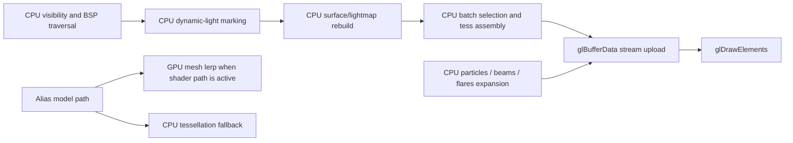
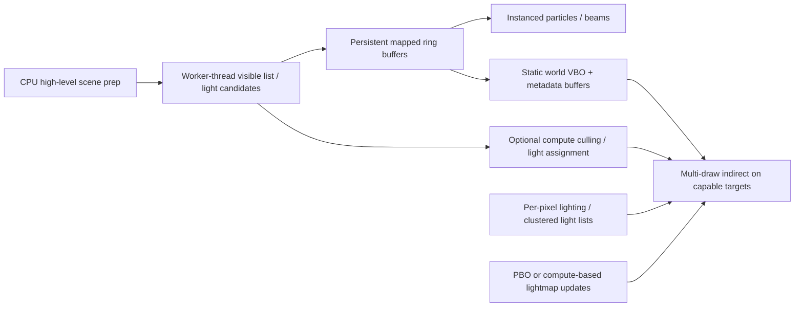

# WORR GL Renderer CPU Bottlenecks and GPU Offload Strategy

## Executive Summary

The inspected `DarkMatter-Productions/WORR` renderer is **not** a pure legacy immediate-mode renderer in the literal sense. The current code already has a shader backend, uniform-buffer infrastructure, optional shader-storage usage for MD5 skinning, a static world-VBO path, texture multi-bind (`qglBindTextures`), a GPU-oriented alias-model path, and fragment-shader dynamic-light logic. In other words, the repository has already crossed part of the modernization bridge; the remaining performance problem is that the **frame is still organized around a CPU-driven front end** that performs visibility traversal, dynamic-light association, lightmap rebuild/upload work in some modes, transient geometry expansion, and many batch/submission decisions on the CPU. fileciteturn34file0L1-L1 fileciteturn22file0L1-L1 fileciteturn17file0L1-L1 fileciteturn36file0L1-L1

The highest-confidence CPU hotspots are these: the BSP/world front end in `world.c` and `main.c`; dynamic-light marking over the BSP; CPU lightmap/style rebuild plus texture sub-uploads in `surf.c` when per-pixel lighting is unavailable or disabled; transient vertex/index streaming through `qglBufferData(GL_STREAM_DRAW)` in `tess.c`; and CPU-side particle/beam/flair geometry generation in `tess.c`. The code also contains CPU mesh interpolation routines in `mesh.c`, but those are no longer the whole story because the shader backend already contains MD2/MD3 mesh-lerp logic and the model loader has a `use_gpu_lerp` mode. That means “move mesh lerp to the GPU” is better understood as **make the GPU path the default, broaden its coverage, and eliminate avoidable fallbacks**, not as a greenfield feature. fileciteturn12file0L1-L1 fileciteturn13file0L1-L1 fileciteturn17file0L1-L1 fileciteturn18file0L1-L1 fileciteturn22file0L1-L1 fileciteturn36file0L1-L1

The best near-term strategy is **not** a full Vulkan-style rewrite. Instead, the strongest sequence is: instrument first; force or widen existing GPU paths; replace transient `glBufferData` streaming with persistent-mapped ring buffers or, on older targets, orphaning plus unsynchronized map; move particles and beams to instancing; reduce draw-call pressure with larger buckets and then multi-draw indirect where supported; only then consider compute-based culling/light assignment. This matches guidance from the entity["organization","Khronos Group","open standards consortium"] and vendor tool documentation: reduce implicit sync, keep dynamic updates in streamed buffers or persistent mappings, prefer fewer driver submissions, and use GPU timing plus vendor profilers to distinguish CPU-bound from GPU-bound frames. citeturn3search1turn5search0turn5search1turn6search1turn6search5turn7search0turn9search0turn12search0turn15search1turn15search2

A critical nuance from the repo inspection is that the repository’s own design note, `docs-dev/proposals/gl-renderer-analysis.md`, is directionally useful but partially stale relative to the code currently present. That note proposes GPU mesh lerp, static world VBOs, and a more GPU-driven pipeline as future work, yet those capabilities already exist in partial form in the source tree. The practical implication is that the modernization gap is **smaller but more specific** than the design note implies: the biggest wins now come from **submission/streaming cleanup, effect instancing, and moving the last major CPU front-end loops out of the hot path**. fileciteturn44file0L1-L1 fileciteturn34file0L1-L1 fileciteturn17file0L1-L1 fileciteturn22file0L1-L1

## What the inspected repository shows

The world-render path is still fundamentally CPU-led. `main.c` and `world.c` organize the frame around frustum setup, leaf/PVS marking, dynamic-light marking, world-node traversal, per-node/per-face processing, optional lightmap upload, and then batched draw submission. `GL_MarkLeaves` avoids some redundant work when the cluster is unchanged, which is good, but visible-node traversal and surface processing still occur as CPU work every frame. fileciteturn26file0L1-L1 fileciteturn12file0L1-L1

`surf.c` confirms that WORR still has a classic CPU lightmap path. A dirty surface can be rebuilt by combining light styles, optionally accumulating dynamic lights into a `blocklights` buffer, converting back to bytes, and then uploading subrectangles with texture subimage calls. This is exactly the kind of “CPU math followed by texture upload” pattern that tends to burden the CPU and create synchronization risk if it touches textures the GPU still wants to sample. At the same time, the code explicitly gates some of this behavior on whether the backend is using per-pixel lighting, which means the cost profile depends heavily on runtime settings and capabilities. fileciteturn13file0L1-L1 fileciteturn12file0L1-L1

`tess.c` is the clearest evidence for a submission/streaming bottleneck. The transient draw path binds arrays, uploads vertex data with `qglBufferData(GL_ARRAY_BUFFER, ..., GL_STREAM_DRAW)`, uploads index data with another `qglBufferData(...)`, and then issues `qglDrawElements`; effect passes like particles, beams, and flares all build geometry on the CPU into transient arrays before draw. This is work the GPU is well suited to absorb through instancing, persistent mapping, and, on newer targets, indirect draw plus compute-generated command data. fileciteturn17file0L1-L1

`mesh.c`, `shader.c`, `models.c`, and `gl.h` show that WORR already has modernized islands. The shader generator emits MD2/MD3 vertex paths with old/new frame attributes and lerp uniforms, `glStatic_t` exposes `use_gpu_lerp`, and model allocation changes depending on that mode. The code also has dynamic-light uniform blocks and fragment-shader light evaluation. This is important because it means the renderer architecture already tolerates capability tiers and GPU-resident metadata; the right refactors should **extend the existing direction** rather than replace it. fileciteturn18file0L1-L1 fileciteturn22file0L1-L1 fileciteturn34file0L1-L1 fileciteturn36file0L1-L1

The current pipeline and the recommended target can be summarized like this. The first diagram reflects the hot-path organization visible in the inspected code; the second shows the recommended end state for the highest-value refactor tiers. fileciteturn12file0L1-L1 fileciteturn13file0L1-L1 fileciteturn17file0L1-L1 citeturn3search1turn6search5turn17search2turn15search2





## CPU hotspots and the right GPU offloads

The table below separates **what is likely CPU-hot now** from **what should be offloaded first**. The “best first remediation” column is intentionally conservative: it prioritizes changes that fit WORR’s present architecture rather than assuming a full GPU-driven renderer on day one. The current-state characterization is based on the inspected repo files; the API recommendations come from official OpenGL guidance on streaming, sync, indirect draw, compute, image load/store, and pixel transfer. fileciteturn12file0L1-L1 fileciteturn13file0L1-L1 fileciteturn17file0L1-L1 fileciteturn18file0L1-L1 fileciteturn22file0L1-L1 citeturn3search1turn5search0turn6search1turn6search5turn15search1turn15search2turn17search2

| Hotspot | Evidence in WORR | Likely cause | Best first remediation | Best GPU offload target | Priority |
|---|---|---|---|---|---|
| World traversal and visible-surface submission | `GL_MarkLeaves`, `GL_WorldNode_r`, per-node/per-face processing | Pointer-chasing BSP traversal, repeated CPU-side visibility and submission work | Flatten visible-face lists, cache-friendly arrays, worker-thread prepass | Compute culling + indirect command generation | High |
| Dynamic-light marking | Recursive `GL_MarkLights_r` per light | Per-light BSP traversal and face-bit mutation | Parallel CPU light candidate pass with per-worker bitmasks | GPU light assignment or clustered lists | High |
| CPU lightmap/style rebuild and texture uploads | `add_light_styles`, `add_dynamic_lights`, `qglTexSubImage2D` | O(lights × texels) work and texture upload stalls | Prefer per-pixel lighting path; PBO-backed async uploads | Compute/image-store lightmap update or style blending in shader | High |
| Transient VBO/EBO upload on batch flush | `GL_LockArrays` + `qglBufferData`, EBO upload before `qglDrawElements` | Implicit sync and driver overhead every flush | Persistent mapped ring buffers; fallback orphan/invalidate map | Same, plus indirect draw buffers | High |
| Particles, beams, flares | CPU billboard/beam vertex expansion loops | CPU generates geometry that shaders can synthesize cheaply | Instanced quads/tubes; compact per-instance struct | Full GPU expansion in vertex shader | High |
| Alias-model interpolation fallback | CPU lerp/tessellation loops still exist | Fallback or legacy paths still pay per-vertex CPU cost | Make shader/GPU-lerp path the default and remove accidental fallback | Keep fully GPU-driven mesh path | Medium |
| Draw-call and state overhead | Frequent flushes on state/texture/index thresholds | Driver work and poor batching across materials | Better buckets, texture arrays, multi-bind everywhere | Multi-draw indirect + bindless textures | Medium |
| Occlusion/flair query handling | Query polling path in flares | Potential CPU bubbles on some paths | Two- or three-frame delayed query consumption | Leave on GPU; avoid same-frame reads | Low |

Two repo-specific nuances matter here. First, the **static world VBO path already exists**, so repeatedly copying world vertices is mostly a fallback-path problem; the more universal hot path is transient upload for batched indices, CPU-generated effect geometry, and any runtime-only vertex data. Second, the **per-pixel dynamic-light shader path already exists**, so the worst lightmap cost is concentrated on compatibility/fallback cases or style-rebuild cases rather than every modern frame. Those nuances should directly shape prioritization. fileciteturn13file0L1-L1 fileciteturn17file0L1-L1 fileciteturn22file0L1-L1 fileciteturn34file0L1-L1

A practical rule of thumb for WORR is this: **offload what is expanded or rebuilt every frame**, not what is already mostly static. Static world geometry is already partly handled as static GPU data. The remaining “wrong-side-of-the-bus” work is the CPU building temporary geometry, temporary lightmaps, temporary batch state, and temporary submission records. That is exactly the workload class that persistent mapping, instancing, indirect draw, and compute/image-store are meant to address. fileciteturn17file0L1-L1 citeturn3search1turn6search1turn6search5turn15search1turn15search2turn17search2

## Detailed checklist and code-level refactor plan

The checklist below is ordered from **highest ROI and lowest architectural disruption** to **largest structural change**. The first three items should happen before any major compute or indirect-draw work, because without instrumentation and better streaming you will struggle to tell whether later changes helped. The repo already has enough internal counters and feature tiers that this can be done incrementally. fileciteturn34file0L1-L1 fileciteturn17file0L1-L1

### Instrument and harden the current hot path

- Add high-resolution CPU timers around `GL_MarkLeaves`, `GL_MarkLights`, `GL_WorldNode_r`, `GL_DrawSolidFaces`, `GL_PushLights`, `GL_UploadLightmaps`, `GL_DrawParticles`, `GL_DrawBeams`, alias-model draw, and post-processing.
- Promote the existing `statCounters_t` output to a stable per-frame telemetry block and log `batchesDrawn`, `texSwitches`, `texUploads`, `lightTexels`, `vertexArrayBinds`, `occlusionQueries`, `dlights*`, visible nodes/faces, and streamed bytes.
- Wrap major render phases in `KHR_debug` groups so vendor frame captures can attribute costs to named ranges.
- Add GPU timer queries around world opaque, dynamic-light/lightmap update, particles/beams, transparent, and postfx passes. Use delayed readback; do not query results on the same frame that produced them unless the data is explicitly marked available. fileciteturn34file0L1-L1 citeturn4search0turn5search1turn5search3

### Make existing GPU paths the default where safe

- Audit the runtime conditions that decide between CPU and GPU alias-model paths, and make GPU lerp the preferred path for shader-capable hardware.
- Add telemetry flags such as `gpu_lerp_used`, `world_static_vbo_used`, and `ppl_used` so every benchmark run records whether the expected fast path was actually active.
- Remove duplicate CPU work when the GPU path is active. For example, do not keep CPU-side animation/tessellation helpers alive in the same hot loop when the vertex shader already has old/new frame attributes and lerp uniforms.
- Treat the repo design note as a hypothesis document, not source of truth; the source code now carries more authority than the proposal doc. fileciteturn18file0L1-L1 fileciteturn22file0L1-L1 fileciteturn34file0L1-L1 fileciteturn36file0L1-L1 fileciteturn44file0L1-L1

### Replace transient `glBufferData` streaming

Right now the transient path uses `qglBufferData(..., GL_STREAM_DRAW)` before draws, which is the classic place where driver overhead and implicit synchronization accumulate. The preferred replacement on GL 4.4 / `ARB_buffer_storage` is a persistent-mapped ring buffer guarded by per-slice fences; on older targets the fallback is orphaning plus invalidated/unsynchronized maps. fileciteturn17file0L1-L1 citeturn3search1turn5search0turn6search1turn16search0turn16search1turn16search2turn16search3turn16search6

```cpp
// init once
glBindBuffer(GL_ARRAY_BUFFER, streamVbo);
glBufferStorage(
    GL_ARRAY_BUFFER,
    ringBytes,
    nullptr,
    GL_MAP_WRITE_BIT |
    GL_MAP_PERSISTENT_BIT |
    GL_MAP_COHERENT_BIT
);

uint8_t* mapped = static_cast<uint8_t*>(
    glMapBufferRange(
        GL_ARRAY_BUFFER,
        0,
        ringBytes,
        GL_MAP_WRITE_BIT |
        GL_MAP_PERSISTENT_BIT |
        GL_MAP_COHERENT_BIT
    )
);

struct Slice {
    size_t offset;
    size_t size;
    GLsync fence = 0;
};

Slice& acquire_slice(size_t bytes) {
    Slice& s = ring[nextSlice];
    if (s.fence) {
        while (glClientWaitSync(s.fence, 0, 0) == GL_TIMEOUT_EXPIRED) {
            /* yield or process jobs */
        }
        glDeleteSync(s.fence);
        s.fence = 0;
    }
    s.offset = head;
    s.size   = bytes;
    head = align_up(head + bytes, 256);
    return s;
}

// per draw/batch
Slice& s = acquire_slice(bytes);
memcpy(mapped + s.offset, srcData, bytes);
glBindBuffer(GL_ARRAY_BUFFER, streamVbo);
glVertexAttribPointer(..., reinterpret_cast<void*>(s.offset + attributeOffset));
glDrawElements(...);
s.fence = glFenceSync(GL_SYNC_GPU_COMMANDS_COMPLETE, 0);
```

If persistent mapping is unavailable, the correct fallback is not “keep doing the same thing.” Use `glBufferData(..., NULL, ...)` to orphan or `glMapBufferRange` with invalidate/unsynchronized flags on a suballocated ring so you avoid overwrite hazards while also avoiding hidden driver stalls. citeturn16search0turn16search1turn16search2turn16search3

### Move particles, beams, and similar effects to instancing

`GL_DrawParticles` and the beam routines are nearly ideal GPU-offload candidates because the CPU is doing algebraically simple expansion work: converting a compact particle or segment description into several vertices and indices. The right data layout is **one compact per-instance struct** plus a static unit quad or tube template. The vertex shader computes billboard corners from camera vectors and instance parameters; the CPU only uploads instance records. This alone can remove a large amount of scalar math and transient upload pressure from `tess.c`. fileciteturn17file0L1-L1 citeturn17search0turn17search7

```glsl
// vertex shader idea for particles
layout(location=0) in vec2 a_corner;        // static quad corners: (-1,-1)..(1,1)
layout(location=1) in vec3 i_position;      // per instance
layout(location=2) in float i_size;
layout(location=3) in vec4 i_color;

uniform mat4 u_view;
uniform mat4 u_proj;
uniform vec3 u_viewRight;
uniform vec3 u_viewUp;

out vec2 v_tc;
out vec4 v_color;

void main() {
    vec3 worldPos =
        i_position +
        u_viewRight * (a_corner.x * i_size) +
        u_viewUp    * (a_corner.y * i_size);

    v_tc = a_corner * 0.5 + 0.5;
    v_color = i_color;
    gl_Position = u_proj * u_view * vec4(worldPos, 1.0);
}
```

For beams, store start/end/width/color/seed and synthesize the oriented quad or segment ring in the shader. If a fully procedural “poly beam” is too disruptive at first, an intermediate step is to draw each beam as an instanced strip or quad and let the shader build camera-facing offsets. The key is to stop uploading fully expanded beam vertices from the CPU on every frame. fileciteturn17file0L1-L1

### Reduce draw submission overhead before going fully GPU-driven

WORR already benefits from some texture-state bucketing and from `qglBindTextures` when texture slots are dense, so the next useful step is to enlarge the granularity of submission rather than immediately jumping to bindless/compute everywhere. The natural progression is:

1. better CPU-side material buckets and stable per-surface metadata,
2. optional texture arrays for compatible sets,
3. multi-draw indirect on GL 4.3+ for world buckets,
4. bindless textures only if profiling still shows binding/state setup as a major cost. fileciteturn17file0L1-L1 citeturn6search5turn6search7turn15search6turn6search4turn13search3

A good metadata layout for an eventual world-MDI path is this:

- immutable vertex/index buffers uploaded once at map load,
- one compact draw record per surface: `indexCount`, `firstIndex`, `baseVertex`, `materialId`, `lightmapId`, flags,
- one material table buffer with texture handles or array-layer indices,
- one visibility buffer or indirect-command buffer updated per frame.

That gives you a bridge from today’s per-face `GL_DrawFace` path to tomorrow’s `glMultiDrawElementsIndirect` path without rewriting the whole renderer at once. fileciteturn17file0L1-L1 citeturn6search5turn17search5

### Modernize lighting and lightmap handling in tiers

The lighting plan should be explicitly tiered because hardware is unspecified.

For **Tier A**, make the existing shader/per-pixel-lighting path the normal path on shader-capable hardware and keep the CPU lightmap path as fallback only. This reduces the “dynamic lights burn CPU + upload texture” problem without changing content formats. fileciteturn13file0L1-L1 fileciteturn22file0L1-L1

For **Tier B**, reduce the remaining lightmap upload cost by using **PBO-backed asynchronous texture uploads** instead of direct client-memory texture updates, while keeping the current algorithm. This is lower risk than a compute rewrite and can eliminate some CPU/GPU sync points around `glTexSubImage2D`. fileciteturn13file0L1-L1 citeturn15search1turn5search5

For **Tier C**, move lightmap/style composition to the GPU. There are two strong variants:

- **Shader-side style blending**: upload immutable style layers at load time and apply style weights in the fragment shader.
- **Compute/image-store update**: write dynamic or composed lightmap tiles to textures via `glDispatchCompute`, `glBindImageTexture`, and `glMemoryBarrier`. citeturn17search2turn15search0turn15search2turn15search3

For **Tier D**, if many dynamic lights remain a bottleneck, adopt clustered or tiled light assignment so fragment shaders receive a compact light list rather than brute-force scans. Clustered shading is a well-established technique with better worst-case behavior than simple tiled approaches for scenes with depth discontinuities and many lights. citeturn14search6turn22file0

A sketch of the compute-based lightmap/update path looks like this. It is best treated as a later-stage optimization, after PBO async upload and streaming cleanup are already in place. citeturn17search2turn15search0turn15search2

```cpp
// CPU side
glUseProgram(lightmapComputeProgram);
glBindImageTexture(0, lightmapTexArray, 0, GL_TRUE, 0, GL_WRITE_ONLY, GL_RGBA8);
glBindBufferBase(GL_SHADER_STORAGE_BUFFER, 0, surfaceTileBuffer);
glBindBufferBase(GL_SHADER_STORAGE_BUFFER, 1, dynamicLightBuffer);

// one workgroup per tile or surface chunk
glDispatchCompute(groupCountX, groupCountY, 1);

// make writes visible to later texture fetches / draws
glMemoryBarrier(GL_SHADER_IMAGE_ACCESS_BARRIER_BIT |
                GL_TEXTURE_FETCH_BARRIER_BIT |
                GL_SHADER_STORAGE_BARRIER_BIT);
```

### Use multithreading where OpenGL still benefits

OpenGL will not suddenly become Vulkan through host-side threading. Khronos’ Vulkan guidance is explicit that Vulkan scales host-side command recording through per-thread command pools, whereas OpenGL remains a state-machine API with less natural multithreaded command recording. For WORR, that means worker threads should focus on **CPU-only prep**: visible-leaf enumeration, light candidate generation, particle simulation, entity sorting, and staging transient buffer data. The actual GL submission should stay on the render thread unless you deliberately introduce shared contexts for background uploads or compilation. citeturn3search0turn11search2

## Profiling and benchmarking procedures

A renderer optimization effort should begin by proving whether a frame is CPU-bound, GPU-bound, or sync-bound. Do not rely on wall-clock timings around draw calls alone; OpenGL is pipelined, and naive CPU timings can misattribute queued GPU work or driver latency. Use GPU timer queries for GPU cost, CPU scoped timers for host cost, and vendor/system profilers for corroboration. citeturn5search1turn5search2turn13search1

### Exact metrics to collect

At minimum, collect these **per frame**:

- CPU frame time: average, p95, p99.
- CPU time per scope: `MarkLeaves`, `MarkLights`, `WorldNode`, `DrawSolidFaces`, `PushLights`, `UploadLightmaps`, `Particles`, `Beams`, alias models, transparent pass, postfx.
- Existing repo counters: `nodesDrawn`, `leavesDrawn`, `facesMarked`, `facesDrawn`, `facesTris`, `texSwitches`, `texUploads`, `lightTexels`, `trisDrawn`, `batchesDrawn`, `batchesDrawn2D`, `uniformUploads`, `vertexArrayBinds`, `occlusionQueries`, `dlightsTotal`, `dlightUploads`, `dlightsUsed`, `dlightsCulled`, and related counters.
- Streamed bytes: VBO bytes/frame, EBO bytes/frame, PBO bytes/frame, texture-upload bytes/frame.
- GPU timings: whole frame, world opaque, lightmap update, particles/effects, postfx.
- Sync metrics: time spent waiting on fences, count of explicit waits, count of query results consumed late vs on time. fileciteturn34file0L1-L1 citeturn5search0turn5search1

On hardware/tool-specific runs, add vendor metrics:

- On entity["company","NVIDIA","gpu vendor"]: GPU unit utilization, event/range timings, CPU backtraces, OpenGL workload traces with Nsight Graphics/Nsight Systems. Nsight Graphics is documented as supporting OpenGL, and GPU Trace is meant to find pipeline bottlenecks and under-utilization; Nsight Systems can sample CPU IPs/backtraces and trace OpenGL GPU workload activity. citeturn7search0turn7search1turn9search0turn9search2turn9search4
- On entity["company","AMD","gpu vendor"]: Radeon GPU Profiler / Radeon Developer Panel are for Vulkan/DX12-class explicit APIs, not OpenGL, so for WORR’s OpenGL renderer the correct AMD-side counter path is GPUPerfAPI, which explicitly supports OpenGL and exposes timing, primitive-assembly, texture-unit, cache, and busy counters. citeturn10search1turn11search4turn11search1turn12search0turn12search5
- On entity["company","Intel","chip company"]: Intel GPA’s frame analyzer is useful for API-state experiments and draw-state what-if analysis. citeturn8search0turn10search0

### Benchmark procedure

Use a **repeatable scene harness**, ideally a deterministic demo or scripted camera flythrough with fixed player input, fixed resolution, fixed quality settings, and V-Sync off. Warm up long enough for shader compilation and asset paging to settle, then record at least three 60-second runs for each configuration. Nsight’s guidance to profile focused regions, wait for background compiles to go inactive, and avoid V-Sync during representative capture is directly applicable here. citeturn7search0turn9search3

Run this benchmark matrix:

| Variable | Values |
|---|---|
| Shader backend | on / off |
| Per-pixel lighting | on / off |
| Dynamic light count | low / medium / high |
| Particle count | low / high |
| Mesh path | force GPU lerp / force CPU fallback |
| World buffer mode | static VBO / fallback |
| Resolution | one CPU-bound resolution and one GPU-bound resolution |

Interpretation should follow a simple decision tree. If frame time improves when resolution is lowered, the test is at least partly GPU-bound. If resolution changes little but CPU scopes dominate, it is CPU-bound. If neither CPU scope nor GPU timer explains the total, look for sync: timer-query readback, buffer upload hazards, texture update contention, or driver validation overhead. citeturn5search1turn5search5turn13search1

## Validation and regression testing

Correctness validation matters as much as speed, because every one of the proposed changes touches synchronization, memory visibility, batching, or shader reconstruction. The safest method is to keep a CPU-reference path for a while and compare outputs against it. citeturn4search0turn5search0turn15search2

For visual correctness, use image-diff captures on a curated test pack: indoor BSP-heavy maps, outdoor maps with long sightlines, dynamic-light stress scenes, particle-heavy scenes, and animation-heavy scenes. Capture baseline vs optimized frames from fixed cameras and compare with an error threshold that tolerates minor floating-point differences but not topology, lighting, sorting, or culling mistakes. That test pack should explicitly include cases where animated light styles, flares/queries, and transparent effects are active, because those are common sources of accidental regressions in refactors of this kind. fileciteturn13file0L1-L1 fileciteturn17file0L1-L1

For synchronization correctness:

- enable debug contexts and `KHR_debug`,
- add debug groups per render phase,
- assert that persistent-buffer slices are never rewritten before their fence signals,
- delay query-object result consumption by at least one frame when possible,
- after compute/image-store writes, use the exact `glMemoryBarrier` bits required by the subsequent consumer stage. citeturn4search0turn5search0turn15search2

For performance correctness, require every optimization patch to ship with:

- before/after frame-time distributions,
- before/after named-scope CPU timings,
- before/after GPU timers,
- before/after repo counters,
- a note stating whether the renderer was CPU-bound or GPU-bound in the test scene.

If a patch makes the frame “faster” only by shifting time from one hidden bottleneck to another, the metric pack will reveal it. For example, persistent-mapped buffers should reduce stream-upload cost and fence waits at steady state; instancing should reduce CPU effect generation and submission counts; indirect draw should reduce driver-side submission overhead and draw-call counts, not merely rename them. fileciteturn34file0L1-L1 citeturn3search1turn6search5turn7search0turn9search0⟩

## Prioritized roadmap and risk notes

The roadmap below is deliberately conservative. It prioritizes changes that exploit what WORR already has, then expands capability tiers, and only then recommends compute-heavy or backend-heavy transitions.

| Task | What to do | Expected impact | Effort | Risk |
|---|---|---|---|---|
| Baseline instrumentation | CPU scoped timers, GPU timer queries, debug groups, stable counter dump | Essential; exposes real bottlenecks | Low | Low |
| Fast-path auditing | Ensure GPU lerp, static VBO, shader path, per-pixel lighting are actually selected where intended | Often immediate wins; removes accidental fallback costs | Low | Low |
| Stream-buffer rewrite | Replace transient `glBufferData` paths with persistent mapped rings; orphan/map fallback for older GL | High on CPU-bound scenes with many batches/effects | Medium | Medium |
| Instanced particles and beams | Move billboard and beam expansion to vertex shader | High and visible CPU reduction | Medium | Medium |
| Async texture-upload tier | Add PBO-backed `glTexSubImage2D` path for lightmap/style updates | Moderate improvement, lower risk than compute | Medium | Medium |
| Submission cleanup | Better buckets, metadata buffers, fewer flushes, broader use of multi-bind | Moderate to high | Medium | Medium |
| Multi-draw indirect tier | Build per-surface or per-bucket command buffers and submit with MDI on GL 4.3+ | High on driver-limited scenes | High | Medium |
| Lighting modernization | Shader-side style blending or compute-based lightmap updates | High on fallback/light-style heavy scenes | High | High |
| Front-end parallelization | Worker-thread visible-list and light-candidate generation | Moderate on modern multi-core CPUs | Medium | Medium |
| Compute culling / clustered lighting | GPU-generated visibility or light lists | Potentially transformative on worst-case scenes | High | High |
| Vulkan evaluation | Only if driver/submission overhead remains dominant after the above | Strategic, not the first move | Very high | Very high |

My recommended implementation order is:

1. **Instrumentation and debug markers.**  
2. **Fast-path audit and cleanup of existing GPU-capable paths.**  
3. **Persistent-mapped streaming rewrite.**  
4. **Instanced particles and beams.**  
5. **PBO-backed async texture-upload path for lightmaps/styles.**  
6. **Submission cleanup and larger buckets.**  
7. **MDI on GL 4.3+ targets.**  
8. **Lighting/lightmap shader or compute modernization.**  
9. **Optional compute culling and clustered lighting.**  
10. **Only then decide whether a Vulkan backend is justified.** fileciteturn17file0L1-L1 fileciteturn22file0L1-L1 citeturn3search0turn3search1turn6search1turn6search5turn11search2

Implementation status, 2026-05-04: item 1 is implemented for the OpenGL renderer under `DV-05-T03`. The implementation adds `gl_cpu_timers`, `gl_gpu_timers`, `gl_profile_log`, `gl_debug_markers`, delayed GPU timer readback, `KHR_debug` phase groups, streamed/upload byte counters, and the `gl_telemetry` per-frame snapshot. See `docs-dev/renderer/opengl-gpu-offload-instrumentation-2026-05-04.md`.

The reason Vulkan is last is not that Vulkan is unhelpful. Vulkan’s host-side threading and lower API overhead are real advantages, and AMD explicitly frames Vulkan as reducing API overhead relative to OpenGL. But WORR’s current GL codebase already contains substantial modernization hooks, and the obvious CPU burdens are concentrated in features that can be improved **within the current renderer** first. A Vulkan rewrite would be expensive, high-risk, and hard to justify before measuring what persistent mapping, instancing, and improved submission can already do. citeturn3search0turn11search2

## Open questions and limitations

This analysis is based on repository inspection and primary documentation, not on running WORR under a live profiler. That means the report can identify **high-confidence likely hotspots**, but it cannot rank them by actual wall-clock or cycle cost on your target machines without measurement. Runtime cvars and capability selection matter a lot here: the real cost split will change depending on whether shader paths, per-pixel lighting, static world buffers, and GPU lerp are active. fileciteturn13file0L1-L1 fileciteturn18file0L1-L1 fileciteturn22file0L1-L1 fileciteturn34file0L1-L1

The most important unresolved question is therefore straightforward: on your actual target hardware, after enabling the intended fast paths, is WORR primarily spending time in **CPU front-end traversal/light assignment**, **transient upload/submission**, or **GPU-side shading/fill**? The instrumentation and benchmark procedure above should answer that quickly and should be treated as the gate for every heavier refactor that follows.
